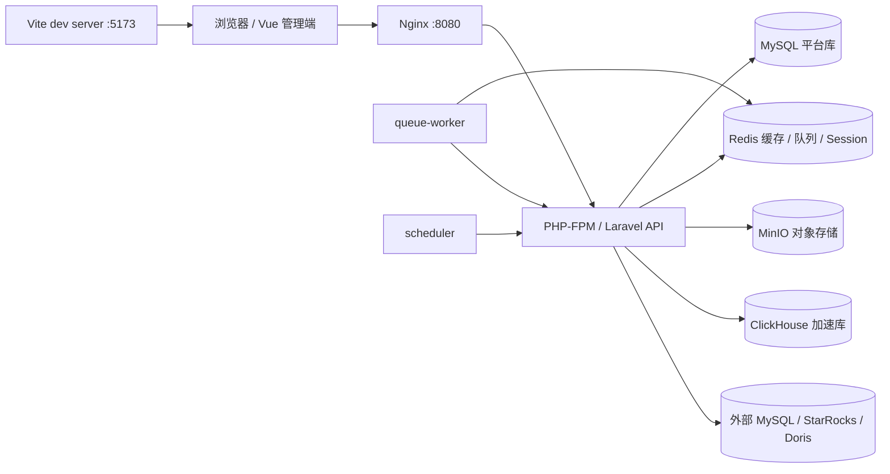
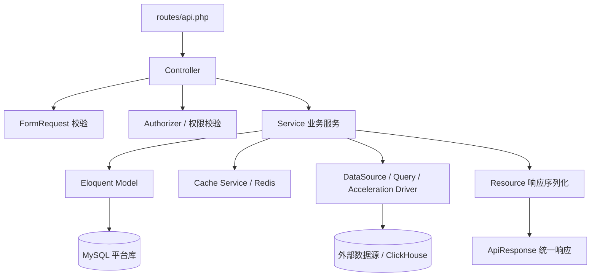
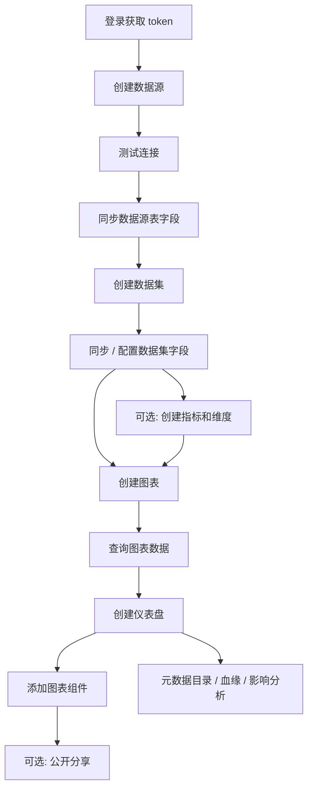
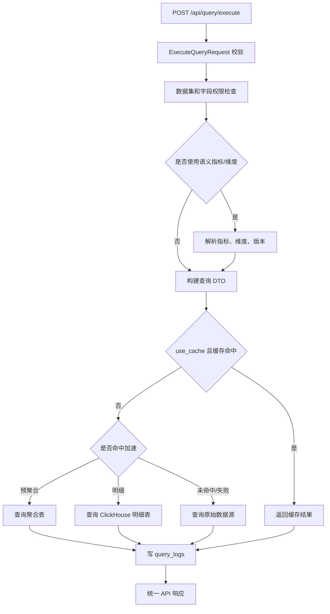
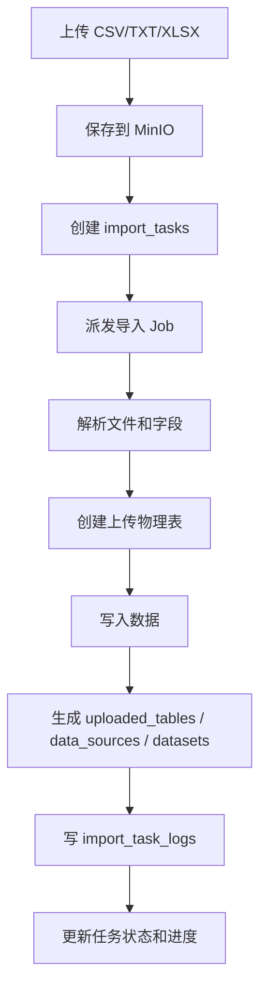
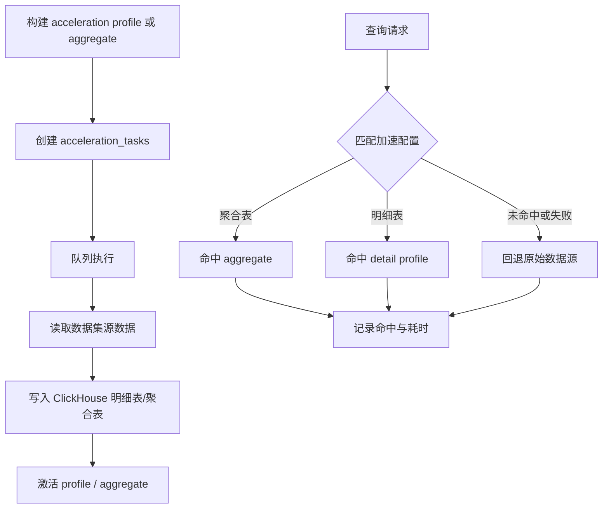
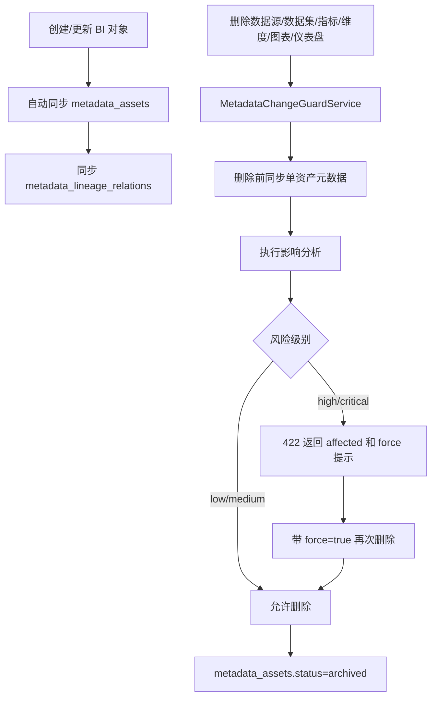
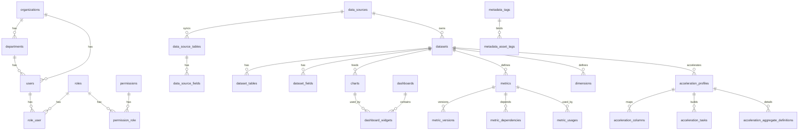

# Laravel BI Platform 项目详细文档

本文档是 Laravel BI Platform 的项目总说明，覆盖技术架构、核心流程、接口文档、表结构、启动关闭、运维命令和使用路径。内容以当前代码、路由、迁移和 Docker 编排为准。

最后核对日期：2026-06-24。

## 1. 项目概览

Laravel BI Platform 是一个后端 API 与 Vue 管理端同仓的轻量 BI 平台，主要面向数据源接入、数据集建模、查询分析、语义指标、图表、仪表盘、导入导出、权限、审计、监控、查询加速和元数据治理。

核心能力：

- 数据源：支持 MySQL、StarRocks、Doris，提供连接测试、库表字段发现、元数据同步和物化视图元数据查询。
- 数据集：支持单表数据集、字段同步、字段语义配置、预览和查询解释。
- 查询引擎：支持维度、指标、过滤、排序、分页、缓存、语义层字段和 SQL explain。
- 图表与仪表盘：支持图表配置、图表数据查询、仪表盘组件编排、全局筛选和公开分享。
- 语义层：支持指标分类、指标库、维度、公式校验、版本、依赖、使用记录和影响分析。
- 元数据治理：支持资产目录、血缘、影响分析、标签、使用统计、删除前风险拦截和自动同步。
- 查询加速：支持 ClickHouse 明细表、预聚合表、推荐、刷新计划、收益统计和 fallback。
- 导入导出：支持 CSV/TXT/XLSX 导入，图表 CSV/XLSX 导出，仪表盘 PDF 导出。
- 权限审计：支持用户、角色、权限、资源权限、行级权限、列级权限、操作日志、登录日志、查询日志、导出日志。
- 前端管理端：Vue 3 SPA，覆盖首页、数据源、数据集、语义层、数据治理、图表、仪表盘、导入、导出、查询日志、权限、监控。

## 2. 技术栈

后端：

- PHP 8.3+
- Laravel 13
- Laravel Sanctum
- Laravel Queue / Scheduler
- PHPUnit
- Laravel Pint

前端：

- Vue 3
- Vue Router
- Pinia
- Axios
- ECharts
- Vite
- Tailwind CSS Vite plugin
- lucide-vue

基础设施：

- MySQL 8.4：业务元数据、平台配置、任务与日志。
- Redis 7.4：缓存、队列、会话。
- MinIO：导入文件、导出文件等对象存储。
- ClickHouse：BI 查询加速明细表和预聚合表。
- Nginx + PHP-FPM：Web/API 运行入口。
- Docker Compose：本地一键运行。

## 3. 代码结构

关键目录：

```text
app/Modules
├── Acceleration       查询加速、预聚合、推荐、刷新、收益统计
├── Audit             操作、登录、导出、查询日志
├── Auth              登录、退出、当前用户
├── Cache             图表、数据集、权限、仪表盘缓存
├── Chart             图表配置、预览、数据查询
├── Dashboard         仪表盘、组件、筛选、联动、分享
├── DataPermission    资源、行级、列级权限
├── DataSource        数据源、数据库驱动、元数据同步、OLAP 物化视图
├── Dataset           数据集、字段、预览
├── Export            导出任务和导出文件
├── Import            导入任务、导入日志、上传表
├── Metadata          元数据目录、血缘、影响分析、标签、使用统计
├── Monitor           健康检查和 Prometheus metrics
├── Permission        角色和权限
├── Query             查询编译、执行、缓存、日志、Explain
├── Semantic          指标库、维度、公式、版本、依赖
└── User              用户、组织、部门
```

前端目录：

```text
resources/js
├── App.vue
├── app.js
├── components        通用组件
├── layouts           AppShell 主布局
├── navigation.js     左侧菜单
├── pages             管理端页面
├── router            Vue Router
├── services          Axios 与 API 封装
└── stores            Pinia auth store
```

配置与运行：

```text
routes/api.php        API 路由
routes/web.php        Vue SPA catch-all
routes/console.php    BI 加速与元数据 Artisan 命令
database/migrations   表结构
database/seeders      初始组织、部门、权限、管理员
docker-compose.yml    本地运行编排
docker/               Nginx、PHP、ClickHouse 配置
```

## 4. 技术架构

### 4.1 部署架构



说明：

- `nginx` 暴露 HTTP 入口，默认 `APP_PORT=8080`。
- `php-fpm` 运行 Laravel API、Blade 入口和业务服务。
- `mysql` 保存平台元数据、用户权限、BI 配置、任务和日志。
- `redis` 用于缓存、队列、会话。
- `minio` 用于导入文件和导出文件。
- `clickhouse` 用于查询加速。
- `queue-worker` 消费导入、导出、加速构建等异步任务。
- `scheduler` 运行 Laravel 定时任务，驱动加速刷新。
- `node` 容器用于前端开发模式；生产构建使用 `npm run build`。

### 4.2 后端分层



约定：

- Controller 只负责 HTTP 入参、鉴权调用和响应包装。
- FormRequest 负责字段校验。
- Service 承载业务规则、事务、缓存清理、元数据同步和任务派发。
- Model 映射数据库表。
- Resource 负责返回字段结构。
- `App\Support\Response\ApiResponse` 统一成功和错误响应格式。

### 4.3 前端架构

```mermaid
flowchart LR
    App[App.vue] --> Router[Vue Router]
    Router --> Shell[AppShell]
    Shell --> Pages[业务页面]
    Pages --> Api[resources/js/services/api.js]
    Api --> Http[Axios http.js]
    Http --> Laravel[/api/*]
    Store[Pinia auth store] --> Router
    Store --> Http
```

前端路由：

| 路径 | 页面 | 说明 |
| --- | --- | --- |
| `/login` | `LoginView` | 登录页 |
| `/` | `DashboardOverviewView` | 首页概览 |
| `/data-sources` | `DataSourcesView` | 数据源 |
| `/datasets` | `DatasetsView` | 数据集 |
| `/semantic-layer` | `SemanticLayerView` | 语义层 |
| `/data-governance` | `DataGovernanceView` | 数据治理 |
| `/charts` | `ChartsView` | 图表配置 |
| `/dashboards` | `DashboardsView` | 仪表盘 |
| `/imports` | `ImportTasksView` | 导入任务 |
| `/exports` | `ExportTasksView` | 导出任务 |
| `/query-logs` | `QueryLogsView` | 查询日志 |
| `/permissions` | `PermissionsView` | 权限管理 |
| `/monitor` | `MonitorView` | 系统监控 |

## 5. 核心业务流程

### 5.1 BI 建模与分析主流程



### 5.2 查询执行流程



### 5.3 导入流程



### 5.4 导出流程

```mermaid
flowchart TD
    Create[创建 export_tasks] --> Validate[校验 source_type/export_type]
    Validate --> Queue[派发导出 Job]
    Queue --> Fetch[查询图表或仪表盘数据]
    Fetch --> Render[生成 CSV/XLSX/PDF]
    Render --> Upload[上传 MinIO]
    Upload --> Log[写 export_logs]
    Log --> Download[GET /api/export-tasks/{id}/download]
```

### 5.5 加速构建与命中流程



### 5.6 元数据治理与删除风险拦截



说明：

- 删除风险拦截覆盖 `data_source`、`dataset`、`metric`、`dimension`、`chart`、`dashboard`。
- 高风险或关键风险删除默认返回 `422`。
- 使用 `?force=1` 或请求体 `{ "force": true }` 可确认删除，但不会绕过认证或业务权限。
- 删除成功后，元数据资产不会物理删除，而是归档为 `archived`。

## 6. 启动、关闭与运维

### 6.1 Docker 快速启动

```bash
cp .env.example .env
docker compose up -d --build
docker compose exec php-fpm composer install
docker compose exec php-fpm php artisan key:generate
docker compose exec php-fpm php artisan migrate
docker compose exec php-fpm php artisan db:seed
npm install
npm run build
```

访问地址：

| 服务 | 地址 |
| --- | --- |
| 管理端 | `http://localhost:8080` |
| API | `http://localhost:8080/api` |
| MinIO Console | `http://localhost:9001` |
| ClickHouse HTTP | `http://localhost:8123` |
| Vite Dev Server | `http://localhost:5173` |

MinIO 默认配置：

```text
username: minioadmin
password: minioadmin
bucket: bi-platform
```

如果 `bi-platform` bucket 不存在，需要在 MinIO Console 手动创建。

`db:seed` 后默认管理员：

```text
email: admin@example.com
password: password
```

### 6.2 Docker 常用命令

```bash
# 查看容器状态
docker compose ps

# 启动全部服务
docker compose up -d

# 重启指定服务
docker compose restart php-fpm queue-worker scheduler

# 查看日志
docker compose logs -f php-fpm
docker compose logs -f queue-worker
docker compose logs -f scheduler
docker compose logs -f nginx

# 停止服务，保留数据卷
docker compose stop

# 停止并删除容器，保留数据卷
docker compose down

# 停止并删除容器、网络和数据卷
docker compose down -v
```

### 6.3 本地非 Docker 运行

```bash
composer install
cp .env.example .env
php artisan key:generate
php artisan migrate
php artisan db:seed
php artisan serve --host=127.0.0.1 --port=8000
```

另开终端启动前端开发服务器：

```bash
npm install
npm run dev -- --host 127.0.0.1 --port 5173
```

如需异步队列：

```bash
php artisan queue:work
```

如需定时任务：

```bash
php artisan schedule:work
```

访问：

```text
管理端: http://127.0.0.1:8000
登录页: http://127.0.0.1:8000/login
```

### 6.4 构建、测试和检查

```bash
# 后端测试
php artisan test

# PHP 格式检查
vendor/bin/pint --test

# PHP 格式化
vendor/bin/pint

# 前端生产构建
npm run build

# API 路由清单
php artisan route:list --path=api

# 迁移预演
php artisan migrate --pretend --database=sqlite

# 清理 Laravel 缓存
php artisan optimize:clear
```

当前验证基线：

```text
81 tests, 720 assertions
187 API routes
```

### 6.5 BI 自定义命令

```bash
# 生成查询加速推荐
php artisan bi:acceleration:recommend --days=7 --dry-run

# 执行到期加速刷新计划
php artisan bi:acceleration:refresh-due --dry-run

# 生成加速收益快照
php artisan bi:acceleration:benefit-report --days=1

# 同步元数据资产
php artisan bi:metadata:sync --all --dry-run
php artisan bi:metadata:sync --data-source=1
php artisan bi:metadata:sync --dataset=1
php artisan bi:metadata:sync --metrics
php artisan bi:metadata:sync --charts
php artisan bi:metadata:sync --dashboards

# 重建血缘
php artisan bi:metadata:lineage:rebuild --all --dry-run
php artisan bi:metadata:lineage:rebuild --dataset=1
php artisan bi:metadata:lineage:rebuild --metric=1
php artisan bi:metadata:lineage:rebuild --chart=1
php artisan bi:metadata:lineage:rebuild --dashboard=1

# 生成元数据使用统计
php artisan bi:metadata:usage-stats --days=1 --dry-run
```

### 6.6 健康检查

```bash
curl http://localhost:8080/api/health
curl http://localhost:8080/api/health/database
curl http://localhost:8080/api/health/redis
curl http://localhost:8080/api/health/storage
curl http://localhost:8080/api/health/queue
curl http://localhost:8080/api/metrics
```

生产环境建议在网关、Nginx 或 Laravel middleware 限制 `/api/health*` 和 `/api/metrics` 访问范围。

## 7. 接口规范

### 7.1 认证

登录：

```bash
curl -X POST http://localhost:8080/api/auth/login \
  -H "Content-Type: application/json" \
  -d '{
    "email": "admin@example.com",
    "password": "password",
    "device_name": "curl"
  }'
```

后续请求：

```text
Authorization: Bearer <token>
```

公开接口：

- `POST /api/auth/login`
- `GET /api/share/dashboards/{token}`
- `GET /api/health`
- `GET /api/health/database`
- `GET /api/health/redis`
- `GET /api/health/storage`
- `GET /api/health/queue`
- `GET /api/metrics`

其他业务 API 默认需要 `auth:sanctum`。

### 7.2 响应格式

成功：

```json
{
  "code": 0,
  "message": "success",
  "data": {}
}
```

分页：

```json
{
  "code": 0,
  "message": "success",
  "data": {
    "items": [],
    "pagination": {
      "page": 1,
      "page_size": 20,
      "total": 0
    }
  }
}
```

错误：

```json
{
  "code": 40001,
  "message": "Invalid request parameters",
  "errors": {}
}
```

常见错误码：

| code | 说明 |
| --- | --- |
| `40001` | 请求参数错误 |
| `40100` | 未认证 |
| `40300` | 无权限 |
| `40400` | 资源不存在 |
| `40500` | HTTP 方法不允许 |
| `50000` | 服务端错误 |

删除风险拦截示例：

```json
{
  "code": 40001,
  "message": "Invalid request parameters",
  "errors": {
    "force": ["Deletion has high impact. Pass force=true to confirm."],
    "risk_level": ["critical"],
    "affected": [[
      {"asset_type": "dashboard", "asset_id": 1}
    ]]
  }
}
```

## 8. 接口文档

说明：

- 表格中 “CRUD” 表示 `GET /resource`、`POST /resource`、`GET /resource/{id}`、`PUT/PATCH /resource/{id}`、`DELETE /resource/{id}`。
- `DELETE` 对数据源、数据集、指标、维度、图表、仪表盘支持 `force=true` 删除确认。
- `page`、`page_size`、状态、关键字等列表过滤参数由各 Service 按模块处理。

### 8.1 Auth

| 方法 | 路径 | 说明 | 关键入参 |
| --- | --- | --- | --- |
| POST | `/api/auth/login` | 登录并创建 Sanctum token | `email`, `password`, `device_name?` |
| POST | `/api/auth/logout` | 注销当前 token | Bearer token |
| GET | `/api/auth/me` | 当前用户信息 | Bearer token |

### 8.2 用户、角色、权限

| 方法 | 路径 | 说明 | 关键入参 |
| --- | --- | --- | --- |
| CRUD | `/api/users` | 用户管理 | `organization_id?`, `department_id?`, `name`, `email`, `password`, `status`, `role_ids[]` |
| CRUD | `/api/roles` | 角色管理 | `name`, `code`, `guard_name`, `description?`, `permission_ids[]` |
| CRUD | `/api/permissions` | 权限点管理 | `name`, `code`, `guard_name`, `group?`, `description?` |

### 8.3 数据源

| 方法 | 路径 | 说明 | 关键入参 |
| --- | --- | --- | --- |
| CRUD | `/api/data-sources` | 数据源管理 | `name`, `type=mysql/starrocks/doris`, `host`, `port`, `database_name`, `username`, `password?`, `charset?`, `timezone?`, `options_json?`, `status?` |
| POST | `/api/data-sources/{data_source}/test` | 测试连接 | 无 |
| POST | `/api/data-sources/{data_source}/sync` | 同步库表字段元数据 | 无 |
| GET | `/api/data-sources/{data_source}/databases` | 获取数据库列表 | 无 |
| GET | `/api/data-sources/{data_source}/tables` | 获取表列表 | `database?`, `keyword?` |
| GET | `/api/data-sources/{data_source}/views` | 获取视图列表 | `database?`, `keyword?` |
| GET | `/api/data-sources/{data_source}/tables/{table}/fields` | 获取字段列表 | `database?` |
| POST | `/api/data-sources/{data_source}/tables/{table}/preview` | 表数据预览 | `limit?`, `database?` |
| GET | `/api/data-sources/{data_source}/materialized-views` | OLAP 物化视图列表 | StarRocks/Doris 数据源 |
| GET | `/api/data-sources/{data_source}/materialized-views/{name}` | 物化视图详情 | `name` |
| POST | `/api/data-sources/{data_source}/materialized-views/{name}/refresh` | 刷新物化视图 | `name` |

### 8.4 数据集与查询

| 方法 | 路径 | 说明 | 关键入参 |
| --- | --- | --- | --- |
| CRUD | `/api/datasets` | 数据集管理 | `name`, `description?`, `data_source_id`, `dataset_type=single_table`, `main_table`, `table_alias?`, `config_json?`, `status?` |
| POST | `/api/datasets/{dataset}/sync-fields` | 从物理表同步字段 | 无 |
| GET | `/api/datasets/{dataset}/fields` | 数据集字段列表 | 无 |
| PUT | `/api/datasets/{dataset}/fields/{field}` | 更新字段语义 | `field_alias?`, `display_name?`, `normalized_type?`, `semantic_type?`, `is_dimension?`, `is_metric?`, `is_visible?`, `is_filterable?`, `default_aggregate?`, `sort_order?` |
| POST | `/api/datasets/{dataset}/preview` | 数据集预览 | `limit?`, `fields[]?` |
| POST | `/api/datasets/{dataset}/explain` | 数据集查询 Explain | 查询 DSL |
| POST | `/api/query/execute` | 执行动态查询 | `dataset_id`, `dimensions[]?`, `metrics[]?`, `semantic_metrics[]?`, `semantic_dimensions[]?`, `filters[]?`, `sorts[]?`, `limit?`, `offset?`, `use_cache?` |

查询 DSL 支持：

| 字段 | 说明 |
| --- | --- |
| `dimensions[].field` | 维度字段名，必须是安全标识符 |
| `dimensions[].time_granularity` | `year/quarter/month/week/day/hour/minute` |
| `metrics[].field` | 指标字段名 |
| `metrics[].aggregate` | `sum/avg/count/countDistinct/max/min` |
| `filters[].operator` | `=`, `!=`, `>`, `>=`, `<`, `<=`, `in`, `not_in`, `like`, `not_like`, `between`, `is_null`, `is_not_null` |
| `sorts[].direction` | `asc/desc` |
| `limit` | 1 到 1000 |

### 8.5 语义层

| 方法 | 路径 | 说明 | 关键入参 |
| --- | --- | --- | --- |
| CRUD | `/api/metric-categories` | 指标分类 | `name`, `parent_id?`, `sort_order?`, `description?` |
| CRUD | `/api/semantic-metrics` | 指标库 | `category_id?`, `dataset_id`, `name`, `code`, `metric_type`, `aggregate_function?`, `source_field?`, `formula?`, `unit?`, `precision?`, `format_type?`, `status?`, `owner_id?` |
| POST | `/api/semantic-metrics/validate-formula` | 指标公式校验 | `dataset_id`, `formula` |
| POST | `/api/semantic-metrics/{metric}/activate` | 激活指标 | 无 |
| POST | `/api/semantic-metrics/{metric}/deprecate` | 废弃指标 | 无 |
| POST | `/api/semantic-metrics/{metric}/archive` | 归档指标 | 无 |
| GET | `/api/semantic-metrics/{metric}/versions` | 指标版本 | 无 |
| GET | `/api/semantic-metrics/{metric}/dependencies` | 指标依赖 | 无 |
| GET | `/api/semantic-metrics/{metric}/usages` | 指标使用记录 | 无 |
| GET | `/api/semantic-metrics/{metric}/impact` | 指标影响分析 | 无 |
| CRUD | `/api/dimensions` | 维度管理 | `dataset_id`, `name`, `code`, `field_name`, `dimension_type`, `time_grain_options_json?`, `description?`, `status?` |
| GET | `/api/datasets/{dataset}/dimensions` | 数据集维度列表 | 无 |
| POST | `/api/datasets/{dataset}/dimensions/init-from-fields` | 从字段初始化维度 | 无 |
| GET | `/api/datasets/{dataset}/metrics` | 数据集指标列表 | 无 |
| POST | `/api/datasets/{dataset}/metrics/init-from-fields` | 从字段初始化指标 | 无 |
| GET | `/api/datasets/{dataset}/semantic-layer` | 数据集语义层总览 | 无 |

公式限制：

- 仅支持指标编码、数字、四则运算和括号。
- 不支持 SQL 片段、函数调用或跨数据集指标。

### 8.6 图表和仪表盘

| 方法 | 路径 | 说明 | 关键入参 |
| --- | --- | --- | --- |
| CRUD | `/api/charts` | 图表管理 | `name`, `description?`, `dataset_id`, `chart_type`, `config_json`, `style_json?`, `status?` |
| POST | `/api/charts/preview` | 按临时配置预览图表 | 同图表配置 |
| POST | `/api/charts/{chart}/data` | 查询图表数据 | `filters[]?`, `sorts[]?`, `limit?`, `offset?`, `use_cache?` |
| POST | `/api/charts/{chart}/explain` | 图表查询 Explain | 图表查询 DSL |
| CRUD | `/api/dashboards` | 仪表盘管理 | `name`, `description?`, `layout_json?`, `global_filters_json?`, `filters[]?`, `status?` |
| POST | `/api/dashboards/{dashboard}/widgets` | 添加组件 | `chart_id`, `widget_type?`, `x`, `y`, `w`, `h`, `config_json?`, `sort_order?` |
| PUT | `/api/dashboards/{dashboard}/widgets/{widget}` | 更新组件 | `x?`, `y?`, `w?`, `h?`, `config_json?`, `sort_order?` |
| DELETE | `/api/dashboards/{dashboard}/widgets/{widget}` | 删除组件 | 无 |
| POST | `/api/dashboards/{dashboard}/data` | 查询仪表盘全部组件数据 | `filters[]?` |
| POST | `/api/dashboards/{dashboard}/share` | 创建公开分享 | `share_type?`, `password?`, `expired_at?` |
| GET | `/api/share/dashboards/{token}` | 公开访问仪表盘 | `token` |

图表 `config_json` 可包含：

- `dimensions[]`
- `metrics[]`
- `semantic_dimensions[]`
- `semantic_metrics[]`
- `filters[]`
- `sorts[]`
- `limit`
- `offset`
- `use_cache`

### 8.7 导入导出

| 方法 | 路径 | 说明 | 关键入参 |
| --- | --- | --- | --- |
| GET | `/api/import-tasks` | 导入任务列表 | `status?`, `page?`, `page_size?` |
| POST | `/api/import-tasks` | 上传并创建导入任务 | multipart `file`，支持 `csv/txt/xlsx`，最大 50MB |
| GET | `/api/import-tasks/{import_task}` | 导入任务详情 | 无 |
| POST | `/api/import-tasks/{import_task}/retry` | 重试导入 | 无 |
| DELETE | `/api/import-tasks/{import_task}` | 删除导入任务 | 无 |
| GET | `/api/export-tasks` | 导出任务列表 | `status?`, `source_type?` |
| POST | `/api/export-tasks` | 创建导出任务 | `export_type=csv/xlsx/pdf`, `source_type=chart/dashboard`, `source_id` |
| GET | `/api/export-tasks/{export_task}` | 导出任务详情 | 无 |
| POST | `/api/export-tasks/{export_task}/retry` | 重试导出 | 无 |
| GET | `/api/export-tasks/{export_task}/download` | 下载导出文件 | 无 |

导出组合：

- 图表：`source_type=chart`，支持 `csv`、`xlsx`。
- 仪表盘：`source_type=dashboard`，支持 `pdf`。

### 8.8 权限、审计和监控

| 方法 | 路径 | 说明 | 关键入参 |
| --- | --- | --- | --- |
| CRUD | `/api/resource-permissions` | 资源权限 | `resource_type`, `resource_id`, `subject_type`, `subject_id`, `permission_type` |
| CRUD | `/api/data-permission-rules` | 行级权限 | `dataset_id`, `subject_type`, `subject_id`, `field_name`, `operator`, `value_type?`, `value_json?`, `status?` |
| CRUD | `/api/column-permission-rules` | 列级权限 | `dataset_id`, `subject_type`, `subject_id`, `field_name`, `permission_type` |
| GET | `/api/operation-logs` | 操作日志 | 过滤参数 |
| GET | `/api/login-logs` | 登录日志 | 过滤参数 |
| GET | `/api/query-logs` | 查询日志 | 过滤参数 |
| GET | `/api/export-logs` | 导出日志 | 过滤参数 |
| GET | `/api/health*` | 健康检查 | 公开 |
| GET | `/api/metrics` | Prometheus metrics | 公开 |

### 8.9 查询加速

| 方法 | 路径 | 说明 | 关键入参 |
| --- | --- | --- | --- |
| CRUD | `/api/acceleration/profiles` | 明细加速 profile | `dataset_id`, `name?`, `engine_type?`, `mode?`, `target_database?`, `target_table?`, `refresh_type?`, `columns[]?` |
| POST | `/api/acceleration/profiles/{profile}/test` | 测试 profile | 无 |
| POST | `/api/acceleration/profiles/{profile}/build` | 构建明细表 | 无 |
| POST | `/api/acceleration/profiles/{profile}/refresh` | 刷新明细表 | 无 |
| POST | `/api/acceleration/profiles/{profile}/activate` | 激活 profile | 无 |
| POST | `/api/acceleration/profiles/{profile}/disable` | 禁用 profile | 无 |
| GET | `/api/datasets/{dataset}/acceleration` | 数据集加速概览 | 无 |
| POST | `/api/datasets/{dataset}/acceleration/build` | 为数据集构建加速 | `profile_id?`, `name?`, `engine_type?`, `target_table?`, `columns[]?` |
| GET | `/api/datasets/{dataset}/acceleration/columns` | 推荐加速字段 | 无 |
| CRUD | `/api/acceleration/aggregates` | 预聚合定义 | `dataset_id?`, `detail_profile_id?`, `metrics[]`, `dimensions[]?`, `time_field?`, `time_grain?`, `filters?` |
| POST | `/api/acceleration/aggregates/{aggregate}/build` | 构建预聚合表 | 无 |
| POST | `/api/acceleration/aggregates/{aggregate}/refresh` | 刷新预聚合表 | 无 |
| POST | `/api/acceleration/aggregates/{aggregate}/activate` | 激活预聚合 | 无 |
| POST | `/api/acceleration/aggregates/{aggregate}/disable` | 禁用预聚合 | 无 |
| GET | `/api/datasets/{dataset}/acceleration/aggregates` | 数据集预聚合列表 | 无 |
| POST | `/api/datasets/{dataset}/acceleration/aggregates` | 为数据集创建预聚合 | 同聚合定义 |
| GET | `/api/acceleration/tasks` | 加速任务列表 | 过滤参数 |
| GET | `/api/acceleration/tasks/{task}` | 加速任务详情 | 无 |
| POST | `/api/acceleration/recommendations/generate` | 生成推荐 | `days?`, `dataset_id?`, `dry_run?` |
| GET | `/api/acceleration/recommendations` | 推荐列表 | 过滤参数 |
| GET | `/api/acceleration/recommendations/{recommendation}` | 推荐详情 | 无 |
| POST | `/api/acceleration/recommendations/{recommendation}/accept` | 接受推荐 | `build?` |
| POST | `/api/acceleration/recommendations/{recommendation}/reject` | 拒绝推荐 | `reason?` |
| CRUD | `/api/acceleration/refresh-schedules` | 刷新计划 | `target_type`, `target_id`, `refresh_type`, `cron_expression?`, `enabled?`, `next_run_at?` |
| POST | `/api/acceleration/refresh-schedules/{schedule}/enable` | 启用计划 | 无 |
| POST | `/api/acceleration/refresh-schedules/{schedule}/disable` | 禁用计划 | 无 |
| POST | `/api/acceleration/refresh-schedules/{schedule}/run-now` | 立即运行 | 无 |
| GET | `/api/acceleration/benefit-report` | 加速收益汇总 | `date?`, `days?` |
| GET | `/api/acceleration/benefit-report/datasets/{dataset}` | 数据集收益 | `date?`, `days?` |
| GET | `/api/acceleration/benefit-report/charts/{chart}` | 图表收益 | `date?`, `days?` |

### 8.10 元数据治理

| 方法 | 路径 | 说明 | 关键入参 |
| --- | --- | --- | --- |
| GET | `/api/metadata/assets` | 元数据资产列表 | `asset_type?`, `status?`, `keyword?`, `tag?` |
| GET | `/api/metadata/assets/{assetType}/{assetId}` | 资产详情 | `assetType`, `assetId` |
| PUT | `/api/metadata/assets/{assetType}/{assetId}` | 更新资产描述/归属/属性 | `name?`, `description?`, `owner_id?`, `tags_json?`, `properties_json?` |
| POST | `/api/metadata/assets/{assetType}/{assetId}/archive` | 归档资产 | 无 |
| POST | `/api/metadata/assets/{assetType}/{assetId}/tags` | 绑定标签 | `tag_id` 或标签信息 |
| DELETE | `/api/metadata/assets/{assetType}/{assetId}/tags/{tag}` | 解绑标签 | `tag` |
| GET | `/api/metadata/assets/{assetType}/{assetId}/usage-stats` | 资产使用统计 | `date?`, `days?` |
| GET | `/api/metadata/search` | 元数据搜索 | `keyword`, `asset_type?`, `status?` |
| GET | `/api/metadata/lineage/{assetType}/{assetId}/upstream` | 上游血缘 | `depth?` |
| GET | `/api/metadata/lineage/{assetType}/{assetId}/downstream` | 下游血缘 | `depth?` |
| GET | `/api/metadata/lineage/{assetType}/{assetId}/graph` | 血缘图 | `direction?`, `depth?` |
| POST | `/api/metadata/lineage/{assetType}/{assetId}/sync` | 同步单资产血缘 | 无 |
| POST | `/api/metadata/impact/analyze` | 影响分析 | `asset_type`, `asset_id`, `change_type` |
| GET | `/api/metadata/usage-stats` | 使用统计列表 | 过滤参数 |
| POST | `/api/metadata/sync` | 同步元数据资产 | `scope`, `data_source_id?`, `dataset_id?`, `dry_run?` |
| CRUD | `/api/metadata/tags` | 元数据标签 | `name`, `color?`, `description?` |

支持的 `asset_type`：

```text
data_source, physical_table, physical_column, dataset, dataset_field,
dimension, metric, chart, dashboard, acceleration_profile,
aggregate_definition, materialized_view
```

## 9. 表结构

### 9.1 用户、组织和权限

| 表 | 用途 | 关键字段和关系 |
| --- | --- | --- |
| `users` | 登录用户 | `id`, `organization_id?`, `department_id?`, `name`, `email unique`, `email_verified_at?`, `password`, `status`, `last_login_at?`, `remember_token`, `created_at`, `updated_at` |
| `organizations` | 组织 | `id`, `name`, `code unique`, `status`, `remark?`, `created_at`, `updated_at`, `deleted_at` |
| `departments` | 部门树 | `id`, `organization_id -> organizations`, `parent_id -> departments`, `name`, `code`, `status`, `sort_order`, `remark?`, `deleted_at`; `unique(organization_id, code)` |
| `roles` | 角色 | `id`, `name`, `code unique`, `guard_name`, `description?`, `is_system`, `deleted_at` |
| `permissions` | 权限点 | `id`, `name`, `code unique`, `guard_name`, `group?`, `description?`, `deleted_at` |
| `role_user` | 用户角色关系 | `id`, `role_id -> roles`, `user_id -> users`; `unique(role_id, user_id)` |
| `permission_role` | 角色权限关系 | `id`, `permission_id -> permissions`, `role_id -> roles`; `unique(permission_id, role_id)` |
| `personal_access_tokens` | Sanctum token | `id`, `tokenable_type`, `tokenable_id`, `name`, `token unique`, `abilities?`, `last_used_at?`, `expires_at?` |
| `password_reset_tokens` | 密码重置 token | `email primary`, `token`, `created_at?` |
| `sessions` | Session 存储 | `id primary`, `user_id?`, `ip_address?`, `user_agent?`, `payload`, `last_activity` |

### 9.2 数据源和数据集

| 表 | 用途 | 关键字段和关系 |
| --- | --- | --- |
| `data_sources` | 数据源连接 | `id`, `tenant_id?`, `name`, `type`, `host`, `port`, `database_name`, `username`, `password_encrypted?`, `charset`, `timezone`, `options_json?`, `status`, `last_tested_at?`, `last_test_result?`, `created_by?`, `updated_by?`, `deleted_at` |
| `data_source_tables` | 物理表元数据 | `id`, `data_source_id -> data_sources`, `table_name`, `table_comment?`, `table_type?`, `row_count_estimate?`, `synced_at?`; `unique(data_source_id, table_name)` |
| `data_source_fields` | 物理字段元数据 | `id`, `data_source_id`, `table_id -> data_source_tables`, `table_name`, `field_name`, `field_comment?`, `data_type`, `normalized_type`, `is_nullable`, `is_primary_key`, `default_value?`, `ordinal_position`; `unique(data_source_id, table_name, field_name)` |
| `datasets` | BI 数据集 | `id`, `tenant_id?`, `name`, `description?`, `data_source_id -> data_sources`, `dataset_type`, `main_table`, `config_json?`, `status`, `created_by?`, `updated_by?`, `deleted_at` |
| `dataset_tables` | 数据集表配置 | `id`, `dataset_id -> datasets`, `data_source_id -> data_sources`, `table_name`, `alias?`, `join_type?`, `join_condition?`, `sort_order`; `unique(dataset_id, table_name)` |
| `dataset_fields` | 数据集字段 | `id`, `dataset_id`, `table_name`, `field_name`, `field_alias?`, `display_name`, `source_type`, `normalized_type`, `semantic_type`, `is_dimension`, `is_metric`, `is_visible`, `is_filterable`, `default_aggregate`, `expression?`, `sort_order`; `unique(dataset_id, table_name, field_name)` |
| `dataset_filters` | 数据集固定过滤 | `id`, `dataset_id -> datasets`, `field_id -> dataset_fields`, `operator`, `value_type`, `value_json?`, `is_required` |

### 9.3 查询、图表和仪表盘

| 表 | 用途 | 关键字段和关系 |
| --- | --- | --- |
| `query_logs` | 查询日志 | `id`, `tenant_id?`, `user_id?`, `dataset_id?`, `chart_id?`, `dashboard_id?`, `query_hash`, `sql`, `bindings_json?`, `elapsed_ms`, `row_count`, `cached`, `is_slow`, `status`, `error_message?`, `acceleration_hit`, `acceleration_profile_id?`, `acceleration_engine?`, `acceleration_mode?`, `fallback_used`, `fallback_reason?`, `source_duration_ms?`, `accelerated_duration_ms?`, `aggregate_definition_id?`, `aggregate_table?`, `detail_fallback_used`, `engine_type?`, `data_source_type?`, `semantic_layer_used`, `semantic_metrics_json?`, `semantic_dimensions_json?`, `metric_versions_json?` |
| `charts` | 图表 | `id`, `tenant_id?`, `name`, `description?`, `dataset_id -> datasets`, `chart_type`, `config_json`, `style_json?`, `status`, `created_by?`, `updated_by?`, `deleted_at` |
| `dashboards` | 仪表盘 | `id`, `tenant_id?`, `name`, `description?`, `layout_json?`, `global_filters_json?`, `status`, `created_by?`, `updated_by?`, `deleted_at` |
| `dashboard_widgets` | 仪表盘组件 | `id`, `dashboard_id -> dashboards`, `chart_id -> charts`, `widget_type`, `x`, `y`, `w`, `h`, `config_json?`, `sort_order` |
| `dashboard_filters` | 仪表盘筛选器 | `id`, `dashboard_id -> dashboards`, `field_name`, `label`, `filter_type`, `default_value_json?`, `config_json?` |
| `dashboard_linkages` | 组件联动 | `id`, `dashboard_id`, `source_widget_id`, `target_widget_id`, `source_field`, `target_field`, `config_json?` |
| `dashboard_shares` | 仪表盘分享 | `id`, `dashboard_id`, `share_token unique`, `share_type`, `password_hash?`, `expired_at?`, `created_by?` |

### 9.4 导入、导出和审计

| 表 | 用途 | 关键字段和关系 |
| --- | --- | --- |
| `import_tasks` | 导入任务 | `id`, `tenant_id?`, `file_name`, `file_path`, `file_type`, `file_size`, `status`, `total_rows`, `success_rows`, `failed_rows`, `progress`, `error_message?`, `created_by?`, `started_at?`, `finished_at?` |
| `import_task_logs` | 导入行级日志 | `id`, `import_task_id -> import_tasks`, `row_number?`, `status`, `message?`, `raw_data_json?`, `created_at?` |
| `uploaded_tables` | 上传表登记 | `id`, `tenant_id?`, `import_task_id -> import_tasks`, `table_name unique`, `display_name`, `schema_json` |
| `export_tasks` | 导出任务 | `id`, `tenant_id?`, `export_type`, `source_type`, `source_id`, `status`, `file_name?`, `file_path?`, `file_size`, `progress`, `error_message?`, `created_by?`, `started_at?`, `finished_at?` |
| `operation_logs` | 操作日志 | `id`, `tenant_id?`, `user_id?`, `action`, `resource_type?`, `resource_id?`, `request_method`, `request_url`, `request_ip?`, `request_user_agent?`, `request_payload_json?`, `response_code`, `elapsed_ms`, `created_at?` |
| `login_logs` | 登录日志 | `id`, `tenant_id?`, `user_id?`, `login_ip?`, `user_agent?`, `status`, `message?`, `created_at?` |
| `export_logs` | 导出日志 | `id`, `tenant_id?`, `user_id?`, `export_task_id?`, `source_type`, `source_id`, `file_path?`, `status`, `created_at?` |

### 9.5 数据权限

| 表 | 用途 | 关键字段和关系 |
| --- | --- | --- |
| `resource_permissions` | 资源级权限 | `id`, `tenant_id?`, `resource_type`, `resource_id`, `subject_type`, `subject_id`, `permission_type`; `unique(resource_type, resource_id, subject_type, subject_id, permission_type)` |
| `data_permission_rules` | 行级权限规则 | `id`, `tenant_id?`, `dataset_id -> datasets`, `subject_type`, `subject_id`, `field_name`, `operator`, `value_type`, `value_json?`, `status` |
| `column_permission_rules` | 列级权限规则 | `id`, `tenant_id?`, `dataset_id -> datasets`, `subject_type`, `subject_id`, `field_name`, `permission_type`; `unique(dataset_id, subject_type, subject_id, field_name, permission_type)` |

### 9.6 语义层

| 表 | 用途 | 关键字段和关系 |
| --- | --- | --- |
| `metric_categories` | 指标分类树 | `id`, `name`, `parent_id?`, `sort_order`, `description?` |
| `metrics` | 指标定义 | `id`, `category_id?`, `dataset_id -> datasets`, `name`, `code unique`, `description?`, `metric_type`, `aggregate_function`, `source_field?`, `formula?`, `unit?`, `precision`, `format_type`, `status`, `version`, `owner_id?`, `created_by?`, `updated_by?` |
| `metric_versions` | 指标版本快照 | `id`, `metric_id -> metrics`, `version`, `name`, `description?`, `metric_type`, `aggregate_function`, `source_field?`, `formula?`, `unit?`, `precision`, `format_type`, `status`, `change_summary?`, `created_by?`, `created_at?`; `unique(metric_id, version)` |
| `dimensions` | 语义维度 | `id`, `dataset_id -> datasets`, `name`, `code`, `field_name`, `dimension_type`, `time_grain_options_json?`, `description?`, `status`, `created_by?`; `unique(dataset_id, code)` |
| `metric_dependencies` | 指标依赖 | `id`, `metric_id -> metrics`, `depends_on_metric_id?`, `depends_on_field_name?`, `dependency_type` |
| `metric_usages` | 指标使用记录 | `id`, `metric_id -> metrics`, `metric_version?`, `used_by_type`, `used_by_id`, `usage_context?`; `unique(metric_id, used_by_type, used_by_id, usage_context)` |

### 9.7 元数据治理

| 表 | 用途 | 关键字段和关系 |
| --- | --- | --- |
| `metadata_assets` | 元数据资产目录 | `id`, `asset_type`, `asset_id`, `name`, `code?`, `description?`, `data_source_id?`, `dataset_id?`, `status`, `owner_id?`, `tags_json?`, `properties_json?`, `last_synced_at?`; `unique(asset_type, asset_id)` |
| `metadata_lineage_relations` | 血缘关系 | `id`, `source_asset_type`, `source_asset_id`, `target_asset_type`, `target_asset_id`, `relation_type`, `relation_detail_json?`, `confidence`, `created_by_system`; 唯一约束覆盖 source、target、relation_type |
| `metadata_tags` | 标签字典 | `id`, `name unique`, `color?`, `description?` |
| `metadata_asset_tags` | 资产标签关系 | `id`, `asset_type`, `asset_id`, `tag_id -> metadata_tags`; `unique(asset_type, asset_id, tag_id)` |
| `metadata_usage_stats` | 元数据使用统计 | `id`, `asset_type`, `asset_id`, `usage_date`, `query_count`, `view_count`, `edit_count`, `last_used_at?`, `avg_duration_ms?`, `slow_query_count`; `unique(asset_type, asset_id, usage_date)` |
| `impact_analysis_logs` | 影响分析日志 | `id`, `asset_type`, `asset_id`, `change_type`, `impact_result_json`, `risk_level`, `analyzed_by?` |

### 9.8 查询加速

| 表 | 用途 | 关键字段和关系 |
| --- | --- | --- |
| `acceleration_profiles` | 明细加速配置 | `id`, `dataset_id -> datasets`, `name`, `engine_type`, `mode`, `status`, `source_connection_id?`, `target_connection_id?`, `target_database?`, `target_table`, `refresh_type`, `refresh_interval_minutes?`, `last_refresh_at?`, `last_success_at?`, `last_error_message?`, `row_count?`, `version`, `config_json?`; `unique(dataset_id, target_database, target_table)` |
| `acceleration_columns` | 明细加速字段映射 | `id`, `acceleration_profile_id -> acceleration_profiles`, `dataset_field_id?`, `source_field_name`, `target_field_name`, `source_type`, `target_type`, `is_dimension`, `is_metric`, `aggregate_functions_json?`, `is_partition_key`, `is_order_key`, `is_nullable`; source/target 字段分别唯一 |
| `acceleration_tasks` | 加速构建任务 | `id`, `acceleration_profile_id`, `task_type`, `status`, `started_at?`, `finished_at?`, `source_row_count?`, `target_row_count?`, `duration_ms?`, `error_message?`, `logs_json?`, `created_by?` |
| `acceleration_aggregate_definitions` | 预聚合定义 | `id`, `dataset_id`, `detail_profile_id`, `aggregate_profile_id?`, `name`, `status`, `target_database?`, `target_table?`, `time_field?`, `time_grain`, `dimensions_json?`, `metrics_json?`, `filters_json?`, `refresh_type`, `last_refresh_at?`, `last_success_at?`, `last_error_message?`, `row_count?`, `version`, `created_by?`; `unique(dataset_id, target_database, target_table)` |
| `acceleration_aggregate_columns` | 预聚合字段 | `id`, `aggregate_definition_id`, `source_field_name?`, `target_field_name`, `column_role`, `aggregate_function`, `source_type`, `target_type`; `unique(aggregate_definition_id, target_field_name)` |
| `acceleration_recommendations` | 加速推荐 | `id`, `dataset_id?`, `chart_id?`, `dashboard_id?`, `recommendation_type`, `status`, `priority`, `reason`, `dimensions_json?`, `metrics_json?`, `filters_json?`, `time_field?`, `time_grain?`, `estimated_query_count`, `estimated_avg_duration_ms?`, `estimated_max_duration_ms?`, `estimated_total_duration_ms?`, `estimated_benefit_score`, `source_query_log_ids_json?`, `created_profile_id?`, `created_aggregate_definition_id?`, `accepted_by?`, `accepted_at?`, `rejected_by?`, `rejected_at?`, `expires_at?` |
| `acceleration_refresh_schedules` | 加速刷新计划 | `id`, `target_type`, `target_id`, `refresh_type`, `cron_expression?`, `enabled`, `last_run_at?`, `next_run_at?`, `last_task_id?`, `last_status?`, `last_error_message?`, `created_by?`; `unique(target_type, target_id, refresh_type)` |
| `acceleration_benefit_reports` | 加速收益快照 | `id`, `dataset_id?`, `chart_id?`, `dashboard_id?`, `acceleration_profile_id?`, `aggregate_definition_id?`, `report_date`, `query_count`, `raw_query_count`, `detail_hit_count`, `aggregate_hit_count`, `cache_hit_count`, `fallback_count`, `avg_raw_duration_ms?`, `avg_detail_duration_ms?`, `avg_aggregate_duration_ms?`, `avg_cache_duration_ms?`, `estimated_saved_ms?`; `unique(report_date, dataset_id, chart_id, dashboard_id)` |

### 9.9 Laravel 系统表

| 表 | 用途 | 关键字段 |
| --- | --- | --- |
| `cache` | 数据库缓存 fallback | `key`, `value`, `expiration` |
| `cache_locks` | 缓存锁 | `key`, `owner`, `expiration` |
| `jobs` | database queue fallback | `id`, `queue`, `payload`, `attempts`, `reserved_at?`, `available_at`, `created_at` |
| `job_batches` | 队列批次 | `id`, `name`, `total_jobs`, `pending_jobs`, `failed_jobs`, `failed_job_ids`, `options?`, `cancelled_at?`, `created_at`, `finished_at?` |
| `failed_jobs` | 失败任务 | `id`, `uuid unique`, `connection`, `queue`, `payload`, `exception`, `failed_at` |
| `migrations` | 迁移记录 | Laravel 自动创建 |

## 10. 数据关系摘要



重要关系：

- 数据源同步后产生 `data_source_tables` 和 `data_source_fields`。
- 数据集基于 `data_sources` 和 `dataset_tables`，字段存于 `dataset_fields`。
- 图表依赖数据集；仪表盘组件依赖图表。
- 指标和维度依赖数据集字段，图表可通过语义层引用指标和维度。
- 元数据目录以 `asset_type + asset_id` 统一映射所有 BI 对象。
- 血缘关系以 source asset 到 target asset 记录，供影响分析和删除风险拦截使用。
- 查询加速 profile 依赖数据集，预聚合定义依赖明细 profile。

## 11. 典型使用示例

### 11.1 创建数据源并同步

```bash
curl -X POST http://localhost:8080/api/data-sources \
  -H "Authorization: Bearer <token>" \
  -H "Content-Type: application/json" \
  -d '{
    "name": "Analytics MySQL",
    "type": "mysql",
    "host": "mysql",
    "port": 3306,
    "database_name": "analytics",
    "username": "reporter",
    "password": "secret",
    "charset": "utf8mb4",
    "timezone": "+00:00"
  }'

curl -X POST http://localhost:8080/api/data-sources/1/test \
  -H "Authorization: Bearer <token>"

curl -X POST http://localhost:8080/api/data-sources/1/sync \
  -H "Authorization: Bearer <token>"
```

### 11.2 创建数据集并查询

```bash
curl -X POST http://localhost:8080/api/datasets \
  -H "Authorization: Bearer <token>" \
  -H "Content-Type: application/json" \
  -d '{
    "name": "Orders Dataset",
    "data_source_id": 1,
    "dataset_type": "single_table",
    "main_table": "orders"
  }'

curl -X POST http://localhost:8080/api/datasets/1/sync-fields \
  -H "Authorization: Bearer <token>"

curl -X POST http://localhost:8080/api/query/execute \
  -H "Authorization: Bearer <token>" \
  -H "Content-Type: application/json" \
  -d '{
    "dataset_id": 1,
    "dimensions": [{"field": "province"}],
    "metrics": [{"field": "amount", "aggregate": "sum", "alias": "amount_sum"}],
    "filters": [{"field": "year", "operator": "=", "value": 2026}],
    "sorts": [{"field": "amount_sum", "direction": "desc"}],
    "limit": 100,
    "use_cache": true
  }'
```

### 11.3 删除高影响资产

```bash
# 第一次删除可能返回 422，并给出 risk_level 和 affected
curl -X DELETE http://localhost:8080/api/charts/1 \
  -H "Authorization: Bearer <token>"

# 确认影响后强制删除
curl -X DELETE "http://localhost:8080/api/charts/1?force=1" \
  -H "Authorization: Bearer <token>"
```

## 12. 安全与生产注意事项

- 生产环境必须设置强随机 `APP_KEY`，不要复用本地 `.env`。
- 生产环境应使用 HTTPS，并保护 MinIO、ClickHouse、MySQL、Redis 管理端口。
- `/api/health*` 和 `/api/metrics` 当前公开，生产建议在网关或 middleware 限制访问。
- 数据源密码落库前会加密，仍需限制数据库备份和日志访问权限。
- `force=true` 只表示确认高影响删除，不代表跳过认证、授权或业务校验。
- 导入和导出依赖队列，生产建议使用 Redis queue 并监控 `queue-worker`。
- 定时刷新依赖 scheduler，生产需保证 `schedule:work` 或 cron `php artisan schedule:run` 正常运行。
- ClickHouse 加速失败会按照配置回退，需持续关注 `query_logs` 的 `fallback_used`、`detail_fallback_used`、`fallback_reason`。
- StarRocks/Doris 作为外部 OLAP 查询源，不由当前 docker-compose 托管，生产数据同步需使用独立 ETL/CDC。

## 13. 故障排查

| 现象 | 排查命令 | 常见原因 |
| --- | --- | --- |
| 管理端打不开 | `docker compose ps`, `docker compose logs -f nginx php-fpm` | Nginx/PHP 未启动，依赖未安装，APP_PORT 被占用 |
| 登录失败 | `php artisan db:seed`, `docker compose logs -f php-fpm` | 未 seed，账号密码不一致，token 表未迁移 |
| 导入/导出卡住 | `docker compose logs -f queue-worker`, `php artisan queue:failed` | 队列 worker 未运行，MinIO bucket 不存在 |
| 健康检查 storage 失败 | `curl http://localhost:9001`, 查看 MinIO bucket | MinIO 未启动或 bucket 缺失 |
| 查询慢或 fallback 多 | 查询 `/api/query-logs`，运行收益报表命令 | 加速未构建，聚合未命中，ClickHouse 不可用 |
| 元数据搜索缺资产 | `php artisan bi:metadata:sync --all` | 未同步元数据或资产已归档 |
| 血缘不完整 | `php artisan bi:metadata:lineage:rebuild --all` | 新建/更新资产后未同步或历史数据缺关系 |
| 前端资源异常 | `npm run build`, 删除过期 `public/hot` | Vite dev server 状态与构建产物不一致 |

## 14. 相关文档

- [项目使用说明](PROJECT_USAGE.md)
- [功能页面文档介绍](FEATURE_PAGES.md)
- [Plan 执行日志](PLAN_EXECUTION_LOG.md)
- [BI 查询加速方案](bi-acceleration.md)
- [ClickHouse 查询加速最小闭环](bi-acceleration-clickhouse.md)
- [预聚合表 / 物化视图加速](bi-acceleration-aggregate.md)
- [查询日志推荐、自动刷新和收益统计](bi-acceleration-recommendation.md)
- [StarRocks / Doris 一等 OLAP 数据源](bi-olap-starrocks-doris.md)
- [BI 语义层 / 指标库 / 口径治理](bi-semantic-layer.md)
- [BI 元数据目录 / 数据血缘 / 影响分析](bi-metadata-lineage.md)
