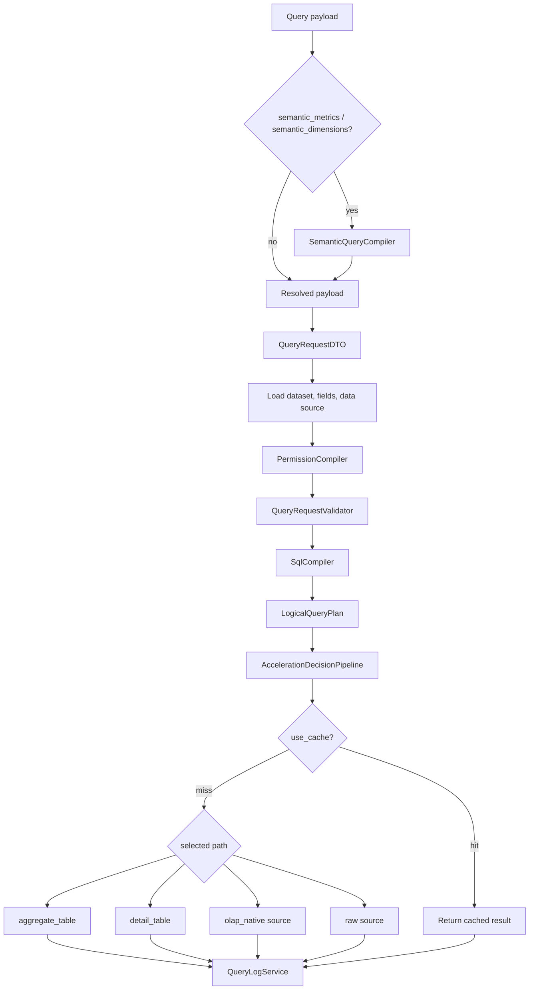

# BI Query Core

本文档说明 BI 查询内核的统一执行链路，覆盖 QueryOrchestrator、LogicalQueryPlan、语义层编译、数据权限编译、加速路由、缓存 key、query_logs 和 debug API。

最后核对日期：2026-06-24。

## 1. 总体职责

查询入口统一收敛到 `App\Modules\Query\Services\QueryOrchestrator`：

- `POST /api/query/execute`：API 直接查询。
- 图表数据：`ChartDataService` 通过 orchestrator 执行。
- 仪表盘数据：`DashboardDataService` 经图表数据服务复用统一链路。
- 数据集预览：`DatasetPreviewService` 通过 `raw_fields` 走统一查询链路。
- Debug API：通过 orchestrator 返回计划、权限、加速决策、SQL 和缓存 key。

`QueryService` 保留真实执行职责，负责缓存读写、加速执行、原始数据源执行和 query_logs 写入。

## 2. 执行流程



关键顺序不可交换：

1. 语义层先编译为物理查询 payload，并带出指标版本。
2. 数据权限先编译并合并到逻辑计划。
3. SQL 编译用于真实执行和查询 hash。
4. LogicalQueryPlan 用于加速决策、plan hash、debug 输出。
5. 缓存 key 使用权限 hash、指标版本 hash、加速模式和数据源信息。

## 3. QueryContext

Debug 链路会返回 `QueryContext`：

```text
user_id
request_source
dataset_id
chart_id
dashboard_id
data_source_id
data_source_type
query_mode
semantic_layer_used
cache_enabled
acceleration_enabled
permission_enabled
debug_enabled
```

当前 `request_source` 主要包括：

```text
api
chart
chart_preview
dashboard
dataset_preview
query_debug
query_explain
permission_debug
acceleration_debug
```

当前 `query_mode`：

```text
raw_field        直接物理字段、普通维度指标、数据集预览
semantic_metric 语义层指标/维度编译后的查询
```

## 4. LogicalQueryPlan

`App\Modules\Acceleration\DTO\LogicalQueryPlan` 是不绑定具体数据库方言的逻辑计划，核心字段包括：

```text
dataset_id
data_source_id
data_source_type
request_source
query_mode
table_refs
select_dimensions
select_metrics
raw_fields
filters
permission_filters
sorts
limit
offset
group_by
semantic_layer_used
required_fields
column_visibility.hidden_fields
column_visibility.masked_fields
permission_hash
```

`hash()` 基于上述结构生成 `logical_plan_hash`。由于权限过滤、字段可见性、数据源、查询模式都会进入计划，权限或语义版本变化不会复用错误计划。

## 5. 语义指标编译

语义层查询由 `SemanticQueryCompiler` 处理：

1. 接收 `semantic_metrics` 和 `semantic_dimensions`。
2. 校验指标、维度属于同一 dataset 且状态可用。
3. 将语义指标转为普通 `metrics[]`，语义维度转为普通 `dimensions[]`。
4. 输出 `metric_versions_json` 和 `metric_versions_hash`。
5. 查询结果返回前按语义指标 alias / code 做一次结果适配。

缓存 key 包含 `metric_versions_hash`。指标版本变更后，旧缓存自然失效。

## 6. 数据权限编译

`PermissionCompiler` 统一输出 `PermissionCompileResult`：

```text
resource_allowed
denied_reason
row_filters
column_rules
masked_fields
hidden_fields
permission_hash
required_permission_fields
```

权限处理规则：

- 资源权限先判定 dataset / chart / dashboard / metric 是否可访问。
- 行级权限转为 `FilterDTO`，进入 SQL where 条件和 LogicalQueryPlan。
- 列级 hidden / masked 字段会在查询校验阶段被拒绝。
- 权限规则创建或更新时，`field_name` 必须存在于 dataset 字段中。
- `permission_hash` 基于用户主体、资源上下文、行级规则和列级规则生成。

数据权限必须在加速路由前合并。预聚合表是否可用取决于过滤字段是否被聚合表覆盖；如果权限过滤字段不在聚合表维度里，预聚合不能命中。

## 7. 加速路由决策

`AccelerationDecisionPipeline` 统一判断加速路径：

```text
OLAP native source
    -> olap_native

普通数据源
    -> aggregate_table
    -> detail_table
    -> raw
```

普通数据源优先预聚合：

- `aggregate_table` 命中后直接执行聚合表。
- 聚合执行失败时，懒加载 detail 决策并尝试 ClickHouse 明细表。
- detail 执行失败且允许 fallback 时，回退原始数据源。
- raw fields 查询不走 aggregate / detail 加速。

StarRocks、Doris、ClickHouse 作为数据源时被视为 `olap_native`：

```text
acceleration_mode = olap_native
acceleration_hit = false
engine_type = starrocks / doris / clickhouse
data_source_type = starrocks / doris / clickhouse
```

OLAP 原生数据源直连失败时不回退 MySQL；除非以后 dataset 显式配置 fallback_source。

## 8. SQL 方言生成

`SqlCompiler` 负责普通源查询 SQL，基于数据源类型选择 dialect：

- MySQL 使用 MySQL quoting 和日期表达式。
- StarRocks / Doris 走 MySQL 协议兼容驱动，但保留 `engine_type` 和 `data_source_type`。
- ClickHouse 加速明细表由 `ClickHouseSqlGenerator` 生成。
- 预聚合表由 `AggregateSqlGenerator` 生成。

所有字段必须先通过 dataset 字段白名单和权限校验；SQL driver 仅允许 SELECT。

## 9. 缓存 Key

`CacheKeyBuilder` 当前格式：

```text
bi:query:{scope}:{mode}:{permission}:{semantic}:{source}:{acceleration}:{query_hash}
bi:chart:{chart_id}:query:{scope}:{mode}:{permission}:{semantic}:{source}:{acceleration}:{query_hash}
```

主要分段：

```text
scope        user:{user_id} 或 guest
mode         mode:{query_mode}
permission   perm:{permission_hash|none}
semantic     semantic:{metric_versions_hash|none}
source       engine:{engine_type}:ds:{data_source_id}
acceleration acc:{raw|detail_table|aggregate_table|olap_native}:...
query_hash   SQL、bindings、dataset、data source、dialect hash
```

该设计保证：

- 不同用户或不同权限 hash 不共享错误缓存。
- 指标版本变更后缓存失效。
- 加速 profile / aggregate 版本变更后缓存失效。
- StarRocks / Doris 原生查询和 ClickHouse 加速查询不会混用缓存。

## 10. query_logs 标准字段

查询日志由 `QueryLogService` 写入，关键字段：

```text
request_source
query_mode
query_hash
logical_plan_hash
permission_hash
permission_applied
cached
acceleration_hit
acceleration_mode
acceleration_profile_id
aggregate_definition_id
engine_type
data_source_type
fallback_used
fallback_reason
raw_duration_ms
source_duration_ms
accelerated_duration_ms
total_duration_ms
semantic_layer_used
semantic_metrics_json
semantic_dimensions_json
metric_versions_json
```

说明：

- `cached` 对应缓存命中状态。
- 原始数据源执行写入 `raw_duration_ms` 和 `total_duration_ms`。
- 加速执行写入 `accelerated_duration_ms` 和 `total_duration_ms`。
- StarRocks / Doris 原生查询写入 `acceleration_mode=olap_native`，但 `acceleration_hit=false`。

## 11. Debug API

Debug API 都需要管理员角色 `code=admin`。

| 方法 | 路径 | 说明 |
| --- | --- | --- |
| POST | `/api/query/debug` | 返回 QueryContext、语义编译结果、权限编译结果、LogicalQueryPlan、加速决策、SQL、bindings、query hash、cache key |
| POST | `/api/query/explain` | 返回非执行态查询解释信息，默认 `execute=false` |
| POST | `/api/permissions/debug-query` | 返回权限编译结果 |
| POST | `/api/metrics/compile-debug` | 返回语义指标编译、依赖和版本信息 |
| POST | `/api/acceleration/debug-decision` | 返回候选加速路径、选中模式、决策详情和 logical plan hash |

`/api/query/debug` 支持 `dataset_id` 查询，也支持 `chart_id`，chart 模式会基于图表配置构建查询 payload。

## 12. 当前边界

- `POST /api/query/explain` 当前返回编译后的解释信息，不执行数据库原生 `EXPLAIN`；数据集和图表已有独立 explain 接口。
- `masked` 字段当前按隐藏字段处理，不在结果中做脱敏替换。
- 预聚合命中依赖维度、指标、过滤字段和权限字段覆盖；不做语义等价推导。
- 自定义 SQL 数据集未纳入本阶段。
- OLAP 原生数据源不做跨源 fallback。

## 13. 后续优化方向

- 将 `QueryResult` 和 `QueryExecutionMetadata` 接入所有响应格式，减少数组上下文传递。
- 对 debug explain 增加可选数据库原生 EXPLAIN 执行。
- 为权限 hash 增加显式规则版本号，降低 hash 计算和排查成本。
- 增加 SQL AST 级字段血缘和更细粒度的缓存失效。
- 为 masked 字段实现结果级脱敏策略。
