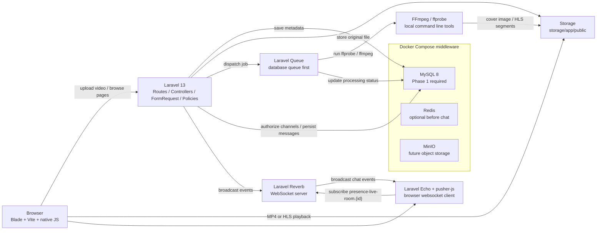
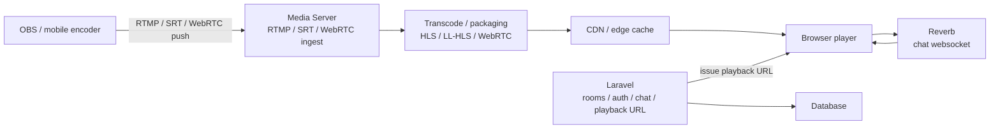

# Laravel 13 视频播放 + 直播房间 + 在线聊天学习项目计划

本文档基于当前 `13-live` 分支生成。目标不是一次做成生产级系统，而是分阶段做出一套可运行、可阅读、可学习、可逐步扩展的 Laravel 13 示例项目。

## 0. 当前项目体检

### Git 与项目结构

- 当前分支：`13-live`
- 当前 HEAD：`92e7f847 Update CHANGELOG`
- 当前跟踪远端：`origin/13-live`
- 当前工作区：生成本文档前是干净状态
- 项目形态：Laravel 13 极简骨架
- 已有主要文件：
  - `routes/web.php`
  - `bootstrap/app.php`
  - `app/Models/User.php`
  - `database/migrations/0001_01_01_000000_create_users_table.php`
  - `database/migrations/0001_01_01_000001_create_cache_table.php`
  - `database/migrations/0001_01_01_000002_create_jobs_table.php`
  - `resources/views/welcome.blade.php`
  - `resources/css/app.css`
  - `resources/js/app.js`
  - `vite.config.js`

### 版本与依赖

- Laravel：`13.9.0`
- PHP 运行时：`8.4.20`
- Composer：`2.9.7`
- Node：`25.9.0`
- npm：`11.12.1`
- `composer.json` 要求：
  - `php: ^8.3`
  - `laravel/framework: ^13.8`
  - `laravel/tinker: ^3.0`
- `package.json` 已有：
  - `vite`
  - `laravel-vite-plugin`
  - `tailwindcss`
  - `@tailwindcss/vite`
  - `concurrently`

### 当前注意点

- 当前仓库没有 `composer.lock` 和 `package-lock.json`，但本地有 `vendor/` 和 `node_modules/`。后续新增依赖后建议提交 lock 文件，保证学习项目可复现。
- 当前 `.env` 使用 `DB_CONNECTION=mysql`、`QUEUE_CONNECTION=sync`，但本地 MySQL 连接失败，说明中间件尚未启动。后续优先通过 Docker Compose 启动 MySQL，而不是要求本机安装并运行 MySQL Server。
- 使用 SQLite 覆盖环境变量测试迁移状态时，基础迁移已运行；SQLite 可作为临时验证手段，但不作为本学习项目 Phase 1 的主数据库：
  - `users`
  - `cache`
  - `jobs`
- `.env.example` 默认是 SQLite + database queue；后续 Phase 0 会补充 Docker MySQL 的本地开发配置说明：
  - `DB_CONNECTION=sqlite`
  - `QUEUE_CONNECTION=database`
  - `SESSION_DRIVER=database`
  - `CACHE_STORE=database`

### 本机软件检查

- 已安装 `ffmpeg`：`/opt/homebrew/bin/ffmpeg`
- 已安装 `ffprobe`：`/opt/homebrew/bin/ffprobe`
- 已安装 MySQL CLI：`/opt/homebrew/opt/mysql@8.0/bin/mysql`
- 未检测到 `redis-server` 命令
- 本机已有 Docker 环境，后续 MySQL、Redis、MinIO 等中间件优先通过 Docker Compose 运行；Laravel PHP 应用本身暂时仍在本机运行。
- PHP 扩展可用：
  - `fileinfo`
  - `gd`
  - `pdo_mysql`
  - `pdo_sqlite`
  - `redis`

## 1. 总体架构



### 学习边界

- Laravel 负责用户、视频元数据、上传、任务调度、房间、权限、聊天消息和播放地址管理。
- FFmpeg 负责本地视频分析、截图和 HLS 转码。
- Reverb 负责 WebSocket 消息通道。
- 浏览器负责播放 MP4/HLS 和渲染实时聊天。
- MySQL、Redis、后续可能用到的 MinIO 等中间件优先用 Docker Compose 启动；Laravel 应用本身暂时仍在本机通过 `php artisan serve` 或 `composer run dev` 运行。
- Phase 1 只要求 MySQL；Redis 可以预留或手动启动，但不作为 VOD 上传播放的依赖。
- 本阶段不做 OBS 推流、CDN、分布式转码、DRM、复杂审核系统。

## 2. 数据库表设计

### `videos`

用于点播视频和转码状态。

| 字段 | 类型 | 说明 |
| --- | --- | --- |
| `id` | bigint | 主键 |
| `user_id` | foreignId nullable | 上传用户，学习阶段可为空或关联当前用户 |
| `title` | string | 视频标题 |
| `description` | text nullable | 视频简介 |
| `original_disk` | string | 原文件磁盘，默认 `public` |
| `original_path` | string | 原 MP4 路径 |
| `original_filename` | string nullable | 上传时文件名 |
| `mime_type` | string nullable | MIME 类型 |
| `size_bytes` | unsignedBigInteger nullable | 文件大小 |
| `duration_seconds` | unsignedInteger nullable | ffprobe 获取的视频时长 |
| `width` | unsignedInteger nullable | 视频宽度 |
| `height` | unsignedInteger nullable | 视频高度 |
| `video_codec` | string nullable | 视频编码，例如 `h264` |
| `audio_codec` | string nullable | 音频编码，例如 `aac` |
| `cover_path` | string nullable | FFmpeg 截图封面 |
| `thumbnail_path` | string nullable | Phase 2 生成的缩略图路径 |
| `hls_path` | string nullable | HLS 目录 |
| `hls_playlist_path` | string nullable | `index.m3u8` 或 `master.m3u8` |
| `hls_status` | string | `pending` / `processing` / `ready` / `failed` |
| `hls_error_message` | text nullable | HLS 生成失败原因 |
| `metadata` | json nullable | ffprobe 原始 JSON 信息 |
| `status` | string | `pending` / `processing` / `ready` / `failed` |
| `failure_reason` | text nullable | 处理失败原因 |
| `error_message` | text nullable | Phase 2 处理失败错误信息 |
| `processed_at` | timestamp nullable | 处理完成时间 |
| `timestamps` | timestamps | 创建/更新时间 |

建议索引：

- `status`
- `user_id`
- `created_at`

### `live_rooms`

用于直播房间和伪直播/点播房间。

| 字段 | 类型 | 说明 |
| --- | --- | --- |
| `id` | bigint | 主键 |
| `owner_id` | foreignId nullable | 房主 |
| `video_id` | foreignId nullable | 关联本地视频，可用于学习阶段的“房间播放某个视频” |
| `title` | string | 房间标题 |
| `description` | text nullable | 房间简介 |
| `status` | string | `scheduled` / `live` / `ended` |
| `playback_type` | string | `video` / `mp4_url` / `hls_url` |
| `playback_url` | string nullable | 外部播放地址预留 |
| `scheduled_at` | timestamp nullable | 计划开始时间 |
| `started_at` | timestamp nullable | 实际开始时间 |
| `ended_at` | timestamp nullable | 结束时间 |
| `timestamps` | timestamps | 创建/更新时间 |

建议索引：

- `status`
- `owner_id`
- `video_id`
- `scheduled_at`

### `live_room_messages`

用于房间聊天消息入库。

| 字段 | 类型 | 说明 |
| --- | --- | --- |
| `id` | bigint | 主键 |
| `live_room_id` | foreignId | 所属房间 |
| `user_id` | foreignId nullable | 发送用户；学习阶段可先要求登录 |
| `body` | text | 文本消息 |
| `type` | string | `message` / `system`，默认 `message` |
| `timestamps` | timestamps | 创建/更新时间 |

建议索引：

- `live_room_id, created_at`
- `user_id`

### 暂不建表但预留的概念

- `live_room_members`：如果以后需要持久化观看时长、最后在线时间，再建表。当前在线人数优先用 Reverb presence channel 提供。
- `video_renditions`：如果以后做多码率 HLS，再拆出清晰度表。学习阶段先把 HLS 输出路径放在 `videos` 表里。

## 3. 模块拆分

### VOD 模块

职责：

- 上传 MP4
- 保存原始文件
- 记录视频元数据
- 列表页、上传页、详情页
- MP4 直接播放

主要路径：

- `app/Models/Video.php`
- `app/Http/Controllers/VideoController.php`
- `app/Http/Requests/StoreVideoRequest.php`
- `resources/views/layouts/app.blade.php`
- `resources/views/videos/index.blade.php`
- `resources/views/videos/create.blade.php`
- `resources/views/videos/show.blade.php`
- `routes/web.php`

### 视频处理模块

职责：

- 使用 Laravel Queue 异步处理视频
- 使用 `ffprobe` 读取时长、分辨率、编码
- 使用 `ffmpeg` 生成封面
- 保存处理状态

主要路径：

- `app/Jobs/ProcessUploadedVideo.php`
- `app/Support/Video/VideoProbe.php`
- `app/Support/Video/VideoThumbnailer.php`
- `config/video.php`
- `docs/live-video-chat/01-vod-and-processing.md`

说明：

- 初期不引入 `php-ffmpeg/php-ffmpeg`，直接用 Laravel 已带的 `Symfony\Component\Process\Process` 调命令，更适合学习 FFmpeg 参数。
- 如果后续希望面向对象封装 FFmpeg，可以再评估引入 Composer 包。

### HLS 模块

职责：

- 使用 FFmpeg 将 MP4 转为 HLS
- 生成 `index.m3u8`
- 前端用 `hls.js` 播放
- Safari 原生 HLS 和 MP4 fallback

主要路径：

- `app/Jobs/TranscodeVideoToHls.php`，或合并进 `ProcessUploadedVideo.php`
- `app/Support/Video/HlsTranscoder.php`
- `resources/js/video-player.js`
- `resources/views/videos/show.blade.php`
- `docs/live-video-chat/02-hls.md`

需要 npm 包：

- `hls.js`：Chrome、Edge、Firefox 需要它播放 HLS；Safari 可原生播放 `.m3u8`。

### 直播房间模块

职责：

- 创建房间
- 房间状态管理
- 房间关联本地视频或外部播放地址
- 房间观看页

主要路径：

- `app/Models/LiveRoom.php`
- `app/Http/Controllers/LiveRoomController.php`
- `app/Http/Requests/StoreLiveRoomRequest.php`
- `app/Http/Requests/UpdateLiveRoomStatusRequest.php`
- `app/Policies/LiveRoomPolicy.php`
- `resources/views/live-rooms/index.blade.php`
- `resources/views/live-rooms/create.blade.php`
- `resources/views/live-rooms/show.blade.php`
- `docs/live-video-chat/03-live-rooms.md`

### 在线聊天模块

职责：

- 安装 Laravel Reverb
- 配置 Broadcasting
- 使用 Laravel Echo 订阅 presence channel
- 房间聊天消息入库
- 新消息广播给同房间用户
- 显示在线人数
- 显示进入/离开提示，先做能跑版本，复杂体验写 TODO

主要路径：

- `routes/channels.php`
- `app/Models/LiveRoomMessage.php`
- `app/Events/LiveRoomMessageSent.php`
- `app/Http/Controllers/LiveRoomMessageController.php`
- `app/Http/Requests/StoreLiveRoomMessageRequest.php`
- `resources/js/live-chat.js`
- `resources/views/live-rooms/show.blade.php`
- `config/broadcasting.php`
- `config/reverb.php`
- `docs/live-video-chat/04-reverb-chat.md`

需要 Composer / npm 包：

- Composer：`laravel/reverb`，提供本地 WebSocket 服务。
- npm：`laravel-echo`、`pusher-js`，浏览器端连接 Reverb 使用 Pusher 协议。

## 4. 分阶段计划

### Phase 0：整理本地开发基线

目标：Laravel 应用继续在本机运行，中间件通过 Docker Compose 启动。Phase 1 只强依赖 MySQL，Redis 先预留给后续队列、缓存和聊天阶段。

要修改的文件：

- `docker-compose.yml`
- `.env.example`
- `.env`，本地文件不提交
- `README.md`
- `docs/live-video-chat/00-project-plan.md`

建议 `.env`：

```dotenv
APP_URL=http://127.0.0.1:8000
DB_CONNECTION=mysql
DB_HOST=127.0.0.1
DB_PORT=33061
DB_DATABASE=laravel_live
DB_USERNAME=laravel
DB_PASSWORD=laravel
QUEUE_CONNECTION=database
FILESYSTEM_DISK=public
SESSION_DRIVER=database
CACHE_STORE=database
REDIS_CLIENT=phpredis
REDIS_HOST=127.0.0.1
REDIS_PASSWORD=null
REDIS_PORT=63791
```

启动命令：

```bash
docker compose up -d
docker compose ps
php artisan migrate
php artisan storage:link
composer run dev
```

验收方式：

- `docker compose ps` 显示 MySQL 和 Redis 容器运行中。
- `php artisan migrate:status` 可以正常显示迁移状态。
- `php artisan route:list` 可以正常运行。
- 访问 `http://127.0.0.1:8000` 能看到 Laravel 欢迎页。

### Phase 1：视频点播 VOD

目标：上传 MP4，保存原文件，数据库记录视频，详情页可播放 MP4。

要新增/修改的文件：

- `database/migrations/*_create_videos_table.php`
- `app/Models/Video.php`
- `app/Http/Requests/StoreVideoRequest.php`
- `app/Http/Controllers/VideoController.php`
- `routes/web.php`
- `resources/views/layouts/app.blade.php`
- `resources/views/videos/index.blade.php`
- `resources/views/videos/create.blade.php`
- `resources/views/videos/show.blade.php`
- `tests/Feature/VideoUploadTest.php`
- `docs/live-video-chat/01-vod.md`

启动命令：

```bash
php artisan migrate
php artisan storage:link
composer run dev
```

验收方式：

- 打开 `/videos` 能看到视频列表。
- 打开 `/videos/create` 能上传一个 MP4。
- 上传后 `storage/app/public/videos/originals` 下有原文件。
- `videos` 表有记录，状态为 `pending`。
- 打开 `/videos/{video}` 能使用 `<video controls>` 播放 MP4。

### Phase 2：视频处理

目标：用队列异步执行 `ffprobe` 和 `ffmpeg`，保存元数据、封面和处理状态。

要新增/修改的文件：

- `app/Jobs/ProcessUploadedVideo.php`
- `app/Support/Video/VideoProbe.php`
- `app/Support/Video/VideoThumbnailer.php`
- `config/video.php`
- `app/Models/Video.php`
- `app/Http/Controllers/VideoController.php`
- `resources/views/videos/show.blade.php`
- `tests/Feature/VideoProcessingTest.php`
- `docs/live-video-chat/02-video-processing.md`

启动命令：

```bash
php artisan queue:work --queue=default --tries=1 --timeout=0
php artisan serve
npm run dev
```

也可以先继续用项目自带脚本：

```bash
composer run dev
```

验收方式：

- 上传视频后，`videos.status` 从 `pending` 变成 `processing`，最终变为 `ready` 或 `failed`。
- `duration_seconds`、`width`、`height`、`video_codec`、`audio_codec` 被写入数据库。
- `cover_path` 有值，并且详情页能显示封面。
- 故意上传非视频文件或损坏视频时，状态变为 `failed` 并记录 `failure_reason`。

### Phase 3：HLS 播放

目标：把 MP4 转成 HLS，并在前端优先播放 HLS，MP4 保留 fallback。

需要新增依赖：

```bash
npm install hls.js
```

原因：非 Safari 浏览器通常不能原生播放 `.m3u8`，`hls.js` 可以通过 Media Source Extensions 播放 HLS。

要新增/修改的文件：

- `app/Support/Video/HlsTranscoder.php`
- `app/Jobs/ProcessUploadedVideo.php`，或拆出 `app/Jobs/TranscodeVideoToHls.php`
- `app/Models/Video.php`
- `resources/js/video-player.js`
- `resources/js/app.js`
- `resources/views/videos/show.blade.php`
- `tests/Feature/HlsPlaybackTest.php`
- `docs/live-video-chat/03-hls.md`

FFmpeg 示例命令：

```bash
ffmpeg -i input.mp4 \
  -codec:v libx264 -codec:a aac \
  -hls_time 6 \
  -hls_playlist_type vod \
  -hls_segment_filename "storage/app/public/videos/hls/{id}/segment_%03d.ts" \
  "storage/app/public/videos/hls/{id}/index.m3u8"
```

验收方式：

- 视频处理完成后，生成 `storage/app/public/videos/hls/{id}/index.m3u8`。
- 浏览器详情页优先加载 HLS。
- 浏览器不支持 HLS 或 HLS 文件不存在时，仍可播放原 MP4。
- Network 面板能看到 `.m3u8` 和 `.ts` 请求。

### Phase 4：直播房间

目标：创建房间，房间可关联一个本地视频或外部播放地址，用户可以进入房间观看。

要新增/修改的文件：

- `database/migrations/*_create_live_rooms_table.php`
- `app/Models/LiveRoom.php`
- `app/Http/Requests/StoreLiveRoomRequest.php`
- `app/Http/Requests/UpdateLiveRoomStatusRequest.php`
- `app/Http/Controllers/LiveRoomController.php`
- `app/Policies/LiveRoomPolicy.php`
- `routes/web.php`
- `resources/views/live-rooms/index.blade.php`
- `resources/views/live-rooms/create.blade.php`
- `resources/views/live-rooms/show.blade.php`
- `tests/Feature/LiveRoomTest.php`
- `docs/live-video-chat/04-live-rooms.md`

启动命令：

```bash
php artisan migrate
composer run dev
```

验收方式：

- `/live-rooms` 能显示房间列表。
- 可以创建 `scheduled` 房间。
- 可以把房间切到 `live` 或 `ended`。
- 房间可以选择一个 `video_id` 播放本地视频。
- 房间也可以填写 `playback_url`，为未来真实直播地址预留。

### Phase 5：在线聊天

目标：使用 Laravel Reverb + Broadcasting + Laravel Echo 实现房间实时聊天。

需要新增依赖：

```bash
php artisan install:broadcasting --reverb
npm install laravel-echo pusher-js
```

原因：

- `laravel/reverb` 提供本地 WebSocket 服务。
- `laravel-echo` 封装浏览器订阅频道逻辑。
- `pusher-js` 是 Echo 连接 Reverb 所需的浏览器协议客户端。

要新增/修改的文件：

- `routes/channels.php`
- `database/migrations/*_create_live_room_messages_table.php`
- `app/Models/LiveRoomMessage.php`
- `app/Events/LiveRoomMessageSent.php`
- `app/Http/Requests/StoreLiveRoomMessageRequest.php`
- `app/Http/Controllers/LiveRoomMessageController.php`
- `resources/js/bootstrap.js`，或在 `resources/js/app.js` 中初始化 Echo
- `resources/js/live-chat.js`
- `resources/views/live-rooms/show.blade.php`
- `tests/Feature/LiveRoomChatTest.php`
- `docs/live-video-chat/05-reverb-chat.md`

频道设计：

```php
presence-live-room.{roomId}
```

授权逻辑：

- 登录用户可以进入公开房间。
- 如果以后加入私有房间，再在 `routes/channels.php` 中检查权限。

启动命令：

```bash
php artisan reverb:start
php artisan queue:work --queue=default --tries=1 --timeout=0
php artisan serve
npm run dev
```

验收方式：

- 两个浏览器窗口打开同一个 `/live-rooms/{room}`。
- 任一窗口发送消息，另一个窗口实时收到。
- `live_room_messages` 表能看到消息记录。
- 页面能显示在线人数。
- 用户进入/离开 presence channel 时，页面能更新在线人数。
- 进入/离开提示如果当阶段不稳定，先写 TODO，不阻塞主流程。

### Phase 6：真实直播预留文档

目标：说明生产直播架构，明确 Laravel 不直接承载高并发音视频流。

要新增/修改的文件：

- `docs/live-video-chat/06-real-live-architecture.md`
- `docs/live-video-chat/README.md`

推荐架构：



说明要点：

- OBS 不推给 Laravel。
- Laravel 不处理大规模音视频流。
- Laravel 负责房间、权限、聊天、播放地址、回放记录和业务状态。
- 媒体服务器可选方案：SRS、Nginx RTMP、MediaMTX、Janus、LiveKit、mediasoup 等。
- 播放协议选择：
  - HLS：兼容性好，延迟较高。
  - LL-HLS：延迟更低，部署复杂度更高。
  - WebRTC：超低延迟，架构复杂度最高。

## 5. 每阶段启动命令总览

### 基础开发

```bash
composer install
npm install
docker compose up -d
docker compose ps
cp .env.example .env
php artisan key:generate
php artisan migrate
php artisan storage:link
composer run dev
```

### 队列处理

```bash
php artisan queue:work --queue=default --tries=1 --timeout=0
```

### Vite

```bash
npm run dev
```

### Laravel HTTP

```bash
php artisan serve
```

### Reverb

```bash
php artisan reverb:start
```

### 测试

```bash
php artisan test
```

## 6. 需要提前安装的软件

### 必需

- PHP 8.3+，当前本机是 8.4.20。
- Composer，当前本机是 2.9.7。
- Node + npm，当前本机是 Node 25.9.0 / npm 11.12.1。
- FFmpeg + ffprobe，当前本机已安装。
- Docker Desktop 或兼容 Docker 环境，用于运行 MySQL、Redis、后续 MinIO 等中间件。

### 推荐

- MySQL 8：通过 Docker Compose 运行，Phase 1 主数据库。
- Redis 7：通过 Docker Compose 预留，Phase 1 不强依赖，后续队列、缓存、限流、广播扩展会用到。
- SQLite：当前 PHP 已有 `pdo_sqlite`，自动化测试可继续使用 SQLite in-memory，避免污染本地 Docker MySQL。

### 可选安装命令，macOS Homebrew

```bash
brew install ffmpeg
```

## 7. 风险点与处理策略

### 上传文件大小限制

风险：

- PHP 默认 `upload_max_filesize`、`post_max_size` 可能太小。

处理：

- 文档中说明修改 `php.ini`。
- 学习阶段限制上传 100MB 左右的短视频。

### FFmpeg 任务耗时

风险：

- 转码大文件耗时长，HTTP 请求超时。

处理：

- 所有视频处理都进入 Laravel Queue。
- 学习阶段使用 `database` queue。
- 后续可切 Redis queue。

### HLS 文件访问

风险：

- HLS 生成在 `storage/app/public`，但未执行 `storage:link` 会 404。
- `.m3u8` 和 `.ts` MIME 类型在本地 PHP server 下通常可用，生产 Nginx 需要配置。

处理：

- Phase 0 验收必须包含 `php artisan storage:link`。
- 生产部署文档补充 Nginx MIME 配置。

### Reverb / Echo 配置

风险：

- `.env` 中 `BROADCAST_CONNECTION`、Reverb host、port、scheme 配错时，浏览器无法连接。

处理：

- 先使用官方 `php artisan install:broadcasting --reverb` 生成配置。
- 在文档中记录浏览器控制台和 Network WebSocket 检查方法。

### Presence channel 认证

风险：

- 未登录用户无法进入 private/presence channel。

处理：

- 聊天阶段优先要求登录。
- 如果要支持游客，先做普通房间观看，聊天后续再做匿名身份方案。

### 真实直播误区

风险：

- 误以为 Laravel 可以直接接收 OBS 推流并分发给大量观众。

处理：

- 在真实直播文档中明确：Laravel 不直接承载高并发音视频流。
- Laravel 只管理业务状态、权限、聊天和播放地址。

## 8. 建议的学习顺序

1. 先用 Docker Compose 跑通 MySQL，Laravel 应用本机运行，再确认 Storage 和 Blade 页面。
2. 上传 MP4 并直接播放。
3. 用队列调用 `ffprobe`，理解媒体元数据。
4. 用 FFmpeg 生成封面，理解后台任务状态流转。
5. 转 HLS，用 `hls.js` 播放。
6. 做直播房间，把“直播”先理解成一个播放容器。
7. 加 Reverb 聊天，理解广播、频道授权、presence 在线人数。
8. 最后写真实直播架构文档，区分业务系统和媒体系统。

## 9. 下一步等待确认

确认本计划后，建议从 Phase 0 开始：

- 新增 Docker Compose 中间件配置，并调整本地 `.env` 为 Docker MySQL + database queue。
- 创建 VOD 基础表、模型、控制器和 Blade 页面。
- 只实现 MP4 上传和播放，不碰 FFmpeg。

等 Phase 1 验收通过，再进入队列和 FFmpeg。
