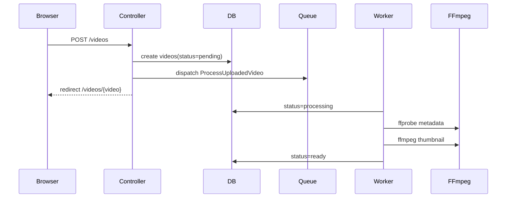

# Phase 2：FFmpeg 队列处理

本阶段实现上传后的异步视频处理：HTTP 请求只负责保存原文件和创建 `videos` 记录，真正的视频分析和缩略图生成交给 Laravel Queue Job。

## 1. 本阶段实现了什么

- 新增 `ProcessUploadedVideo` Job。
- 上传成功后派发 Job，不在 HTTP 请求中直接处理视频。
- Job 将 `videos.status` 更新为 `processing`。
- Job 使用 `ffprobe` 读取视频元数据：
  - 时长
  - 宽度
  - 高度
  - 视频编码
  - 音频编码
  - 完整 JSON metadata
- Job 使用 `ffmpeg` 生成缩略图：
  - `storage/app/public/videos/thumbnails/{video_id}/thumbnail.jpg`
- Job 成功后将状态更新为 `ready`。
- Job 失败后将状态更新为 `failed`，并把错误写入 `error_message`。

## 2. 为什么视频处理要用队列

视频处理通常比较慢，而且耗 CPU：

- `ffprobe` 需要打开媒体文件读取流信息。
- `ffmpeg` 生成封面或转码可能需要几秒到几分钟。
- 大文件处理时，HTTP 请求容易超时。
- 浏览器上传完成后，用户应该尽快看到“已上传，处理中”的反馈。

因此本项目把耗时操作放进 Laravel Queue：



## 3. Laravel Queue 如何启动

本项目 Phase 2 仍使用 `database` queue。确认 `.env`：

```dotenv
QUEUE_CONNECTION=database
```

启动队列 worker：

```bash
php artisan queue:work --queue=default --tries=1 --timeout=0
```

如果你使用项目自带开发脚本：

```bash
composer run dev
```

它会同时启动：

- `php artisan serve`
- `php artisan queue:listen --tries=1 --timeout=0`
- `php artisan pail --timeout=0`
- `npm run dev`

学习阶段建议先单独开一个终端运行 `queue:work`，这样更容易观察 Job 输出和失败原因。

## 4. ffprobe 和 ffmpeg 分别做什么

### ffprobe

`ffprobe` 只读取媒体信息，不生成新文件。

本项目使用类似命令：

```bash
ffprobe -v error \
  -print_format json \
  -show_format \
  -show_streams \
  /absolute/path/to/video.mp4
```

写入数据库的字段：

- `duration_seconds`
- `width`
- `height`
- `video_codec`
- `audio_codec`
- `metadata`

### ffmpeg

`ffmpeg` 负责生成缩略图。

本项目使用类似命令：

```bash
ffmpeg -y \
  -ss 00:00:01 \
  -i /absolute/path/to/video.mp4 \
  -frames:v 1 \
  -q:v 2 \
  /absolute/path/to/thumbnail.jpg
```

写入数据库的字段：

- `thumbnail_path`
- `cover_path`

`cover_path` 是 Phase 1 计划中预留的封面字段；`thumbnail_path` 是 Phase 2 明确新增的缩略图字段。当前两者保存同一个路径，方便后续阶段逐步调整。

## 5. 配置文件

新增 `config/video.php`：

```php
return [
    'ffmpeg_path' => env('FFMPEG_PATH', 'ffmpeg'),
    'ffprobe_path' => env('FFPROBE_PATH', 'ffprobe'),
    'thumbnail_time' => env('VIDEO_THUMBNAIL_TIME', '00:00:01'),
    'process_timeout' => (int) env('VIDEO_PROCESS_TIMEOUT', 300),
];
```

`.env.example` 中也增加了推荐配置：

```dotenv
FFMPEG_PATH=ffmpeg
FFPROBE_PATH=ffprobe
VIDEO_THUMBNAIL_TIME=00:00:01
VIDEO_PROCESS_TIMEOUT=300
```

如果你的 FFmpeg 不在 PATH 中，可以写绝对路径：

```dotenv
FFMPEG_PATH=/opt/homebrew/bin/ffmpeg
FFPROBE_PATH=/opt/homebrew/bin/ffprobe
```

修改 `.env` 后，建议清理配置缓存：

```bash
php artisan config:clear
```

## 6. 数据库字段

新增迁移添加：

| 字段 | 类型 | 说明 |
| --- | --- | --- |
| `thumbnail_path` | string nullable | FFmpeg 生成的缩略图 |
| `metadata` | json nullable | ffprobe 原始 JSON 信息 |
| `error_message` | text nullable | 处理失败时的错误信息 |

复用 Phase 1 已有字段：

- `duration_seconds`
- `width`
- `height`
- `video_codec`
- `audio_codec`
- `cover_path`
- `status`
- `failure_reason`
- `processed_at`

## 7. 失败重试怎么处理

Job 内部会先把状态更新为 `processing`。

如果处理失败：

- `status = failed`
- `error_message = 异常信息`
- `failure_reason = 异常信息`
- Job 重新抛出异常，让 Laravel Queue 记录失败并按 worker 的 `--tries` 策略处理。

学习阶段建议：

```bash
php artisan queue:work --queue=default --tries=1 --timeout=0
```

这样失败会直接暴露，方便排查。

后续可以尝试：

```bash
php artisan queue:work --queue=default --tries=3 --backoff=10
```

常用失败任务命令：

```bash
php artisan queue:failed
php artisan queue:retry all
php artisan queue:forget {failed_job_id}
php artisan queue:flush
```

## 8. 如何确认 Job 执行成功

1. 上传视频后进入详情页。
2. 初始状态通常是 `pending` 或 `processing`。
3. 启动 worker：

```bash
php artisan queue:work --queue=default --tries=1 --timeout=0
```

4. 刷新详情页，确认：

- `status` 变为 `ready`
- 显示 `Duration`
- 显示 `Resolution`
- 显示 `Codecs`
- 显示 `Thumbnail path`
- 页面上方显示缩略图

也可以进数据库查看：

```sql
select id, status, duration_seconds, width, height, video_codec, audio_codec, thumbnail_path, error_message
from videos
order by id desc;
```

确认文件存在：

```bash
find storage/app/public/videos/thumbnails -type f
```

## 9. 常见错误排查

### `ffprobe failed`

可能原因：

- `ffprobe` 没安装。
- `.env` 中 `FFPROBE_PATH` 写错。
- 上传文件不是有效视频。
- worker 没读到最新配置缓存。

排查：

```bash
which ffprobe
ffprobe -version
php artisan config:clear
```

### `ffmpeg failed`

可能原因：

- `ffmpeg` 没安装。
- `.env` 中 `FFMPEG_PATH` 写错。
- 视频太短，`VIDEO_THUMBNAIL_TIME` 截图时间点不合适。
- public disk 目录不可写。

排查：

```bash
which ffmpeg
ffmpeg -version
ls -ld storage/app/public
```

可以把截图时间改成视频开头：

```dotenv
VIDEO_THUMBNAIL_TIME=00:00:00
```

### 上传后一直是 `pending`

通常是队列 worker 没启动。

启动：

```bash
php artisan queue:work --queue=default --tries=1 --timeout=0
```

检查 jobs 表：

```sql
select id, queue, attempts, reserved_at, available_at, created_at
from jobs
order by id desc;
```

### 状态变成 `failed`

先看页面详情里的错误信息，再看日志：

```bash
tail -f storage/logs/laravel.log
```

也可以查看失败任务：

```bash
php artisan queue:failed
```

### 修改配置后 worker 没生效

长期运行的 worker 不会自动重载代码和配置。

处理：

```bash
php artisan queue:restart
php artisan config:clear
```

然后重新启动 worker。

## 10. 本地运行命令

启动 Docker 中间件：

```bash
docker compose up -d
docker compose ps
```

执行迁移：

```bash
php artisan migrate
```

启动 Laravel：

```bash
php artisan serve
```

启动 Vite：

```bash
npm run dev
```

启动队列：

```bash
php artisan queue:work --queue=default --tries=1 --timeout=0
```

运行测试：

```bash
php artisan test
```

## 11. 下一阶段

Phase 3 可以在当前基础上继续做 HLS：

- 使用 FFmpeg 生成 `.m3u8` 和 `.ts` 文件。
- 新增前端 HLS 播放逻辑。
- 保留原 MP4 播放作为 fallback。
