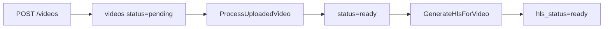

# Phase 3：HLS 播放

本阶段把上传后的视频继续通过 FFmpeg 生成 HLS 文件，并在视频详情页优先播放 HLS。原 MP4/MOV/WebM 播放仍保留为 fallback。

## 1. 本阶段实现了什么

- 新增 `GenerateHlsForVideo` Job。
- `ProcessUploadedVideo` 成功后派发 `GenerateHlsForVideo`。
- 使用 FFmpeg 生成单码率 HLS：
  - `index.m3u8`
  - `segment_000.ts`、`segment_001.ts` 等 TS 分片
- HLS 文件保存到 private disk：
  - `storage/app/private/videos/hls/{video_id}/`
- 新增受控 HLS 路由：
  - `GET /videos/{video}/hls/playlist`
  - `GET /videos/{video}/hls/segment/{filename}`
- 视频详情页优先使用 `hls.js` 播放 HLS。
- Safari 等原生支持 HLS 的浏览器直接加载 m3u8。
- HLS 未生成或播放失败时回退到原始文件播放。

## 2. 为什么拆成独立 Job

本阶段选择新增 `GenerateHlsForVideo`，而不是合并进 `ProcessUploadedVideo`。

原因：

- `ProcessUploadedVideo` 负责媒体探测和缩略图，是 Phase 2 的学习边界。
- `GenerateHlsForVideo` 负责 HLS 打包，是 Phase 3 的学习边界。
- HLS 失败时，可以只重试 HLS，不必重复跑 ffprobe 和缩略图。
- 后续扩展多码率时，HLS Job 会变复杂，独立 Job 更容易阅读。

当前流程：



## 3. 什么是 HLS

HLS，全称 HTTP Live Streaming，是 Apple 提出的基于 HTTP 的流媒体协议。

它的核心思想：

- 不让浏览器一次性加载完整视频文件。
- 把视频切成很多小分片。
- 用一个播放列表文件告诉播放器按什么顺序加载这些分片。
- 播放器一边下载分片，一边播放。

HLS 可以用于：

- 点播视频 VOD。
- 普通直播。
- 大多数浏览器和播放器生态。

## 4. m3u8 是什么

`.m3u8` 是 HLS 播放列表文件，本质是 UTF-8 文本。

本项目生成：

```text
index.m3u8
```

里面会有类似内容：

```text
#EXTM3U
#EXT-X-VERSION:3
#EXT-X-TARGETDURATION:6
#EXT-X-PLAYLIST-TYPE:VOD
#EXTINF:6.000000,
segment_000.ts
#EXT-X-ENDLIST
```

播放器先请求 m3u8，再根据里面列出的分片地址请求每个分片。

## 5. 分片文件是什么

分片文件是被 FFmpeg 切出来的小视频片段。

本项目先使用简单稳定的 TS 分片：

```text
segment_000.ts
segment_001.ts
segment_002.ts
```

TS 分片兼容性好，适合学习阶段。后续也可以扩展成 fMP4 分片：

```text
init.mp4
segment_000.m4s
segment_001.m4s
```

## 6. 为什么 HLS 适合点播和普通直播

适合点播：

- 浏览器不用一次性下载完整大文件。
- CDN 对 m3u8 和分片文件缓存友好。
- 后续可以做多码率自适应。

适合普通直播：

- 推流端不断生成新分片。
- 播放器不断刷新 m3u8。
- 延迟通常是数秒到十几秒，适合大多数普通直播。

不适合的场景：

- 强互动超低延迟直播，比如连麦、视频会议，这类更适合 WebRTC。

## 7. Laravel 负责什么

Laravel 在本阶段负责：

- 保存视频业务记录。
- 派发 HLS Job。
- 记录 `hls_status`。
- 保存 `hls_path` 和 `hls_playlist_path`。
- HLS 失败时保存 `hls_error_message`。
- 提供受控路由读取 private disk 中的 HLS 文件。
- 校验访问权限和文件名，避免路径穿越。

Laravel 不负责：

- 解析视频编码细节。
- 真正切片。
- 高并发分发视频流。

## 8. FFmpeg 负责什么

FFmpeg 负责把原始视频转换成 HLS。

本项目使用类似命令：

```bash
ffmpeg -y \
  -i input.mp4 \
  -codec:v libx264 \
  -codec:a aac \
  -preset veryfast \
  -f hls \
  -hls_time 6 \
  -hls_playlist_type vod \
  -hls_segment_filename "segment_%03d.ts" \
  index.m3u8
```

说明：

- `-codec:v libx264`：视频转为 H.264，兼容性好。
- `-codec:a aac`：音频转为 AAC，兼容性好。
- `-hls_time 6`：每个分片大约 6 秒。
- `-hls_playlist_type vod`：生成点播播放列表。
- `-hls_segment_filename`：设置分片命名格式。

当前不做多码率，先保持参数简单稳定。

## 9. 前端播放器如何加载 HLS

视频详情页会输出：

```html
<video data-hls-player data-hls-url="..." data-fallback-url="..."></video>
```

`resources/js/video-player.js` 负责：

1. 如果浏览器原生支持 HLS，直接把 video src 设置为 m3u8。
2. 如果浏览器不原生支持，但 `hls.js` 支持，就用 `hls.js` 加载 m3u8。
3. 如果 HLS 不可用或发生 fatal error，就回退到原始 MP4/MOV/WebM 地址。

安装的 npm 包：

```bash
npm install hls.js
```

## 10. HLS 路由和安全边界

HLS 文件放在 private disk：

```text
storage/app/private/videos/hls/{video_id}/
```

浏览器不能直接访问 private disk，所以通过 Laravel 路由读取：

| Method | URI | 说明 |
| --- | --- | --- |
| GET | `/videos/{video}/hls/playlist` | 返回 m3u8 |
| GET | `/videos/{video}/hls/segment/{filename}` | 返回 TS/fMP4 分片 |

安全处理：

- 只有 `hls_status=ready` 且文件存在才返回。
- 如果 `videos.user_id` 不为空，只允许该用户访问。
- `filename` 只能包含字母、数字、点、下划线和中划线。
- 拒绝 `..`。
- 只允许读取当前 `video_id` 对应目录：`videos/hls/{video_id}`。
- playlist 响应时会把 `segment_000.ts` 改写成受控 segment 路由。

## 11. 数据库字段

新增：

| 字段 | 说明 |
| --- | --- |
| `hls_status` | `pending` / `processing` / `ready` / `failed` |
| `hls_error_message` | HLS 生成失败原因 |

复用已有：

| 字段 | 说明 |
| --- | --- |
| `hls_path` | HLS 目录，例如 `videos/hls/1` |
| `hls_playlist_path` | HLS playlist，例如 `videos/hls/1/index.m3u8` |

## 12. 如何启动

执行迁移：

```bash
php artisan migrate
```

启动 Laravel：

```bash
php artisan serve
```

启动 Vite：

```bash
npm run dev
```

启动队列：

```bash
php artisan queue:work --queue=default --tries=1 --timeout=0
```

也可以用：

```bash
composer run dev
```

## 13. 如何确认 HLS 成功

上传视频后，等待队列处理。

详情页确认：

- `Status` 为 `ready`
- `HLS status` 为 `ready`
- 页面提示 HLS is ready
- Network 面板能看到 playlist 和 segment 请求

命令行确认：

```bash
find storage/app/private/videos/hls -type f
```

数据库确认：

```sql
select id, status, hls_status, hls_path, hls_playlist_path, hls_error_message
from videos
order by id desc;
```

## 14. 常见错误

### 一直是 `hls_status=pending`

通常是 `ProcessUploadedVideo` 没执行或没成功。

先确认队列启动：

```bash
php artisan queue:work --queue=default --tries=1 --timeout=0
```

再看 `status` 是否为 `ready`。

### `hls_status=failed`

看详情页的 `HLS error`，或查看日志：

```bash
tail -f storage/logs/laravel.log
```

常见原因：

- `ffmpeg` 路径不对。
- 输入文件不是有效视频。
- FFmpeg 不支持当前编码。
- private storage 目录不可写。

### playlist 404

检查：

- `hls_status` 是否为 `ready`。
- `storage/app/private/videos/hls/{video_id}/index.m3u8` 是否存在。
- `hls_path` 是否是 `videos/hls/{video_id}`。

### segment 404

检查 playlist 里列出的分片是否存在：

```bash
cat storage/app/private/videos/hls/{video_id}/index.m3u8
ls storage/app/private/videos/hls/{video_id}
```

## 15. 如何扩展多码率

当前是单码率 HLS。后续可以扩展为：

- 480p
- 720p
- 1080p

思路：

1. 为每个清晰度生成独立目录：

```text
videos/hls/{video_id}/480p/index.m3u8
videos/hls/{video_id}/720p/index.m3u8
videos/hls/{video_id}/1080p/index.m3u8
```

2. 生成 master playlist：

```text
videos/hls/{video_id}/master.m3u8
```

3. master playlist 中写入每个清晰度的带宽和分辨率：

```text
#EXT-X-STREAM-INF:BANDWIDTH=1200000,RESOLUTION=854x480
480p/index.m3u8
#EXT-X-STREAM-INF:BANDWIDTH=2800000,RESOLUTION=1280x720
720p/index.m3u8
#EXT-X-STREAM-INF:BANDWIDTH=5000000,RESOLUTION=1920x1080
1080p/index.m3u8
```

4. 前端仍加载 master m3u8，由播放器自动根据网络状况选择清晰度。

学习阶段先不做多码率，避免一次引入过多 FFmpeg 参数。
