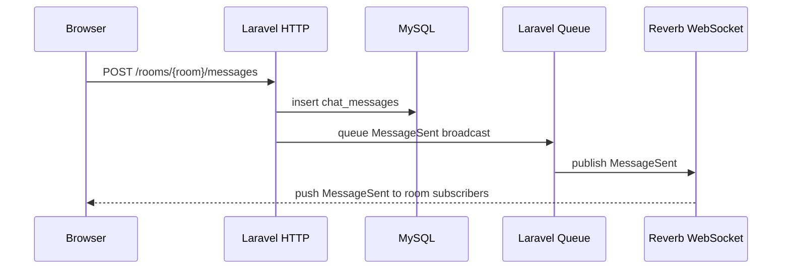

# Phase 4: Live Rooms and Reverb Chat

本阶段增加“直播房间 + 在线聊天”。它仍然是学习型实现：房间和消息使用 Laravel 常规 MVC，实时消息使用 Laravel Broadcasting、Reverb、Echo。

## 本阶段新增内容

- `live_rooms`：保存房间标题、简介、状态、关联视频或播放地址。
- `chat_messages`：保存房间消息、用户 ID、昵称和内容。
- `MessageSent` 事件：消息入库后广播给同一个房间里的浏览器。
- `/rooms`：房间列表。
- `/rooms/{room}`：房间观看页和聊天区。
- `/rooms/{room}/messages`：发送聊天消息的 JSON 接口。

## 依赖说明

Composer 新增：

```bash
composer require laravel/reverb
```

原因：Reverb 是 Laravel 官方 WebSocket 服务器，适合本地学习 Broadcasting。

NPM 新增：

```bash
npm install --save-dev laravel-echo pusher-js
```

原因：Laravel Echo 是前端订阅广播频道的官方客户端封装；Reverb 兼容 Pusher 协议，因此浏览器端使用 `pusher-js` 作为底层客户端。

## 数据表

`live_rooms`

| 字段 | 说明 |
| --- | --- |
| `id` | 主键 |
| `title` | 房间标题 |
| `description` | 房间简介，可为空 |
| `status` | `scheduled` / `live` / `ended` |
| `video_id` | 关联已上传视频，可为空 |
| `stream_url` | 外部直播或播放地址，可为空 |
| `owner_id` | 房主用户 ID，可为空 |
| `started_at` | 开始时间，可为空 |
| `ended_at` | 结束时间，可为空 |
| `created_at` / `updated_at` | 时间戳 |

`chat_messages`

| 字段 | 说明 |
| --- | --- |
| `id` | 主键 |
| `live_room_id` | 房间 ID |
| `user_id` | 发送者用户 ID，可为空 |
| `nickname` | 昵称，可为空 |
| `content` | 消息内容 |
| `created_at` / `updated_at` | 时间戳 |

## 请求和广播流程



## HTTP 和 WebSocket 的区别

HTTP 适合“请求一次，响应一次”的操作，例如发送消息接口：

```text
浏览器 -> Laravel: 保存这条消息
Laravel -> 浏览器: 保存成功
```

WebSocket 适合服务器主动推送，例如同房间其他人收到新消息：

```text
Laravel/Reverb -> 所有订阅该房间的浏览器: MessageSent
```

聊天通常两者一起使用：先用 HTTP 入库，再用 WebSocket 广播。

## Event、Broadcasting、Echo、Reverb 的关系

- `MessageSent`：Laravel 事件，描述“有一条消息要广播”。
- `ShouldBroadcast`：告诉 Laravel 这个事件需要进入广播流程。
- Queue：`ShouldBroadcast` 默认会通过队列异步广播，所以本地要启动 `queue:work`。
- Reverb：Laravel 官方 WebSocket 服务，负责维持浏览器连接并推送消息。
- Echo：浏览器端 JS 库，负责订阅频道和监听事件。

## Presence Channel 和 Public Fallback

本阶段配置了 presence channel：

```php
presence-live-room.{roomId}
```

后端授权定义在 `routes/channels.php`：

```php
Broadcast::channel('live-room.{roomId}', function ($user, int $roomId) {
    // 确认房间存在后，返回 presence 成员信息
});
```

Presence channel 可以拿到在线成员列表，因此前端可以显示在线人数，并显示加入、离开提示。

当前项目还没有登录注册 UI。Laravel 的 presence/private channel 默认要求已登录用户才能通过 `/broadcasting/auth` 鉴权。所以本阶段前端会：

1. 优先 `Echo.join('live-room.{roomId}')` 进入 presence channel。
2. 如果游客没有登录导致鉴权失败，降级订阅公共频道 `live-room.{roomId}`，保证基础实时聊天可用。
3. 游客降级时无法得到准确在线人数。

生产项目建议删除公共频道降级，要求用户登录，并在 channel 授权里检查房间权限。

## 为什么消息要先入库再广播

先入库可以保证：

- 页面刷新后还能看到历史消息。
- 广播失败时消息不会丢。
- 后续可以做审核、删除、分页、关键词过滤。
- 多端收到的是数据库里真实存在的消息 ID。

本阶段 `POST /rooms/{room}/messages` 会先写入 `chat_messages`，再广播 `MessageSent`。

## 本地启动

确认 `.env` 至少包含：

```dotenv
BROADCAST_CONNECTION=reverb
QUEUE_CONNECTION=database

REVERB_APP_ID=local-live-video-chat
REVERB_APP_KEY=local-live-video-chat-key
REVERB_APP_SECRET=local-live-video-chat-secret
REVERB_HOST=127.0.0.1
REVERB_PORT=8080
REVERB_SCHEME=http
REVERB_SERVER_HOST=0.0.0.0
REVERB_SERVER_PORT=8080

VITE_REVERB_APP_KEY="${REVERB_APP_KEY}"
VITE_REVERB_HOST="${REVERB_HOST}"
VITE_REVERB_PORT="${REVERB_PORT}"
VITE_REVERB_SCHEME="${REVERB_SCHEME}"
```

启动中间件：

```bash
docker compose up -d mysql redis
```

运行迁移：

```bash
php artisan migrate
```

开 4 个终端分别运行：

```bash
php artisan reverb:start
```

```bash
php artisan queue:work
```

```bash
npm run dev
```

```bash
php artisan serve
```

访问：

```text
http://127.0.0.1:8000/rooms
```

## 创建本地测试房间

当前阶段没有做房间创建页面，可以先用 Tinker 创建：

```bash
php artisan tinker
```

```php
App\Models\LiveRoom::create([
    'title' => 'Demo Live Room',
    'description' => 'A local room for Reverb chat testing.',
    'status' => 'live',
]);
```

如果想关联一个已有视频：

```php
App\Models\LiveRoom::create([
    'title' => 'Video Room',
    'status' => 'live',
    'video_id' => 1,
]);
```

## 如何确认运行成功

1. 打开两个浏览器窗口访问同一个 `/rooms/{room}`。
2. 在其中一个窗口发送消息。
3. 另一个窗口应实时追加消息。
4. 终端里的 `queue:work` 应能看到广播任务被处理。
5. 已登录用户使用 presence channel 时，在线人数会变化；游客降级到公共频道时，消息仍可实时推送，但在线人数不准确。

## 常见问题

### `/broadcasting/auth` 返回 403

通常是 presence/private channel 需要登录用户。当前学习项目没有认证页面，游客会降级到公共频道。生产项目应补登录、权限和房间访问控制。

### 消息入库了，但页面没有实时更新

检查：

- `php artisan reverb:start` 是否运行。
- `php artisan queue:work` 是否运行。
- `.env` 里的 `REVERB_APP_KEY` 和 `VITE_REVERB_APP_KEY` 是否一致。
- 修改 `.env` 后是否重启了 `npm run dev`。

### 浏览器控制台显示 WebSocket 连接失败

检查：

- `REVERB_HOST` 是否是浏览器可访问的主机，默认本地是 `127.0.0.1`。
- `REVERB_PORT` 是否和 `php artisan reverb:start` 的端口一致。
- `REVERB_SCHEME=http` 时前端应使用 `ws`，不是 `wss`。

### 队列没有处理广播

`MessageSent` 实现的是 `ShouldBroadcast`，默认会走队列。使用 `QUEUE_CONNECTION=database` 时，需要先执行迁移并启动：

```bash
php artisan queue:work
```

如果只是快速本地验证，也可以临时用：

```dotenv
QUEUE_CONNECTION=sync
```

这样广播会在请求内同步执行，但不适合耗时任务和真实并发场景。

## 后续扩展

- 增加房间创建、编辑、结束直播页面。
- 增加 Policy，限制只有房主能修改房间。
- 去掉公共频道 fallback，要求登录后才能进入聊天。
- 对消息做分页加载。
- 对消息做限流、敏感词过滤和管理员删除。
- 接入真实直播媒体服务器输出的 HLS 或 WebRTC 播放地址。
