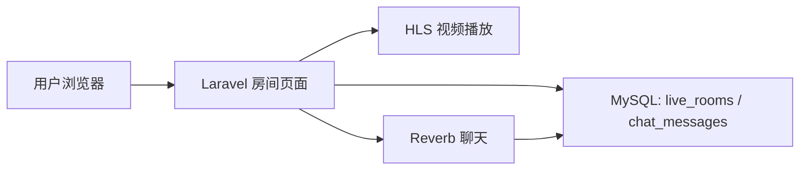
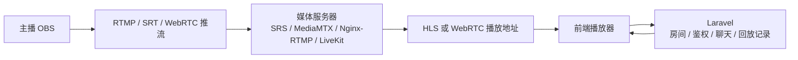

# Phase 5: Pseudo Live and Real Live Architecture

本阶段不接 OBS，也不接真实推流服务器。我们先用已经生成好的 HLS 视频绑定到直播房间，让房间看起来像“直播中”：左侧播放 HLS，右侧使用 Reverb 实时聊天。

## A. 当前伪直播架构



当前系统里的伪直播流程：

1. 上传视频。
2. 队列任务用 FFmpeg 生成 HLS。
3. 创建直播房间，并绑定 `video_id`。
4. 房间状态改为 `live`。
5. 用户进入 `/rooms/{room}`，页面优先播放绑定视频的 HLS。
6. 聊天消息先写入 `chat_messages`，再通过 Reverb 广播给同房间用户。

伪直播的核心是“播放一个已经存在的 HLS 点播视频”。它适合学习房间、播放器、聊天和状态流转，但它不是实时采集、实时转码、实时分发的真直播。

## 当前房间管理入口

页面入口：

```text
GET /rooms
GET /rooms/create
GET /rooms/{room}
GET /rooms/{room}/edit
```

提交入口：

```text
POST  /rooms
PATCH /rooms/{room}
PATCH /rooms/{room}/status
```

可以完成：

- 创建房间。
- 绑定一个已上传视频。
- 填写外部 `stream_url`。
- 将房间状态改为 `scheduled` / `live` / `ended`。

状态时间规则：

- `scheduled`：清空 `started_at` 和 `ended_at`。
- `live`：设置 `started_at`，清空 `ended_at`。
- `ended`：如果没有 `started_at` 则补上，并设置 `ended_at`。

## B. 真实直播推荐架构



推荐拆分：

1. 主播使用 OBS 推流。
2. OBS 使用 RTMP、SRT 或 WebRTC 推到媒体服务器。
3. 媒体服务器负责接流、转封装、转码和分发。
4. 媒体服务器输出 HLS 或 WebRTC 播放地址。
5. Laravel 保存房间信息、权限、聊天、播放地址、直播状态和回放记录。
6. 前端播放器读取 Laravel 提供的 `stream_url`，再向媒体服务器拉流播放。

可选媒体服务器：

- SRS：适合学习 RTMP、HLS、WebRTC 和常见直播链路。
- MediaMTX：配置轻，支持 RTSP、RTMP、HLS、WebRTC、SRT 等协议。
- Nginx-RTMP：传统 RTMP/HLS 方案，简单直接。
- LiveKit：偏实时互动和 WebRTC 连麦场景。

## Laravel 在真实直播中的职责

Laravel 应该做业务控制层：

- 房间创建、编辑、结束。
- 主播和观众权限。
- 直播状态管理。
- 保存媒体服务器输出的 `stream_url`。
- 聊天、在线人数、点赞、礼物等互动。
- 回放记录和视频归档。
- 管理员审核和运营后台。

媒体服务器应该做音视频层：

- 接收 OBS 推流。
- 转封装，例如 RTMP 转 HLS。
- 转码，例如生成 480p / 720p / 1080p。
- 分发 HLS、WebRTC 或低延迟直播流。
- 处理长连接和大流量。

## C. 为什么 Laravel 不应该直接处理音视频流

PHP-FPM 请求生命周期不适合长连接媒体流。

Laravel 常见部署是 Nginx + PHP-FPM。PHP-FPM 更适合短请求：收到 HTTP 请求、执行业务逻辑、返回响应。直播流是持续不断的数据通道，生命周期很长，和 PHP-FPM 的工作模型不匹配。

视频流量大。

一个直播间可能同时有很多观众。音视频分片、码率、缓存、重试和带宽消耗都很大。让 Laravel 直接承载这些流量，会很快占满 PHP worker、网络和磁盘 IO。

转码和分发应该交给专门组件。

转码需要 CPU/GPU，分发需要协议支持、连接管理和缓存能力。FFmpeg、SRS、MediaMTX、LiveKit、Nginx-RTMP、CDN 更适合处理这些工作。

Laravel 更适合做业务控制层。

Laravel 的强项是数据库、权限、队列、事件、后台管理和业务 API。它应该告诉前端“这个房间能不能看、播放地址是什么、聊天发到哪里”，而不是亲自搬运每一段音视频数据。

## 当前伪直播和真实直播的差异

| 能力 | 当前伪直播 | 真实直播 |
| --- | --- | --- |
| 视频来源 | 已上传并处理好的 HLS 文件 | OBS 或摄像头实时推流 |
| 播放地址 | Laravel HLS 路由 | 媒体服务器输出地址 |
| 延迟 | 点播式，不体现真实延迟 | 取决于 HLS / LL-HLS / WebRTC |
| 转码 | 上传后离线 FFmpeg | 推流中实时转码或转封装 |
| Laravel 职责 | 房间、绑定视频、聊天 | 房间、鉴权、聊天、播放地址管理 |

## D. 后续扩展方向

- 直播鉴权：只有有权限的用户才能进入房间或获取播放地址。
- 防盗链：播放地址签名、过期时间、Referer 校验、Token 校验。
- 聊天敏感词：入库前过滤或进入审核队列。
- 在线人数：生产环境使用 presence channel、Redis 计数或媒体服务器回调统计。
- 礼物 / 点赞：单独建表记录互动事件，必要时异步聚合。
- 回放生成：直播结束后将媒体服务器录制文件导入 VOD 流程。
- 多码率 HLS：生成 480p / 720p / 1080p，并输出 `master.m3u8`。
- CDN：将 HLS 分片交给 CDN 分发，降低源站压力。
- WebRTC 连麦：使用 LiveKit、SRS WebRTC 或其他 SFU 方案处理多人实时互动。

## 本地验收

1. 确认视频已经完成 Phase 3 的 HLS 处理，视频详情页显示 HLS ready。
2. 访问 `/rooms/create` 创建房间，绑定该视频。
3. 将房间状态设为 `live`。
4. 进入 `/rooms/{room}`，左侧应播放绑定视频的 HLS。
5. 打开两个浏览器窗口进入同一房间，右侧聊天应实时同步。

需要启动：

```bash
docker compose up -d mysql redis
php artisan migrate
php artisan reverb:start
php artisan queue:work
npm run dev
php artisan serve
```
