# Phase 7: Project Review

本阶段不新增大功能，重点是把前面几个阶段串起来复盘，检查当前实现是否清晰、稳定，并整理成适合复习和面试讲解的材料。

## 1. 当前项目已经实现了什么

### 视频上传

- 用户可以进入 `/videos` 查看视频列表。
- 用户可以进入 `/videos/create` 上传 MP4、MOV、AVI、MKV、WebM 等常见视频文件。
- 上传后，Laravel 将原始文件保存到 `public` disk 的 `videos/originals/` 目录。
- `videos` 表记录标题、简介、文件路径、大小、MIME、处理状态等信息。
- 详情页 `/videos/{video}` 可以播放原始 MP4，并在 HLS 可用时优先播放 HLS。

### 视频处理

- 上传完成后不会在 HTTP 请求中直接处理视频，而是派发 `ProcessUploadedVideo` 队列任务。
- `ProcessUploadedVideo` 使用 `ffprobe` 读取时长、分辨率、视频编码、音频编码和原始 metadata。
- `ProcessUploadedVideo` 使用 `ffmpeg` 截取封面图。
- 处理成功后写入 `duration_seconds`、`width`、`height`、`video_codec`、`audio_codec`、`thumbnail_path`、`metadata`、`status=ready`。
- 处理失败后写入 `status=failed`、`error_message`、`failure_reason`。
- 本阶段小修复：队列失败信息会截断到合理长度，避免 FFmpeg 的超长错误输出撑坏页面或字段。

### HLS 播放

- `GenerateHlsForVideo` 负责把上传视频转成单码率 HLS。
- HLS 文件输出到 `storage/app/private/videos/hls/{video_id}/`。
- 每个视频拥有独立 HLS 目录，降低文件混读风险。
- 播放清单通过 `/videos/{video}/hls/playlist` 输出。
- 分片文件通过 `/videos/{video}/hls/segment/{filename}` 输出。
- 前端使用 `hls.js` 播放 HLS，浏览器原生支持 HLS 时走原生播放，HLS 未生成时回退到 MP4。

### 直播房间

- `live_rooms` 表支持标题、简介、状态、绑定视频、外部播放地址、房主、开始时间和结束时间。
- `/rooms` 展示房间列表。
- `/rooms/create` 创建房间。
- `/rooms/{room}/edit` 修改房间信息。
- `/rooms/{room}` 进入房间观看。
- `/rooms/{room}/status` 可以把房间状态切换为 `scheduled`、`live`、`ended`。

### 伪直播

- 房间可以绑定 `video_id`。
- 如果绑定的视频已经有 HLS，房间详情页会播放该视频的 HLS。
- 这不是 OBS 真实推流，而是用已有点播 HLS 模拟直播观看体验。
- 这种方式适合学习房间模型、播放器、聊天和状态流转。

### 在线聊天

- `chat_messages` 表记录房间消息。
- `ChatMessageController` 先把消息写入数据库，再广播事件。
- `MessageSent` 实现 `ShouldBroadcast`，通过 `broadcastWith` 只暴露前端需要的字段。
- 前端使用 Laravel Echo 订阅 `live-room.{roomId}` channel，接收消息后追加到房间聊天区。
- 当前实现优先尝试 presence channel；未登录访客会回退到公开监听，适合本地学习演示。

### 真实直播架构预留

- 当前项目不直接接 OBS，也不直接处理高并发音视频流。
- 文档保留真实直播推荐架构：
  OBS -> RTMP/SRT/WebRTC -> 媒体服务器 -> HLS/WebRTC 播放地址 -> Laravel 管理房间、权限、聊天和播放地址。
- `live_rooms.stream_url` 为后续接入媒体服务器输出地址预留。

## 2. 当前核心链路

文字版链路：

用户上传视频 -> Laravel 保存原始文件和数据库记录 -> Queue Job 调用 ffprobe / ffmpeg -> 生成封面和 HLS -> 创建直播房间并绑定视频 -> 浏览器播放 HLS -> Reverb 实时聊天。

```mermaid
flowchart LR
    A["用户上传视频"] --> B["Laravel 保存原始文件"]
    B --> C["videos 表创建记录 status=pending"]
    C --> D["派发 ProcessUploadedVideo"]
    D --> E["ffprobe 读取时长/分辨率/编码"]
    D --> F["ffmpeg 截取封面"]
    E --> G["videos 更新 status=ready"]
    F --> G
    G --> H["派发 GenerateHlsForVideo"]
    H --> I["ffmpeg 生成 index.m3u8 和 ts 分片"]
    I --> J["videos 更新 hls_status=ready"]
    J --> K["创建直播房间绑定 video_id"]
    K --> L["浏览器加载房间页"]
    L --> M["播放器请求 HLS playlist/segment"]
    L --> N["Echo 连接 Reverb"]
    N --> O["聊天消息先入库"]
    O --> P["MessageSent 广播到房间"]
    P --> Q["同房间浏览器实时追加消息"]
```



## 3. 每个核心组件的职责

### Laravel

- 提供 HTTP 路由、Controller、Blade 页面。
- 负责视频、房间、聊天消息的业务建模。
- 负责权限边界、表单校验、文件路径校验。
- 负责派发队列任务和广播事件。

### MySQL

- 保存 `videos`、`live_rooms`、`chat_messages`、队列任务、session 等业务数据。
- 当前适合作为本地学习环境的主数据库。

### Redis

- 当前 Docker Compose 已提供 Redis。
- Phase 1 到 Phase 7 不强依赖 Redis，因为队列默认使用 database driver。
- 后续可以切换为 Redis queue/cache，提高队列和缓存能力。

### Queue

- 把耗时视频处理从 HTTP 请求中移出去。
- 避免用户上传后一直等待 FFmpeg 执行。
- 支持失败重试、失败记录和后台处理。

### FFmpeg

- 负责真正的视频处理。
- 当前用于截取封面和生成 HLS。
- 后续可以扩展多码率、转码参数优化、硬件加速等。

### ffprobe

- 负责读取媒体文件 metadata。
- 当前用于获取时长、宽、高、编码信息。

### HLS

- 把一个视频拆成播放清单和多个小分片。
- 浏览器可以边下边播，适合点播和普通延迟直播。
- 当前使用单码率 HLS，后续可以扩展多码率自适应。

### Reverb

- Laravel 官方 WebSocket 服务。
- 负责把广播事件实时推送给浏览器。
- 当前用于直播房间聊天。

### Echo

- 浏览器端 WebSocket 客户端封装。
- 负责连接 Reverb、订阅频道、接收广播事件。

### 浏览器播放器

- 使用原生 `<video>` 标签承载播放。
- 使用 `hls.js` 给不原生支持 HLS 的浏览器播放 `.m3u8`。

### 未来媒体服务器

- 在真实直播中接收 OBS 推流。
- 负责转码、切片、低延迟分发、录制回放。
- 可选组件包括 SRS、MediaMTX、Nginx-RTMP、LiveKit 等。

## 4. 本项目适合学习的 Laravel 知识点

- Migration：按阶段演进 `videos`、`live_rooms`、`chat_messages` 表。
- Eloquent Model：模型字段、casts、关联关系和简单 helper 方法。
- Controller：上传、播放、房间、聊天职责拆分。
- FormRequest：视频上传和房间表单校验。
- Storage：public disk 保存原始视频和封面，local/private 保存 HLS。
- Queue Job：`ProcessUploadedVideo`、`GenerateHlsForVideo` 后台处理视频。
- Event Broadcasting：`MessageSent` 事件广播聊天消息。
- Laravel Reverb：本地 WebSocket 服务。
- Laravel Echo：前端订阅频道并更新页面。
- Blade：简单页面和表单。
- Feature Test：覆盖上传、处理、HLS 安全、房间和聊天核心链路。
- Docker Compose：本地启动 MySQL 和 Redis 中间件。

## 5. 本项目适合面试讲解的点

### 为什么视频处理要异步？

视频处理通常耗时长、CPU 消耗高，而且 FFmpeg 输出不可控。放在 HTTP 请求中会导致用户等待、请求超时、PHP worker 被占用。使用 Queue 后，HTTP 请求只负责保存文件和记录，视频处理在后台执行，失败也可以记录和重试。

### 为什么不用 Laravel 直接处理直播流？

Laravel/PHP 更适合做业务控制层，不适合直接承载高并发长连接音视频流。直播流量大、连接长、转码和分发复杂，应该交给 SRS、MediaMTX、Nginx-RTMP、LiveKit 或 CDN 等专门组件。Laravel 负责房间、鉴权、聊天、播放地址和回放记录。

### HLS 和 MP4 播放有什么区别？

MP4 通常是一个完整文件，适合简单点播和 fallback。HLS 把视频拆成 `.m3u8` 播放清单和多个分片，播放器可以按需加载，适合点播、大文件播放和普通延迟直播。HLS 还可以扩展多码率，让播放器根据网络选择清晰度。

### WebSocket 聊天为什么要先入库再广播？

先入库可以保证消息可追溯、可刷新恢复、可审核，也能避免广播成功但数据库丢消息。广播只负责把已经确认的消息实时通知给在线用户。

### 如何设计直播房间状态？

当前使用 `scheduled`、`live`、`ended` 三个状态。`scheduled` 表示未开始，`live` 表示正在直播或伪直播播放，`ended` 表示已经结束。切换状态时同步维护 `started_at` 和 `ended_at`，便于列表展示和后续统计。

### 如何避免 HLS 文件路径穿越？

HLS 文件按 `video_id` 分目录隔离。segment 路由只接收受限文件名，不允许 `/`、`..` 等路径片段，并限制后缀为 `ts`、`m4s`、`mp4`。实际读取时只从当前视频的 HLS 目录中取文件。

### 如何处理视频处理失败？

队列任务捕获异常后写入失败状态和错误信息，再重新抛出异常让 Laravel 队列系统记录失败。页面可以根据 `status`、`error_message`、`hls_status`、`hls_error_message` 给用户展示清晰提示。

### 后续如何接入真实直播媒体服务器？

新增或复用 `stream_url` 保存媒体服务器输出的 HLS/WebRTC 地址。OBS 推流到媒体服务器，媒体服务器输出播放地址，Laravel 只负责房间状态、权限、聊天和播放地址下发。前端根据 `stream_url` 播放真实直播流。

## 6. 本次代码体检结论

### 路由

- 视频路由、HLS 路由、房间路由和聊天消息路由命名清晰。
- HLS playlist 和 segment 路由已经分离。
- 房间管理入口包含创建、编辑、状态更新。
- 当前没有发现重复或明显废弃路由。

### 数据库

- `videos` 表已经覆盖上传、处理、封面、HLS 和失败信息。
- `live_rooms` 表满足伪直播和真实直播地址预留。
- 聊天表实际名称为 `chat_messages`，不是早期计划中的 `live_room_messages`；当前命名更短，模型和代码一致。
- 外键和 nullable 设置适合学习项目：视频、房主、消息用户都允许在合理场景下为空或级联置空。
- `chat_messages` 已有房间和时间索引，适合按房间加载最新消息。
- `cover_path` 和 `thumbnail_path` 同时存在，略有历史冗余；当前代码会同步写入，暂不重构。

### Model

- `Video`、`LiveRoom`、`ChatMessage` 的 fillable、casts 和关联关系清楚。
- helper 方法主要用于页面展示和路径生成，复杂度可接受。
- 当前没有发现需要立即拆分的重业务逻辑。

### Controller

- 上传、HLS 输出、房间管理、聊天消息职责基本分清。
- `LiveRoomController` 内部状态时间处理已有私有方法，保持了可读性。
- 后续如果继续扩展权限、审核、统计，可以再引入 Service 层；当前不建议提前复杂化。

### 视频处理

- ffprobe / ffmpeg 调用使用 Symfony Process 数组参数，避免 shell 字符串拼接。
- 输入路径来自 Storage disk。
- 失败状态会写入 `videos` 表。
- 本阶段已补充失败信息截断，降低超长错误输出风险。

### HLS

- HLS 目录按 `video_id` 隔离。
- segment 路由限制文件名和后缀，避免路径穿越。
- playlist 路由会把分片行改写成 Laravel 安全路由。
- HLS 未生成时，页面会显示处理状态并保留 MP4 fallback。
- 后续可以进一步加强：如果 playlist 中出现异常路径，直接拒绝输出而不是保留原行。

### Reverb 聊天

- channel 命名为 `live-room.{roomId}`，语义清楚。
- 授权逻辑会校验房间存在。
- 消息先入库再广播。
- `broadcastWith` 只返回消息 id、房间 id、昵称、内容和时间，不暴露邮箱等敏感字段。
- 当前访客场景下会回退公开监听，适合学习演示；生产环境应补完整登录和 presence 授权。

### Docker 和配置

- `docker-compose.yml` 提供 MySQL 和 Redis。
- MySQL 端口 `33061`、Redis 端口 `63791` 与 `.env.example` 一致。
- `.env.example` 已包含 FFmpeg、Reverb、Broadcasting、Queue、Redis 的核心配置。
- 大文件上传时，使用 PHP 内置服务器需要显式传入 `upload_max_filesize` 和 `post_max_size`；推荐使用 README 中的启动方式。

### 测试

- Feature 测试覆盖上传、队列派发、视频处理、HLS 路由安全、房间管理和聊天广播。
- 测试中使用 fake 脚本模拟 ffprobe / ffmpeg，不依赖本机真实 FFmpeg，稳定性较好。
- 上传相关测试使用 `Storage::fake` 和 `Queue::fake`。
- 后续可补充：登录用户权限、presence 在线人数、多窗口聊天端到端、真实大文件本地验收脚本。

## 7. 当前项目的不足

- 没有完整用户登录和权限系统。
- 没有视频审核、转码队列优先级、取消任务。
- 没有多码率 HLS。
- 没有 CDN、防盗链和限速。
- 没有真实 OBS 推流接入。
- 没有 WebRTC 低延迟连麦。
- 没有复杂在线人数统计。
- 没有生产级队列监控和告警。
- 没有媒体文件生命周期管理，例如清理失败 HLS、删除视频时清理文件。

## 8. 后续扩展路线

### P0：修复和稳定

- 保持测试通过。
- 补充权限边界测试。
- 完善页面错误提示。
- 增加删除视频时的文件清理。

### P1：多码率 HLS

- 生成 480p / 720p / 1080p 多套分片。
- 输出 `master.m3u8`。
- 前端播放器自动选择清晰度。

### P2：真实直播媒体服务器接入

- 使用 SRS、MediaMTX、Nginx-RTMP 或 LiveKit。
- `live_rooms.stream_url` 保存媒体服务器输出地址。
- Laravel 管理推流权限和播放权限。

### P3：权限和鉴权

- 登录用户才能创建房间和发言。
- 房主才能修改房间状态。
- HLS 文件访问加鉴权、防盗链或短期签名。

### P4：监控和队列可观测性

- 记录转码耗时、失败原因、重试次数。
- 引入队列失败告警。
- 后续可考虑 Horizon，但这会引入 Redis queue 依赖。

### P5：生产部署方案

- PHP-FPM + Nginx。
- Queue worker 使用 Supervisor 或 systemd。
- Reverb 独立进程管理。
- 媒体文件使用对象存储或共享存储。
- HLS 分发接 CDN。

## 9. 本地重新启动建议

```bash
docker compose up -d mysql redis
php artisan migrate
php artisan storage:link
npm install
npm run dev
php artisan reverb:start
VIDEO_PROCESS_TIMEOUT=900 php artisan queue:work --tries=3 --timeout=1000
```

大文件上传建议使用下面的 Laravel HTTP 启动方式：

```bash
cd public
php -d upload_max_filesize=500M \
    -d post_max_size=520M \
    -d memory_limit=1024M \
    -d max_input_time=300 \
    -d max_execution_time=300 \
    -S 127.0.0.1:8000 \
    ../vendor/laravel/framework/src/Illuminate/Foundation/resources/server.php
```

## 10. 手动验收流程

1. 打开 `/videos/create` 上传一个 100MB 左右的视频。
2. 打开队列 worker，等待视频状态变成 `ready`，HLS 状态变成 `ready`。
3. 打开 `/videos/{video}`，确认可以播放 HLS，封面和 metadata 正常展示。
4. 打开 `/rooms/create` 创建房间，绑定刚才的视频，状态设为 `live`。
5. 打开 `/rooms/{room}`，确认顶部状态、播放器和聊天区域正常。
6. 在两个浏览器窗口打开同一个房间，分别发送消息，确认消息实时出现。
7. 把房间状态改成 `ended`，确认页面状态同步变化。

## 11. 本阶段运行检查

本阶段执行过以下检查：

```bash
./vendor/bin/pint --dirty
php artisan route:list
php artisan migrate:status
php artisan test
```

结果：

- Pint：通过。
- Route list：成功输出 19 条路由，视频、HLS、房间、聊天和 broadcasting/auth 路由存在。
- Migrate status：项目相关 migration 均为 `Ran`。
- Test：22 个测试全部通过，98 个断言全部通过。
