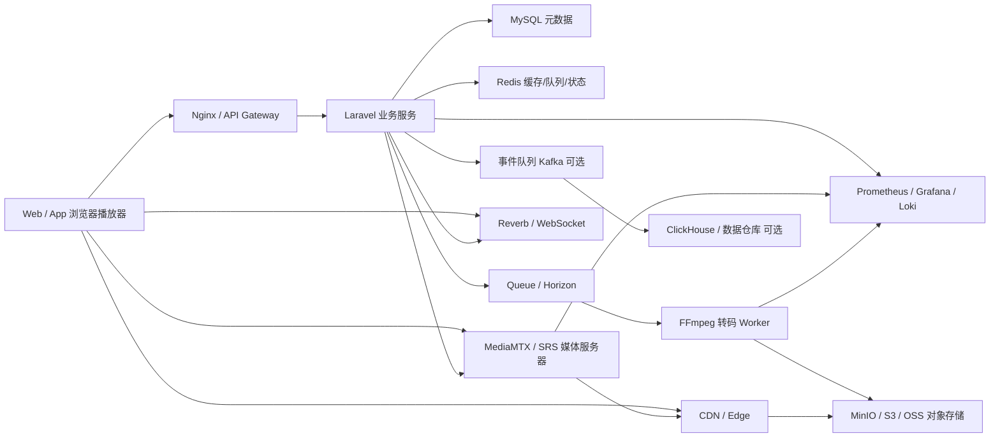
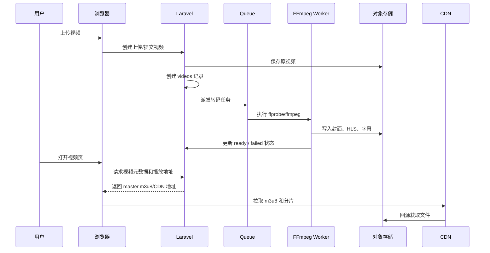
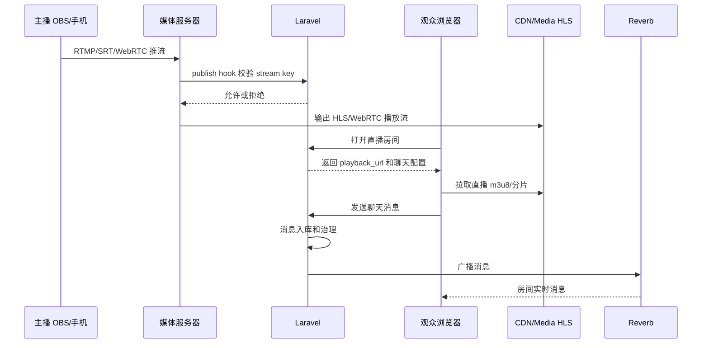

# 【大型视频分享与直播平台后端架构】技术方案设计

本文面向“大视频网站 / 直播网站资深后端”面试复盘，基于当前项目、`10-mainstream-roadmap.md`、`laravel-live-video-chat-roadmap.md` 和 `feature-designs/` 目录，对已覆盖内容、未覆盖内容、生产级设计重点和面试讲解主线做一次总整理。

## 0. 已检查资料和覆盖度结论

### 0.1 已检查的文档

- `docs/live-video-chat/10-mainstream-roadmap.md`
- `docs/live-video-chat/laravel-live-video-chat-roadmap.md`
- `docs/live-video-chat/prompt.md`
- `docs/live-video-chat/feature-designs/README.md`
- `docs/live-video-chat/feature-designs/01` 到 `26` 的代表性设计文档

当前 `feature-designs` 已经覆盖了很多学习项目到项目展示版的关键模块：

- 用户权限与房主控制
- 视频发布流程与状态机
- 视频删除、清理、重新转码
- 大文件分片上传
- 播放器增强、播放进度、字幕、错误上报
- 搜索、分类、标签、热门排序
- 播放量、点赞、收藏、观看历史
- 评论系统
- stream key 管理和开播流程
- 在线人数
- 推流状态检测
- MediaMTX 鉴权与回调
- 直播录制与回放
- 弹幕、点赞、简单礼物事件
- 聊天室治理
- 私信、通知
- 上传安全
- 内容审核举报与风控
- HLS 防盗链
- 对象存储、CDN
- Redis Queue、Horizon、失败重试
- 日志监控和可观测性
- Docker、Nginx、Supervisor、健康检查
- 管理后台、审核后台
- 数据统计和创作者后台

整体评价：

```text
当前文档已经足够支撑“学习型项目”和“中高级 Laravel 后端项目讲解”。
如果目标是面试大视频 / 直播平台资深后端，还需要补充平台级、基础设施级、数据平台级和稳定性治理级设计。
```

### 0.2 当前文档已经覆盖得比较好的方向

| 方向 | 覆盖情况 | 说明 |
| --- | --- | --- |
| VOD 上传和转码 | 较好 | 分片上传、FFmpeg、HLS、多码率、队列均已覆盖 |
| 直播基础链路 | 较好 | MediaMTX、stream key、推流状态、录制回放已有设计 |
| 聊天互动 | 较好 | Reverb、在线人数、弹幕、治理、私信通知已有设计 |
| 内容管理 | 较好 | 发布状态、管理后台、审核举报已有设计 |
| 存储和分发 | 较好 | MinIO/S3、CDN、防盗链已有设计 |
| 工程化 | 中等 | Docker、Nginx、Supervisor、日志监控已有，但 HA/发布体系不足 |
| 数据统计 | 中等 | 创作者后台有设计，但数据平台、推荐、OLAP 还不够 |

### 0.3 资深后端面试视角下仍需补充的方向

| 缺口 | 为什么重要 | 建议补充文档 |
| --- | --- | --- |
| 推荐系统和 Feed 架构 | 主流视频站核心是内容分发，不只是搜索和热门排序 | [`27-推荐系统与Feed流架构.md`](feature-designs/27-推荐系统与Feed流架构.md) |
| 事件数据管道 | 播放、曝光、点击、完播、互动都需要事件流 | [`28-事件采集Kafka与OLAP分析.md`](feature-designs/28-事件采集Kafka与OLAP分析.md) |
| 多媒体编码策略 | 大平台关注编码成本、画质、码率阶梯、CMAF、低延迟 | [`29-编码阶梯CMAF与低延迟播放.md`](feature-designs/29-编码阶梯CMAF与低延迟播放.md) |
| 直播媒体服务器集群 | 单 MediaMTX 不足以解释生产直播平台 | [`30-直播源站边缘集群与调度.md`](feature-designs/30-直播源站边缘集群与调度.md) |
| 热点内容和多级缓存 | 热门视频、热门直播间会打爆源站和数据库 | [`31-热点内容缓存与多级缓存.md`](feature-designs/31-热点内容缓存与多级缓存.md) |
| 多 CDN 和调度 | 大视频平台通常要按地域、成本、质量调度 CDN | [`32-多CDN调度与成本优化.md`](feature-designs/32-多CDN调度与成本优化.md) |
| DRM、版权和水印 | 版权内容平台会重点关注保护能力 | [`33-版权保护DRM指纹与水印.md`](feature-designs/33-版权保护DRM指纹与水印.md) |
| 账号风控和反作弊 | 播放量、点赞、礼物、弹幕都可能被刷 | [`34-账号风控反作弊与限流.md`](feature-designs/34-账号风控反作弊与限流.md) |
| 高可用和容灾 | 资深后端必须能讲 RPO/RTO、备份、故障切换 | [`35-高可用容灾与故障演练.md`](feature-designs/35-高可用容灾与故障演练.md) |
| API 网关和移动端 BFF | 视频平台通常有 Web、App、小程序、多端 API | [`36-API网关BFF版本治理.md`](feature-designs/36-API网关BFF版本治理.md) |
| CI/CD 和发布治理 | 生产系统需要灰度、回滚、配置管理 | [`37-CICD灰度发布与配置治理.md`](feature-designs/37-CICD灰度发布与配置治理.md) |
| 成本模型 | 视频业务最贵的是带宽、存储和转码 | [`38-视频业务成本模型.md`](feature-designs/38-视频业务成本模型.md) |
| 数据库扩展 | 互动、消息、事件、评论量大后需要分区和归档 | [`39-数据库分区归档与扩展.md`](feature-designs/39-数据库分区归档与扩展.md) |
| 直播低延迟方案 | HLS 延迟较高，直播平台常需要 HTTP-FLV / WebRTC / LL-HLS | [`40-直播低延迟协议选型.md`](feature-designs/40-直播低延迟协议选型.md) |

这些不是当前学习项目必须马上实现的内容，但很适合面试时展示“我知道 Demo 和生产平台的距离在哪里”。上述 14 个方向已经在 `feature-designs/27` 到 `feature-designs/40` 中按 `prompt.md` 的结构展开为独立方案文档，可作为资深后端面试补充材料。

## 1. 模块定位

本模块属于 **业务 + 技术混合的平台级模块**。

它不是单一功能，而是把视频分享、点播转码、直播推流、实时聊天、内容分发、互动统计、审核风控、可观测性和生产部署串成一个完整平台。

它涉及：

- Laravel 业务服务
- MySQL 元数据和业务状态
- Redis 缓存、计数、限流、队列、在线状态
- Queue / Horizon 异步任务
- FFmpeg 转码
- MediaMTX / SRS / 云直播等媒体服务器
- MinIO / S3 / OSS / COS 对象存储
- CDN 和边缘分发
- Reverb / WebSocket / IM 服务
- 日志、指标、链路追踪
- 数据仓库 / OLAP / 推荐系统

为什么属于混合模块：

```text
视频平台既有明确业务对象：用户、视频、直播间、评论、弹幕、收藏、关注；
也有重技术链路：上传、转码、HLS、RTMP、CDN、WebSocket、队列、监控、风控。
```

## 2. 解决的问题

### 用户层面

- 用户可以上传视频、观看视频、搜索内容、评论互动。
- 主播可以用 OBS、手机或相机推流开播。
- 观众可以进入直播间观看、聊天、发送弹幕和互动。
- 创作者可以看到视频和直播数据。
- 管理员可以审核内容、处理举报和治理违规行为。

### 系统层面

- 把大文件上传、视频转码、HLS 生成、直播推流、聊天广播等耗时或高并发任务拆给合适组件。
- Laravel 专注业务控制，不直接承载大规模媒体流。
- 对象存储和 CDN 承担文件存储和分发。
- 媒体服务器承担直播接入和转封装。
- Redis、队列和数据平台承担削峰、聚合和异步处理。

### 如果不做平台级设计，会有什么问题

- 视频上传大文件容易超时。
- 转码阻塞 HTTP 请求。
- HLS segment 全走 Laravel 会压垮 PHP。
- 热门直播间聊天广播会形成扇出风暴。
- 播放量直接更新 MySQL 热点行会锁竞争。
- 直播推流中断后 Laravel 不知道真实状态。
- CDN 404、转码失败、WebSocket 断开难以排查。
- 内容审核、版权和风控能力缺失。

### 在视频 / 直播 / 聊天网站中的位置

```text
视频平台 = 内容生产 + 媒体处理 + 内容分发 + 互动社区 + 数据反馈 + 安全治理
```

当前 Laravel 项目已经跑通了主链路，后续要做的是把每个链路从“能跑”推进到“可扩展、可观测、可治理”。

## 3. 常见方案对比

| 方案 | 核心思路 | 需要组件 | 优点 | 缺点 | 适合阶段 | 是否推荐 |
| --- | --- | --- | --- | --- | --- | --- |
| Laravel 学习版 | Laravel + 本地 storage + FFmpeg + MediaMTX + Reverb | MySQL、Redis、FFmpeg、MediaMTX | 易理解、可本地运行、适合面试项目 | 不适合高并发和大流量 | 学习 / 简历项目 | 当前推荐 |
| 小型自建版 | Laravel + Redis Queue + MinIO + Nginx + MediaMTX/SRS + CDN | Redis、MinIO、Nginx、Supervisor、CDN | 成本可控、边界清晰 | 运维能力要求上升 | 小型团队 | 推荐演进 |
| 云服务版 | 云点播、云直播、云转码、云 CDN、云对象存储 | 云厂商 VOD/LIVE/CDN/OSS | 快速上线、稳定、省运维 | 成本和厂商绑定 | 创业团队 / 中小业务 | 生产常见 |
| 中大型自建版 | 媒体服务集群 + 转码集群 + 对象存储 + 多 CDN + 数据平台 | SRS/LiveKit、Kafka、ClickHouse、Prometheus | 可控性强、可深度优化 | 复杂、成本高 | 大型平台 | 只做设计理解 |
| 混合版 | 核心业务自研，媒体/存储/CDN 用云服务 | Laravel + 云直播/云点播 + 自研数据/审核 | 平衡成本、速度和控制力 | 需要做好抽象和供应商适配 | 很多真实公司 | 最推荐生产思路 |

## 4. 推荐学习方案

当前学习项目推荐方案：

```text
方案名称：Laravel 业务控制层 + FFmpeg VOD + MediaMTX Live + Reverb Chat + MinIO/CDN 预留

核心组件：
Laravel、MySQL、Redis、Queue、FFmpeg、MediaMTX、Reverb、hls.js、Storage、Docker Compose

Laravel 职责：
用户、视频、直播间、转码任务、播放地址、权限、聊天消息、审核状态、统计入口、后台管理

中间件职责：
MySQL 保存业务数据
Redis 做队列、缓存、限流、在线状态和计数
FFmpeg 做离线视频处理
MediaMTX/SRS 做直播推流接入和转封装
对象存储/CDN 做文件存储和分发
Reverb 做 WebSocket 广播

数据流：
上传视频 -> 保存元数据 -> 队列调用 FFmpeg -> 生成多码率 HLS -> 浏览器播放
OBS/手机推流 -> MediaMTX 接收 RTMP -> 输出 HLS -> Laravel 房间页播放
聊天消息 -> HTTP 入库 -> Reverb 广播 -> 房间实时展示

适合原因：
本地能跑通完整视频/直播/聊天链路，能讲清 Laravel 与媒体系统边界。

不足：
不是生产级高并发架构，缺少对象存储、CDN、多节点、风控、推荐、数据平台和高可用。

后续升级：
补权限、对象存储、CDN、防盗链、推流鉴权、队列监控、播放质量上报、事件数据管道和推荐系统。
```

## 5. 生产环境方案、容量和架构设计

### 5.1 生产环境常见方案

| 方案 | 典型架构 | 适合规模 | 优点 | 缺点 | 成本 | 维护难度 | 是否推荐 |
| --- | --- | --- | --- | --- | --- | --- | --- |
| 小型业务 | Laravel + MySQL + Redis + 对象存储 + CDN + 单媒体服务器 | 日活几千到几万 | 结构清楚，成本低 | 单点较多 | 低到中 | 中 | 可作为 MVP |
| 中型业务 | Laravel 多实例 + Redis Queue + Horizon + 转码 worker + S3/OSS + CDN + SRS/MediaMTX 集群 | 日活几十万 | 可扩展，可监控 | 需要运维体系 | 中 | 中高 | 推荐 |
| 大型业务 | 业务服务拆分 + 媒体源站/边缘集群 + 多 CDN + Kafka + OLAP + 推荐系统 + 风控系统 | 日活百万到千万级 | 扛大流量，可深度优化 | 架构复杂 | 高 | 高 | 设计理解 |
| 云服务 | 云点播/直播/转码/CDN/对象存储/监控 | 快速上线或团队小 | 省运维，稳定 | 成本、厂商绑定 | 中到高 | 低中 | 真实生产常见 |
| 混合云/自建 | 云 CDN + 自建业务/数据/审核/推荐 | 中大型团队 | 兼顾效率和控制 | 集成复杂 | 中高 | 高 | 大厂常见思路 |

### 5.2 容量估算重点

#### 视频上传和存储

需要估算：

- 每日上传视频数
- 平均原视频大小
- 最大视频大小
- 转码清晰度数量
- 转码后膨胀比例
- HLS 分片数量
- 封面、字幕、回放保留周期

示例：

```text
每天上传 1000 个视频，平均原视频 500MB：
原片每天新增约 500GB。
如果生成 360p、720p、1080p，转码后约增加 1 到 2 倍：
每天总新增存储可能是 1TB 到 1.5TB。
```

#### 点播播放带宽

需要估算：

- 同时观看人数
- 平均播放码率
- CDN 命中率
- 回源比例
- 热点视频比例

示例：

```text
10 万人同时看视频，平均码率 2Mbps：
总下行带宽约 200Gbps。
这不能由 Laravel 或单机 Nginx 承担，必须走 CDN。
```

#### HLS 请求量

如果 segment 时长 4 秒：

```text
10 万并发观看者，每 4 秒请求一个分片：
segment QPS 约 25,000。
如果 playlist 每 4 到 6 秒刷新一次：
m3u8 QPS 可能也在万级。
```

所以生产环境中：

```text
HLS segment 必须走 CDN 或边缘节点；
Laravel 最多做鉴权和签名，不应该直接发送所有分片。
```

#### 直播带宽

示例：

```text
一个直播间 1 万观众，平均播放码率 2Mbps：
单房间下行带宽约 20Gbps。
```

结论：

- 直播下行必须走 CDN 或边缘媒体节点。
- 主播推流上行流量小，观众拉流下行流量巨大。
- 直播间热门程度决定媒体层和聊天层压力。

#### 聊天广播

示例：

```text
一个热门直播间 1 万观众，消息 100 条/秒：
如果每条都广播给所有人，理论扇出是 100 万条投递/秒。
```

所以大房间通常需要：

- 消息采样或合并。
- 分频道分片。
- 弹幕限流。
- 热门房间独立通道。
- WebSocket 集群。

#### 数据事件

需要估算：

- 曝光事件 QPS
- 播放开始事件 QPS
- 播放进度事件 QPS
- 点赞、收藏、评论、弹幕 QPS
- 原始事件保留周期
- 聚合维度数量

如果播放进度每 10 秒上报一次，10 万在线观众就是：

```text
10,000 events/s
```

这种数据不适合全量同步写业务库，应进入事件队列、日志系统或 OLAP。

### 5.3 关键设计问题

#### 架构边界

- Laravel 负责业务控制、权限、状态、元数据和调度。
- FFmpeg worker 负责离线转码。
- Media server 负责直播推流、转封装、录制。
- 对象存储负责大文件保存。
- CDN 负责大规模分发。
- Redis 负责缓存、计数、锁、队列、限流和在线状态。
- WebSocket 服务负责实时消息。
- 数据平台负责事件分析、推荐特征和报表。

#### 技术状态和业务状态分离

视频建议拆：

```text
processing_status：pending / processing / ready / failed
publish_status：draft / published / hidden / blocked
review_status：pending / approved / rejected
```

直播建议拆：

```text
room_status：scheduled / live / ended
stream_status：idle / publishing / interrupted / stopped
review_status：normal / warning / blocked
```

#### 数据一致性

可以强一致：

- 用户权限
- 视频归属
- 订单和支付，当前项目不做
- 管理员封禁

允许最终一致：

- 播放量
- 点赞数
- 在线人数
- 热榜
- 创作者统计
- 推荐特征

#### 成本

视频平台成本大头通常是：

```text
CDN 下行流量 > 存储 > 转码计算 > 数据分析 > 业务服务器
```

面试时要能说清：

- 为什么不是 Laravel 服务器最贵。
- 为什么码率、清晰度、缓存命中率会直接影响成本。
- 为什么要做冷热数据和生命周期管理。

### 5.4 典型容量瓶颈和解决方式

| 瓶颈 | 表现 | 原因 | 解决方式 |
| --- | --- | --- | --- |
| PHP 上传超时 | 大视频上传失败 | 单请求传大文件 | 分片上传、对象存储直传 |
| 转码队列积压 | 视频长时间 processing | FFmpeg 耗 CPU | 独立转码队列、多 worker、任务优先级 |
| 本地磁盘不足 | 上传或转码失败 | 原片和 HLS 都存在本机 | 对象存储、生命周期清理 |
| HLS segment 请求压垮 Laravel | PHP-FPM 飙高 | 分片走业务服务 | CDN/Nginx/X-Accel/对象存储 |
| CDN 回源风暴 | 源站带宽飙升 | 热点内容缓存失效 | 预热、分层缓存、回源保护 |
| MySQL 热点计数 | 播放量点赞更新慢 | 高频更新同一行 | Redis 计数、异步落库 |
| 聊天广播风暴 | WebSocket 延迟高 | 热门房间扇出过大 | 房间分片、限流、采样、消息队列 |
| Redis 热 key | 热门视频/房间 key 压力大 | 访问集中 | 本地缓存、key 分片、读写分离 |
| 直播流中断状态不准 | 页面显示 live 但无画面 | 没有媒体回调/心跳 | Media server hook、定时探测 |
| 数据统计查询慢 | 创作者后台卡 | 明细表太大 | 日/小时聚合、OLAP、分区归档 |

### 5.5 学习版到生产版演进

```text
学习版：
Laravel + MySQL + Redis + FFmpeg + MediaMTX + Reverb + 本地 storage

项目展示版：
Redis queue + Horizon + MinIO + Nginx + 基础后台 + 播放错误上报 + 推流鉴权

小型生产版：
对象存储 + CDN + HTTPS + Supervisor + Nginx + 告警 + HLS 防盗链 + 权限系统

中型生产版：
多 Laravel 实例 + 独立转码 worker + SRS/MediaMTX 集群 + Redis Cluster + MySQL 读写分离 + Prometheus/Grafana

大型平台版：
媒体源站/边缘节点 + 多 CDN 调度 + Kafka 事件流 + ClickHouse/OLAP + 推荐系统 + 风控系统 + 多地域容灾
```

### 5.6 生产环境面试讲解

#### 问题 1：如果 Demo 变生产系统，你会怎么改？

我会先拆边界：Laravel 不直接传视频流，视频文件迁到对象存储，播放走 CDN；转码走独立队列和 worker；直播交给媒体服务器；聊天走 WebSocket 集群；统计事件进入异步管道。然后补权限、审核、监控、告警和灰度发布。

#### 问题 2：容量估算看哪些指标？

看上传量、原片大小、转码版本数、播放并发、平均码率、CDN 命中率、直播房间数、单房间峰值、WebSocket 连接数、聊天 QPS、播放事件 QPS、存储保留周期。

#### 问题 3：哪些地方不能由 Laravel 承担？

大视频分发、HLS segment 高并发、RTMP 直播流、实时转码、大规模 WebSocket 扇出、OLAP 分析都不应该由 Laravel 单独承担。Laravel 做业务控制层。

#### 问题 4：流量上来最先遇到什么瓶颈？

通常是存储和带宽，其次是转码队列，再是热点计数、聊天扇出和数据库查询。视频业务最容易低估的是 CDN 带宽和对象存储增长。

#### 问题 5：怎么异步化和削峰？

上传完成后派发转码；播放统计先写 Redis 或事件队列；点赞收藏用幂等表加缓存计数；评论通知异步；直播事件通过 hook 入库后再异步通知和聚合。

#### 问题 6：怎么设计存储和 CDN？

原片、转码文件、封面、字幕、回放都作为 media asset 管理。公开内容走 CDN 长缓存，私有内容用签名 URL 或 CDN token。生命周期策略清理失败分片、过期回放和冷数据。

#### 问题 7：失败重试和告警怎么做？

队列任务要有 `tries`、`backoff`、业务状态和错误摘要。转码失败、推流中断、CDN 404、队列积压、WebSocket 连接异常都要有指标和告警。

#### 问题 8：成本和复杂度怎么取舍？

学习版优先本地组件；小团队生产优先云点播/云直播/云 CDN；有规模后才考虑自建媒体集群和多 CDN。自建不是为了炫技，而是为了成本、质量和控制权。

## 6. 系统架构图

### 6.1 总体架构



### 6.2 VOD 上传转码播放流程



### 6.3 直播推流观看聊天流程



## 7. 核心流程

### 7.1 正常流程

1. 用户上传视频或主播开始推流。
2. 浏览器请求 Laravel，Laravel 做鉴权、校验和元数据写入。
3. MySQL 保存用户、视频、房间、状态、消息、审核和统计元数据。
4. Redis 处理缓存、计数、限流、在线状态、分布式锁和队列 backend。
5. Queue 派发转码、清理、聚合、通知、审核任务。
6. FFmpeg worker 生成封面、多码率 HLS、字幕相关资源。
7. Media server 接收直播流，输出 HLS/WebRTC，并回调 Laravel。
8. 对象存储保存大文件，CDN 分发 HLS 分片和封面。
9. Reverb/WebSocket 推送聊天、在线人数、状态变化。
10. 页面展示播放状态、房间状态、互动数据和错误提示。

### 7.2 异常流程

- 上传失败：保留 upload session，允许重传或清理过期分片。
- 转码失败：记录失败原因，支持重试或重新转码。
- HLS 缺文件：页面 fallback 到 MP4 或提示重新生成。
- Redis 断开：降级为数据库快照，限制实时功能。
- 队列未启动：状态停留 pending，健康检查报警。
- WebSocket 断开：前端重连，聊天可降级为刷新历史消息。
- 推流中断：media hook 或探测任务更新 `stream_status=interrupted`。
- CDN 404：检查源文件、回源路径、缓存刷新和签名过期。
- 权限不足：返回 403，不暴露真实文件路径。
- 并发操作：使用状态机、唯一索引和 Redis lock 保证幂等。

## 8. Laravel 实现拆分

### 8.1 数据库表

核心表建议：

- `users`：用户账号。
- `user_profiles`：头像、简介、创作者信息。
- `videos`：视频主表，标题、作者、处理状态、发布状态、审核状态。
- `video_renditions`：360p、720p、1080p 等清晰度。
- `media_assets`：原视频、封面、HLS、字幕、回放统一资产表。
- `video_upload_sessions`：分片上传会话。
- `video_upload_chunks`：分片记录。
- `live_rooms`：直播间。
- `stream_keys`：推流密钥和状态。
- `live_stream_events`：publish/unpublish/interrupted 回调。
- `chat_messages`：直播聊天。
- `comments`：视频评论。
- `likes` / `favorites` / `follows`：互动关系。
- `video_play_events`：播放明细事件。
- `video_daily_metrics`：视频日聚合。
- `live_room_metrics`：直播间指标。
- `moderation_reports`：举报。
- `moderation_actions`：审核处理。
- `notifications`：站内通知。
- `playback_sessions`：播放鉴权会话。
- `system_health_checks`：中间件健康检查。

### 8.2 Model

关系示例：

- User hasMany Video / LiveRoom / Comment。
- Video belongsTo User。
- Video hasMany VideoRendition / MediaAsset / Comment / PlayEvent。
- LiveRoom belongsTo User as owner。
- LiveRoom hasMany ChatMessage / LiveStreamEvent / LiveRoomMetric。
- MediaAsset morphTo owner。
- ModerationReport morphTo reportable。

### 8.3 Controller

Controller 保持薄：

- VideoController：页面和基础 CRUD。
- UploadSessionController：分片上传入口。
- PlaybackController：生成播放会话和播放地址。
- LiveRoomController：房间管理。
- StreamKeyController：stream key 管理。
- MediaServerHookController：媒体服务器回调。
- ChatMessageController：消息发送。
- CreatorDashboardController：创作者数据。
- AdminModerationController：审核后台。

不应该放 Controller 的逻辑：

- FFmpeg 命令构建。
- HLS playlist 重写复杂逻辑。
- 权限计算。
- CDN URL 签名。
- Redis 在线人数统计。
- 审核状态机。
- 数据聚合。

### 8.4 Service / Support / Action

建议拆：

- VideoProcessingService
- HlsPlaylistService
- MediaStorageService
- CdnUrlService
- PlaybackAuthorizationService
- UploadSessionService
- LiveStreamService
- StreamKeyService
- OnlineViewerService
- ChatModerationService
- MetricsAggregationService
- RecommendationCandidateService
- ModerationWorkflowService

### 8.5 Job

关键 Job：

- ProcessUploadedVideo
- GenerateAdaptiveHlsForVideo
- GenerateVideoThumbnailJob
- GenerateRenditionJob
- BuildMasterPlaylistJob
- CleanupVideoAssetsJob
- MergeUploadedChunksJob
- SyncLiveStatusFromMediaHookJob
- RecordLiveStreamJob
- GenerateLiveReplayJob
- AggregateVideoMetricsJob
- AggregateLiveMetricsJob
- PruneExpiredPlaybackSessionsJob
- CheckMediaServerHealthJob

Job 需要：

- 设置 `tries`、`timeout`、`backoff`。
- 失败时写业务状态和错误摘要。
- 幂等：重复执行不会生成重复记录或破坏状态。
- 可观察：记录开始时间、结束时间、耗时、错误。

### 8.6 Event / Listener

事件：

- VideoUploaded
- VideoProcessingCompleted
- VideoProcessingFailed
- VideoPublished
- PlaybackStarted
- LiveRoomStarted
- StreamPublished
- StreamInterrupted
- MessageSent
- CommentCreated
- VideoLiked
- ModerationReportCreated

监听器：

- 发送通知。
- 更新统计。
- 广播房间事件。
- 触发审核。
- 记录审计日志。

### 8.7 WebSocket / Broadcasting

Channel 设计：

- `presence-live-room.{roomId}`：在线用户和聊天。
- `private-user.{userId}`：私信、通知、处理完成通知。
- `private-creator.{userId}.metrics`：创作者实时数据。
- `private-admin.alerts`：管理告警。

广播原则：

- 不广播邮箱、手机号、stream key 原文等敏感字段。
- 聊天消息先入库再广播。
- 热门房间要限流和采样。
- presence 在线人数允许最终一致。

### 8.8 Policy / Middleware

权限：

- 作者可以编辑自己的视频。
- 房主可以管理自己的直播间。
- 管理员可以审核、下架、封禁。
- 私有视频只有授权用户可看。
- stream key 只对主播和管理员可见。
- 媒体服务器回调不走用户 session，但必须校验签名或 secret。

## 9. Docker 组件选择

| 组件 | 镜像示例 | 用途 | 本地学习是否需要 |
| --- | --- | --- | --- |
| MySQL | `mysql:8.0` | 业务数据 | 必须 |
| Redis | `redis:7-alpine` | 队列、缓存、状态、限流 | 必须 |
| MediaMTX | `bluenviron/mediamtx` | RTMP/HLS 直播学习 | 已使用 |
| SRS | `ossrs/srs` | 生产直播方案对比 | 后续扩展 |
| MinIO | `minio/minio` | 本地对象存储 | 后续推荐 |
| Nginx | `nginx` | 反代、静态文件、X-Accel | 后续推荐 |
| Supervisor | 系统包 | 管理 worker/reverb | 生产需要 |
| Prometheus | `prom/prometheus` | 指标采集 | 后续扩展 |
| Grafana | `grafana/grafana` | 指标面板 | 后续扩展 |
| Loki | `grafana/loki` | 日志聚合 | 后续扩展 |
| ClickHouse | `clickhouse/clickhouse-server` | OLAP 事件分析 | 设计理解 |
| Kafka / Redpanda | `redpandadata/redpanda` | 事件流 | 大型设计理解 |
| Mailpit | `axllent/mailpit` | 邮件通知测试 | 可选 |

## 10. 数据和状态设计

### 10.1 视频状态

```text
upload_status:
created -> uploading -> uploaded -> expired / failed

processing_status:
pending -> probing -> transcoding -> packaging -> ready
pending -> processing -> failed
failed -> retrying -> ready

publish_status:
draft -> published -> hidden -> deleted
published -> blocked

review_status:
pending -> approved / rejected / manual_review
```

### 10.2 直播状态

```text
room_status:
scheduled -> live -> ended

stream_status:
idle -> publishing -> interrupted -> stopped

recording_status:
disabled / recording -> processing -> ready / failed
```

### 10.3 播放状态

```text
playback_session:
created -> active -> expired / revoked

playback_event:
started -> progress -> completed / abandoned / error
```

### 10.4 审核状态

```text
report:
submitted -> triaging -> accepted / rejected -> action_taken

moderation_action:
pending -> executed -> appealed / reversed
```

状态设计原则：

- 技术状态和业务状态分离。
- 状态迁移必须有明确触发者。
- 失败状态必须记录原因。
- 用户页面展示友好状态，不展示内部异常。
- 管理后台展示原始错误和审计日志。

## 11. Redis / Queue / WebSocket 使用方式

### 11.1 Redis

用途：

- Queue backend。
- 分布式锁：防止重复合并、重复转码、重复 complete。
- 在线人数：Set / Hash / TTL。
- 限流：上传、聊天、评论、点赞、播放上报。
- 计数器：播放量、点赞数、弹幕数。
- 排行榜：Sorted Set。
- 缓存：视频详情、热门列表、权限结果短缓存。

需要注意：

- 热 key 分片。
- TTL 设计。
- Redis 内存估算。
- Redis 不可用时的降级策略。

### 11.2 Queue

必须异步：

- 视频转码。
- HLS 多码率生成。
- 分片合并。
- 文件删除和迁移。
- CDN 预热和刷新。
- 数据聚合。
- 通知发送。
- 审核异步任务。
- 直播回放生成。

队列设计：

```text
default
video-processing
video-low-priority
live-events
metrics
notifications
cleanup
```

生产建议：

- Redis queue + Horizon。
- 不同队列不同 worker 数。
- 转码 worker 限制并发。
- 失败任务告警。
- 队列积压指标。

### 11.3 WebSocket / Reverb

适合：

- 直播聊天。
- 弹幕。
- 在线人数变化。
- 房间状态变化。
- 私信和通知。
- 转码完成通知。

大规模时：

- 单节点 Reverb 不够，需要多节点和共享广播后端。
- 热门直播间要做限流和消息采样。
- 在线人数允许最终一致。
- 重要消息入库，非关键互动可只做事件。

## 12. 安全风险

| 风险 | 表现 | 处理方式 |
| --- | --- | --- |
| 上传恶意文件 | 伪造 MIME、上传脚本 | MIME + 扩展名 + ffprobe 校验，隔离存储 |
| FFmpeg 命令注入 | 文件名拼 shell | Symfony Process 数组参数 |
| 路径穿越 | 读取非当前视频分片 | basename、白名单、目录隔离 |
| HLS 盗链 | m3u8/ts 被外站长期引用 | signed URL、CDN token、referer/IP 策略 |
| stream key 泄露 | 冒充主播推流 | hash 存储、重置、Media hook 鉴权 |
| 聊天 XSS | 消息注入脚本 | Blade escape、前端 textContent |
| 刷播放量 | 播放量虚高 | user/session/IP/window 去重、风控 |
| 点赞刷量 | 热点计数异常 | 幂等唯一索引、限流、风控 |
| WebSocket 泄露敏感信息 | 广播用户隐私 | broadcastWith 白名单 |
| 管理员误操作 | 误删、误封 | 审计日志、二次确认、软删除 |
| CDN 签名过期异常 | 用户无法播放 | 合理过期时间、刷新 playlist |
| API 滥用 | QPS 过高 | RateLimiter、WAF、网关限流 |
| 数据泄露 | 私有视频被访问 | Policy、播放会话、对象存储私有桶 |

## 13. 性能和扩展

### 13.1 当前学习版规模

适合：

- 单人本地学习。
- 少量视频上传。
- 少量直播房间。
- 少量浏览器聊天。

不适合：

- 大量并发播放。
- 大量 HLS segment 经过 Laravel。
- 多主播并发转码。
- 热门直播间高频聊天。

### 13.2 扩展路线

| 当前 | 扩展方向 |
| --- | --- |
| 本地 storage | MinIO / S3 / OSS / COS |
| Laravel 发送 HLS | Nginx X-Accel / CDN / 对象存储直出 |
| database queue | Redis queue + Horizon |
| 单 FFmpeg worker | 多 worker / 多机器 / 专用转码服务 |
| 单 MediaMTX | SRS/MediaMTX 集群 / 云直播 |
| 单 Reverb | WebSocket 集群 / IM 服务 |
| MySQL 计数 | Redis 计数 + 异步落库 |
| MySQL 明细事件 | Kafka + ClickHouse / 数据仓库 |
| 简单搜索 | Meilisearch / Elasticsearch |
| 单 CDN | 多 CDN 调度 |

## 14. 监控和排查

### 14.1 核心指标

视频：

- 上传成功率。
- 上传耗时。
- 转码成功率。
- 转码耗时。
- 转码队列积压。
- HLS 404。
- 播放失败率。
- 首帧时间。
- 卡顿率。

直播：

- 推流成功率。
- 推流中断次数。
- 单房间峰值在线。
- 直播延迟。
- HLS m3u8 404。
- 媒体服务器 CPU / 内存 / 网络。

聊天：

- WebSocket 连接数。
- 消息 QPS。
- 广播延迟。
- 消息失败率。
- 限流命中数。

存储/CDN：

- CDN 命中率。
- 回源流量。
- 回源 4xx/5xx。
- 存储增长量。
- 热点文件请求量。

业务：

- DAU/MAU。
- 播放次数。
- 观看时长。
- 完播率。
- 点赞评论收藏。
- 举报数量。

### 14.2 本地排查方式

- `storage/logs/laravel.log`
- `php artisan queue:failed`
- `php artisan queue:work -vvv`
- `docker compose logs -f mediamtx`
- `docker compose logs -f redis`
- 浏览器 Network 查看 m3u8 / ts / WebSocket。
- `ffmpeg -version` / `ffprobe -version`
- MySQL 查询业务状态。
- Redis CLI 查看在线人数、限流 key、队列 key。

## 15. 分阶段实施路线

### Phase 1：学习版 / 最小可用

目标：

- 本地能跑。
- 上传、转码、播放、直播、聊天主链路完整。

已经基本完成：

- VOD 上传。
- FFmpeg 队列。
- Adaptive HLS。
- MediaMTX 推流。
- Reverb 聊天。

不做：

- CDN。
- 多节点。
- 推荐。
- 复杂风控。

验收：

- 上传视频可播放。
- OBS/手机可推流。
- 房间可聊天。

### Phase 2：进阶版 / 项目可展示

目标：

- 更接近简历项目和中高级面试。

建议做：

- 用户权限和房主控制。
- 视频发布状态和审核状态。
- 删除清理和重新转码。
- HLS 防盗链学习版。
- Redis Queue + Horizon。
- 播放错误上报。
- 推流鉴权和回调。
- 在线人数和聊天治理。
- MinIO 对象存储。

验收：

- 有权限边界。
- 有后台管理。
- 有故障提示和重试。
- 有基础监控。

### Phase 3：生产化方向

目标：

- 面试能讲清真实公司怎么演进。

需要设计：

- 对象存储 + CDN。
- 多 worker 转码。
- 媒体服务器集群。
- 多 CDN 调度。
- 事件数据管道。
- 推荐系统。
- 审核风控。
- 高可用容灾。

不一定现在实现，但要能讲：

- 为什么需要。
- 哪些指标触发演进。
- 成本和复杂度怎么权衡。

## 16. 面试讲解角度

### 16.1 为什么这样设计？

因为视频平台的核心瓶颈不是 CRUD，而是大文件、媒体流、带宽、异步任务和实时互动。Laravel 适合业务控制，媒体和分发要交给专门组件。

### 16.2 Laravel 负责什么？

Laravel 负责用户、权限、视频元数据、直播房间、聊天入库、转码任务调度、播放地址管理、审核、统计入口和后台。

### 16.3 中间件负责什么？

MySQL 保存业务状态，Redis 做缓存/队列/计数/限流，FFmpeg 做转码，MediaMTX/SRS 做直播，CDN/对象存储做分发，Reverb 做实时消息。

### 16.4 为什么不能全部用 Laravel？

Laravel/PHP-FPM 不适合长连接媒体流、大量 HLS segment 分发、实时转码和百万级 WebSocket 扇出。这些需要媒体服务器、CDN、对象存储和专门实时服务。

### 16.5 流量变大怎么扩展？

先把文件迁到对象存储和 CDN，把队列换 Redis + Horizon，把转码 worker 拆出来；再做媒体服务器集群、WebSocket 集群、Redis Cluster、MySQL 读写分离和事件数据平台。

### 16.6 失败场景怎么处理？

每个异步任务有业务状态、错误摘要和重试。推流用 hook 和探测更新状态。播放失败前端上报。CDN 404、队列积压、转码失败、WebSocket 断开都要有日志和告警。

### 16.7 安全风险怎么处理？

上传隔离和校验；FFmpeg 用数组参数；HLS 路由防路径穿越；私有视频用签名 URL；stream key hash 存储和可重置；聊天转义、限流和敏感词；管理员操作审计。

### 16.8 方案不足

当前学习项目没有真实 CDN、对象存储生产权限、媒体服务器集群、数据仓库、推荐系统、版权保护和高可用容灾。它适合理解核心链路，不等价于生产平台。

## 17. 视频网站技术总结

### 17.1 视频网站的本质

视频网站不是“把 MP4 放网页上播放”。

更准确地说：

```text
视频网站 = 内容生产系统 + 媒体处理系统 + 内容分发系统 + 互动社区系统 + 数据反馈系统 + 安全治理系统
```

### 17.2 点播和直播的共同点

点播：

```text
文件 -> FFmpeg -> HLS/DASH -> CDN -> 浏览器
```

直播：

```text
设备推流 -> 媒体服务器 -> HLS/WebRTC/HTTP-FLV -> CDN/边缘 -> 浏览器
```

共同点：

- 最终都要变成用户端能稳定播放的协议。
- 都要考虑码率、延迟、带宽、存储、分发和播放质量。
- 都不能让 Laravel 直接承担媒体流。

### 17.3 后端真正要讲清的边界

```text
Laravel：业务控制、权限、状态、调度、后台
FFmpeg：离线转码和封装
Media Server：直播接入、转封装、录制
Object Storage：媒体文件存储
CDN：大规模分发
Redis：缓存、计数、限流、队列、在线状态
WebSocket：实时互动
数据平台：统计、推荐、风控
```

### 17.4 资深后端面试最容易被追问的问题

- 为什么 HLS 分片不能都走 Laravel？
- 视频处理为什么必须异步？
- 播放量如何防刷和削峰？
- 直播间 1 万人聊天如何广播？
- CDN 回源风暴怎么处理？
- 直播推流中断怎么检测？
- stream key 泄露怎么办？
- 转码任务积压怎么办？
- 热门视频数据库热点怎么处理？
- 对象存储和 CDN 如何做权限控制？
- 如何估算直播带宽？
- 如何从单机 Demo 演进到多节点生产？

### 17.5 建议你的面试讲法

先讲当前项目闭环：

```text
上传 -> 队列 -> FFmpeg -> Adaptive HLS -> 播放
OBS/手机 -> MediaMTX -> HLS -> 房间页
聊天 -> 入库 -> Reverb -> 实时展示
```

再讲生产演进：

```text
对象存储和 CDN 承担分发；
Redis Queue 和 Horizon 承担异步；
媒体服务器集群承担直播；
Redis/WebSocket 集群承担实时互动；
事件管道和 OLAP 承担统计；
审核和风控保证内容安全。
```

最后讲取舍：

```text
学习版追求可理解；
项目展示版追求边界清楚和可验收；
生产版追求容量、稳定性、成本和治理。
```

## 一句话总结

大型视频 / 直播平台的核心不是 Laravel 单体能做多少，而是把上传、转码、直播、分发、互动、统计、审核这些高负载链路拆给合适组件；Laravel 负责把业务状态、权限、调度和用户体验串起来。
