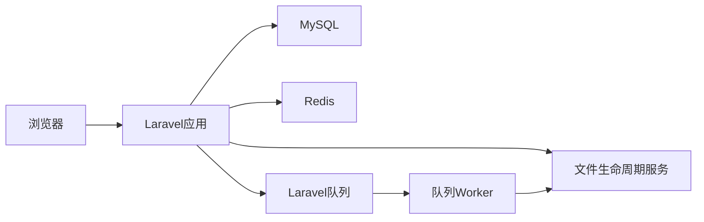
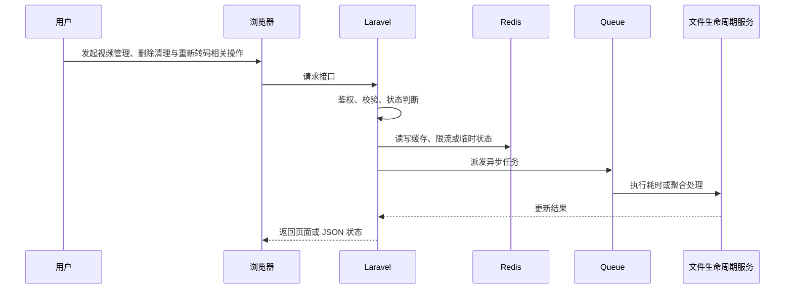

# 【视频管理、删除清理与重新转码】技术方案设计

> 来源：根据 `docs/live-video-chat/10-mainstream-roadmap.md`、`docs/live-video-chat/laravel-live-video-chat-roadmap.md` 和 `docs/live-video-chat/prompt.md` 整理。

## 1. 模块定位

视频管理、删除清理与重新转码属于 **业务 + 技术混合模块**。

删除视频和重试转码会同时影响数据库、原文件、封面、HLS 分片、renditions、队列任务和搜索索引。

它涉及的核心组件是：Storage、Queue、failed_jobs、video_renditions、事务、文件清理 Job、搜索索引。

## 2. 解决的问题

- 用户层面：创作者能管理作品，失败后能重试，删除后页面不再显示无效内容。
- 系统层面：确保数据库记录和多份媒体文件生命周期一致，避免脏数据和磁盘膨胀。
- 不做的问题：只删数据库会留下大文件；只删文件会让播放页 404；重复重试会制造并发转码冲突。
- 所在位置：这是视频发布流程进入可维护项目后的基础运维能力。

## 3. 常见方案对比

| 方案 | 核心思路 | 需要组件 | 优点 | 缺点 | 适合阶段 | 是否推荐 |
| --- | --- | --- | --- | --- | --- | --- |
| 同步删除 | 请求里直接删除 DB 和文件 | Storage、MySQL | 直观 | 大目录删除容易超时 | 小 Demo | 只适合少量文件 |
| 软删除 + 异步清理 | 先隐藏记录，再派发 Job 清理文件 | SoftDeletes、Queue | 用户体验好，可重试 | 需要清理状态 | 学习项目 | 推荐 |
| 生命周期任务 | 定期扫描孤儿文件和过期草稿 | Scheduler、Storage | 能兜底异常 | 实现更复杂 | 项目展示版 | 推荐升级 |
| 对象存储生命周期策略 | S3/OSS 生命周期自动清理冷数据 | 对象存储、CDN | 生产可控成本 | 依赖云服务配置 | 生产环境 | 后续推荐 |

## 4. 推荐学习方案

当前学习项目推荐方案：

```text
方案名称：软删除 + CleanupVideoFilesJob + RetryTranscodeJob
核心组件：Storage、Redis Queue、failed_jobs、video_renditions
Laravel 职责：授权、标记删除、派发清理、重试前重置状态
中间件职责：队列 worker 处理文件删除和转码重试
数据流：用户删除 -> video 标记 deleted -> 派发清理 Job -> 删除原片/封面/HLS/renditions -> 记录日志
适合原因：不会让 HTTP 请求承担大文件删除，也便于失败重试
不足：删除完成存在短暂最终一致性
后续升级：孤儿文件扫描、对象存储 lifecycle、后台批量操作
```

## 5. 生产环境方案、容量和架构设计

### 5.1 生产环境常见方案

| 方案 | 典型架构 | 适合规模 | 优点 | 缺点 | 成本 | 维护难度 | 是否推荐 |
| --- | --- | --- | --- | --- | --- | --- | --- |
| 小型业务方案 | Laravel + MySQL + Redis，文件生命周期服务 单机运行 | 学习项目到小型站点 | 实现成本低，便于排查 | 容量和高可用有限 | 低 | 低 | 学习期推荐 |
| 中型业务方案 | Storage、Queue、failed_jobs、video_renditions、事务、文件清理 Job、搜索索引，队列和缓存拆分，关键任务异步 | 有稳定用户和内容增长 | 吞吐更好，边界清晰 | 需要监控和运维 | 中 | 中 | 推荐演进 |
| 大型业务方案 | 文件生命周期服务 服务化，Redis Cluster，多 worker，多节点 WebSocket/媒体/存储 | 高并发平台 | 可横向扩展 | 架构复杂 | 高 | 高 | 只做设计理解 |
| 云服务方案 | 云对象存储、云 CDN、云直播、云监控或云 IM 等托管能力 | 快速上线或团队较小 | 稳定省运维 | 费用和厂商绑定 | 中到高 | 低到中 | 生产可选 |
| 自建方案 | 自建媒体服务器、对象存储、监控、队列和边缘节点 | 有基础设施团队 | 可控性强 | 建设和维护成本高 | 高 | 高 | 当前不建议实现 |

### 5.2 生产环境容量估算

需要提前估算：

- 每日删除量、平均文件数、HLS 分片数、清理队列积压、磁盘释放速度

估算方式：

```text
先估算峰值用户行为，再换算为数据库写入、Redis key、队列任务、文件容量或广播扇出。
例如一个高峰动作每秒 1000 次，如果每次都同步写 MySQL 热点行，很快会遇到锁竞争；
学习版可以直接写库，项目展示版应增加 Redis 计数、队列聚合或缓存快照。
```

### 5.3 关键设计问题

- Laravel 负责业务控制、权限、状态和元数据，不直接承担大流量或长耗时处理。
- 中间件负责它擅长的事情：Redis 做状态和削峰，Queue 做异步任务，媒体服务器做直播流，对象存储/CDN 做文件分发。
- 所有状态变化要可追踪，失败要能重试或补偿。
- 对用户可见的数据允许最终一致时，要明确同步周期和兜底校准方式。

### 5.4 典型容量瓶颈和解决方式

| 瓶颈 | 表现 | 原因 | 解决方式 |
| --- | --- | --- | --- |
| HLS 分片过多导致删除慢 | 请求变慢、数据不准或任务积压 | 设计不当或容量增长过快 | 拆分异步任务、增加缓存/索引、扩展 worker 或改用专门中间件 |
| 本地磁盘 inode 不足 | 请求变慢、数据不准或任务积压 | 设计不当或容量增长过快 | 拆分异步任务、增加缓存/索引、扩展 worker 或改用专门中间件 |
| 重试任务和新上传任务抢 worker | 请求变慢、数据不准或任务积压 | 设计不当或容量增长过快 | 拆分异步任务、增加缓存/索引、扩展 worker 或改用专门中间件 |

### 5.5 学习版到生产版的演进路线

- 本地学习版：Laravel + MySQL + Redis + 本地 storage，先跑通闭环。
- 项目展示版：引入 Redis queue、状态日志、后台管理、基础监控。
- 小型生产版：Nginx、Supervisor、对象存储、CDN、HTTPS、告警。
- 中大型生产版：多节点、独立 worker、Redis Cluster、读写分离、专门媒体/搜索/监控组件。
- 云服务方案：优先使用云点播、云直播、云 CDN、云对象存储降低运维复杂度。

### 5.6 生产环境面试讲解

如果这个模块从 Demo 变成生产系统，我会先拆清 Laravel 和中间件边界；同步请求只做必要校验和状态写入，耗时任务交给队列，高频状态交给 Redis，大文件和媒体流交给对象存储、CDN 或媒体服务器。容量估算重点看 每日删除量、平均文件数、HLS 分片数、清理队列积压、磁盘释放速度。流量上来后，优先处理 HLS 分片过多导致删除慢、本地磁盘 inode 不足。

## 6. 系统架构图





## 7. 核心流程

### 正常流程

1. 用户在页面发起操作。
2. 浏览器请求 Laravel 接口，并携带登录态或必要参数。
3. Laravel 通过 Policy / FormRequest / Service 校验权限和输入。
4. MySQL 写入业务记录、状态或审计日志。
5. Redis 处理限流、缓存、计数、锁或在线状态。
6. Queue 处理耗时任务、通知、聚合、清理或重试。
7. 相关中间件完成媒体、存储、实时通信或监控职责。
8. 页面展示最新状态，必要时通过轮询或 WebSocket 接收结果。

### 异常流程

- 权限不足：返回 403，并记录必要审计。
- Redis 不可用：降级到数据库快照或直接提示稍后重试。
- 队列未启动：业务状态停留在 pending/processing，后台健康检查报警。
- 并发请求：使用唯一索引、Redis lock 或状态机防重复执行。
- 中间件异常：记录错误摘要，避免把底层异常直接暴露给用户。

## 8. Laravel 实现拆分

### 8.1 数据库表

- videos：deleted_at、cleanup_status、processing_status、hls_path、thumbnail_path
- video_renditions：video_id、quality、path、status
- video_file_cleanup_logs：video_id、path、status、error
- failed_jobs：记录失败任务

### 8.2 Model

- Video hasMany VideoRendition / CleanupLog
- Video uses SoftDeletes

### 8.3 Controller

- VideoManagementController：edit、update、destroy、retryTranscode
- Controller 不直接遍历删除目录

Controller 只负责接收请求、调用授权、组织响应；复杂状态、文件、队列和中间件调用应放到 Service 或 Job。

### 8.4 Service / Support / Action

- VideoFileInventoryService：列出该视频所有文件路径
- VideoCleanupService：幂等删除
- VideoRetryService：重置状态并派发转码

### 8.5 Job

- CleanupVideoFilesJob：删除原文件、封面、HLS、rendition
- RetryVideoTranscodeJob：重置失败状态后重新进入处理队列
- ScanOrphanVideoFilesJob：定期兜底清理

Job 需要设置合理的 `tries`、`timeout`、`backoff`，失败后更新业务状态并写入可排查的错误摘要。

### 8.6 Event / Listener

- VideoDeleted、VideoCleanupCompleted、VideoTranscodeRetried

### 8.7 WebSocket / Broadcasting

- private-user.{id} 推送重试结果

### 8.8 Policy / Middleware

- 作者可删除自己的视频，管理员可下架或删除违规视频

## 9. Docker 组件选择

| 组件 | 镜像示例 | 用途 | 本地学习是否需要 |
| --- | --- | --- | --- |
| MySQL | mysql:8.0 | 业务数据、状态、审计日志 | 需要 |
| Redis | redis:7-alpine | 缓存、限流、队列、在线状态 | 多数模块需要 |
| Redis Queue | redis:7-alpine | 清理和重试队列 | 需要 |
| MinIO | minio/minio | 后续验证对象存储删除 | 后续扩展 |

## 10. 数据和状态设计

核心状态：

- cleanup_status：pending -> deleting -> deleted / failed
- processing_status：failed -> retrying -> processing -> ready / failed

状态设计原则：

- 状态迁移必须有明确触发者：用户、管理员、队列任务、媒体服务器回调或定时任务。
- 状态变化失败时要保留错误原因，并允许重试或人工处理。
- 页面展示使用业务状态，不直接暴露内部异常栈。

## 11. Redis / Queue / WebSocket 使用方式

### 11.1 Redis

- 重试操作用 video:{id}:retrying 锁防并发
- 清理进度可短期写 Redis
- 删除后清理热门列表缓存

### 11.2 Queue

- 清理和重试都必须异步
- 清理任务要幂等，文件不存在视为成功
- 转码重试设置 timeout 和 tries

### 11.3 WebSocket / Reverb

- 创作者后台可接收 cleanup failed / retry completed 通知

## 12. 安全风险

- 路径穿越：清理前校验路径在视频目录内
- 并发转码和删除冲突：删除前加视频级锁
- 误删共享目录：文件路径必须按 video_id 隔离
- 重复重试：状态和锁双重控制

## 13. 性能和扩展

- 学习版：单机 Laravel + MySQL + Redis 可以支撑低并发演示和手动验收。
- 第一类瓶颈：HLS 分片过多导致删除慢。
- 第二类瓶颈：本地磁盘 inode 不足。
- 扩展方式：先拆异步任务和缓存，再拆专门中间件，最后考虑多节点和云服务。
- 存储扩展：本地 storage -> MinIO/S3 -> CDN。
- 队列扩展：database queue -> Redis queue -> Horizon -> 多 worker / 多机器。
- 实时扩展：单 Reverb -> 多节点 Reverb + Redis pub/sub 或专门网关。

## 14. 监控和排查

重点指标：

- 清理成功率
- 清理耗时
- 孤儿文件数量
- 转码重试成功率
- 失败任务数量

本地排查方式：

- `storage/logs/laravel.log`
- `php artisan queue:failed`
- `docker compose logs`
- 浏览器 Network / Console
- Redis CLI 查看关键 key
- MySQL 查询状态表和日志表

## 15. 分阶段实施路线

- Phase 1：删除视频时软删除并清理本地文件
- Phase 2：失败任务重试、清理日志、孤儿文件扫描
- Phase 3：对象存储生命周期、批量删除、文件成本报表

验收标准：

- Phase 1：本地能跑通主流程，有最小权限校验和失败提示。
- Phase 2：状态、队列、Redis、日志和后台入口完整，能作为简历项目讲解。
- Phase 3：能说明生产环境如何扩容、如何监控、如何控制成本和风险。

## 16. 面试讲解角度

### 16.1 这个功能为什么要这样设计？

因为 只删数据库会留下大文件；只删文件会让播放页 404；重复重试会制造并发转码冲突。，所以需要把业务状态、技术组件和异常处理拆清楚。

### 16.2 Laravel 在里面负责什么？

Laravel 负责认证授权、业务状态、数据库元数据、队列派发、事件通知和后台管理。

### 16.3 中间件负责什么？

中间件负责缓存、限流、异步执行、媒体处理、实时通信、文件分发或监控采集，避免 Laravel 承担不适合的工作。

### 16.4 为什么不能全部用 Laravel 直接做？

Laravel 适合业务控制，不适合长时间转码、大文件分发、高频实时连接或大规模计数。全部塞进 Laravel 会导致请求超时、内存压力、连接数瓶颈和维护困难。

### 16.5 如果数据量 / 流量变大，怎么扩展？

先做 Redis 缓存和计数削峰，再把耗时逻辑放进队列；文件和媒体流迁移到对象存储、CDN 或媒体服务器；最后按业务压力拆分 worker、WebSocket、搜索或监控组件。

### 16.6 失败场景怎么处理？

失败要记录状态、错误摘要和可重试入口。队列任务失败进入 failed_jobs，用户看到可理解的状态，管理员能在后台查看和处理。

### 16.7 安全风险怎么处理？

围绕越权、刷接口、路径安全、敏感信息泄露和管理员误操作做防护，关键动作都要走 Policy、RateLimiter、审计日志和输入校验。

### 16.8 这个方案还有哪些不足？

学习版强调可理解和可验收，不覆盖复杂推荐、版权识别、支付结算、跨地域高可用和大型风控系统。生产环境需要按业务规模逐步引入专门服务。

## 17. 总结

视频管理要把数据库状态、媒体文件和队列任务当成一个生命周期处理，删除和重试都需要幂等、可重试、可审计。

## 一句话总结

视频管理、删除清理与重新转码的核心设计是：Laravel 管业务和状态，中间件管性能和基础设施，所有高频、耗时、可失败的部分都要异步化、可观测、可重试。
