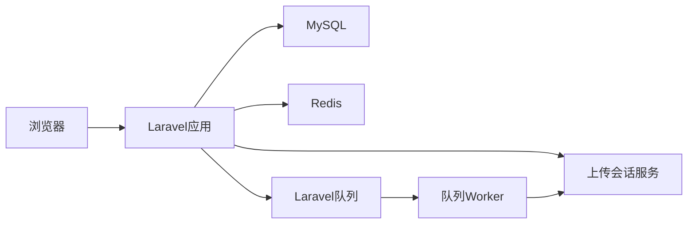
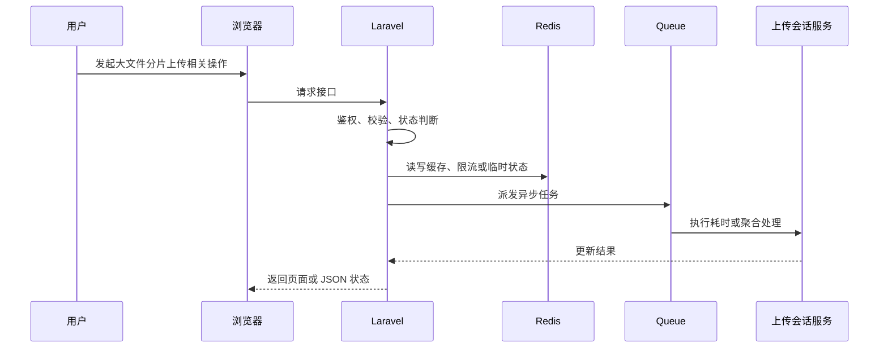

# 【大文件分片上传】技术方案设计

> 来源：根据 `docs/live-video-chat/10-mainstream-roadmap.md`、`docs/live-video-chat/laravel-live-video-chat-roadmap.md` 和 `docs/live-video-chat/prompt.md` 整理。

## 1. 模块定位

大文件分片上传属于 **技术功能模块**。

大视频不能长期依赖普通表单上传，需要处理分片、断点续传、临时文件、合并、幂等和清理。

它涉及的核心组件是：Blade + JS、XHR/fetch progress、upload_sessions、chunk storage、Queue、Scheduler。

## 2. 解决的问题

- 用户层面：用户上传大视频时能看到进度，网络中断后可以继续，不必从头上传。
- 系统层面：降低单个 HTTP 请求超时和 PHP 上传限制带来的失败率。
- 不做的问题：大文件上传容易超时、失败后无法恢复，临时文件也会不断堆积。
- 所在位置：它是从学习 Demo 走向主流视频平台上传体验的关键步骤。

## 3. 常见方案对比

| 方案 | 核心思路 | 需要组件 | 优点 | 缺点 | 适合阶段 | 是否推荐 |
| --- | --- | --- | --- | --- | --- | --- |
| 普通表单上传 | 一次请求上传完整文件 | PHP upload、Storage | 最简单 | 大文件易失败 | 小 Demo | 已有基础即可 |
| 前端进度条 | 仍单文件上传，但监听 progress | XHR、Controller | 体验改善 | 不能断点续传 | 学习版 | 可先做 |
| 自研分片上传 | 创建上传会话，逐片上传，最后合并 | upload_sessions、chunk dir | 可控、适合学习 | 需要处理幂等和清理 | 项目展示版 | 推荐 |
| 对象存储 Multipart Upload | 浏览器直传 S3/OSS 分片 | S3 Multipart、签名 URL | 生产成熟 | 本地学习复杂 | 生产环境 | 后续推荐 |

## 4. 推荐学习方案

当前学习项目推荐方案：

```text
方案名称：Laravel 上传会话 + 本地分片目录 + 合并 Job
核心组件：video_upload_sessions、Storage、Redis lock、Queue
Laravel 职责：创建会话、校验分片、记录进度、合并后创建 video 并派发转码
中间件职责：队列合并文件和清理过期分片
数据流：创建 session -> 上传 chunk -> 记录 chunk -> complete -> 合并 -> 创建视频记录 -> 转码
适合原因：本地 Docker 可验证，能讲清断点续传和幂等
不足：大并发合并会占用本机磁盘 IO
后续升级：S3 Multipart Upload + 前端直传 + 回调创建视频
```

## 5. 生产环境方案、容量和架构设计

### 5.1 生产环境常见方案

| 方案 | 典型架构 | 适合规模 | 优点 | 缺点 | 成本 | 维护难度 | 是否推荐 |
| --- | --- | --- | --- | --- | --- | --- | --- |
| 小型业务方案 | Laravel + MySQL + Redis，上传会话服务 单机运行 | 学习项目到小型站点 | 实现成本低，便于排查 | 容量和高可用有限 | 低 | 低 | 学习期推荐 |
| 中型业务方案 | Blade + JS、XHR/fetch progress、upload_sessions、chunk storage、Queue、Scheduler，队列和缓存拆分，关键任务异步 | 有稳定用户和内容增长 | 吞吐更好，边界清晰 | 需要监控和运维 | 中 | 中 | 推荐演进 |
| 大型业务方案 | 上传会话服务 服务化，Redis Cluster，多 worker，多节点 WebSocket/媒体/存储 | 高并发平台 | 可横向扩展 | 架构复杂 | 高 | 高 | 只做设计理解 |
| 云服务方案 | 云对象存储、云 CDN、云直播、云监控或云 IM 等托管能力 | 快速上线或团队较小 | 稳定省运维 | 费用和厂商绑定 | 中到高 | 低到中 | 生产可选 |
| 自建方案 | 自建媒体服务器、对象存储、监控、队列和边缘节点 | 有基础设施团队 | 可控性强 | 建设和维护成本高 | 高 | 高 | 当前不建议实现 |

### 5.2 生产环境容量估算

需要提前估算：

- 单视频最大大小、chunk 大小、并发上传数、临时文件保留时间、每日新增临时存储

估算方式：

```text
先估算峰值用户行为，再换算为数据库写入、Redis key、队列任务、文件容量或广播扇出。
例如一个高峰动作每秒 1000 次，如果每次都同步写 MySQL 热点行，很快会遇到锁竞争；
学习版可以直接写库，项目展示版应增加 Redis 计数、队列聚合或缓存快照。
```

### 5.3 关键设计问题

- Laravel 负责业务控制、权限、状态和元数据，不直接承担大流量或长耗时处理。
- 中间件负责它擅长的事情：Redis 做状态和削峰，Queue 做异步任务，媒体服务器做直播流，对象存储/CDN 做文件分发。
- 所有状态变化要可追踪，失败要能重试或补偿。
- 对用户可见的数据允许最终一致时，要明确同步周期和兜底校准方式。

### 5.4 典型容量瓶颈和解决方式

| 瓶颈 | 表现 | 原因 | 解决方式 |
| --- | --- | --- | --- |
| PHP 请求体限制 | 请求变慢、数据不准或任务积压 | 设计不当或容量增长过快 | 拆分异步任务、增加缓存/索引、扩展 worker 或改用专门中间件 |
| 临时目录磁盘 IO | 请求变慢、数据不准或任务积压 | 设计不当或容量增长过快 | 拆分异步任务、增加缓存/索引、扩展 worker 或改用专门中间件 |
| 合并大文件占用 worker | 请求变慢、数据不准或任务积压 | 设计不当或容量增长过快 | 拆分异步任务、增加缓存/索引、扩展 worker 或改用专门中间件 |
| 用户重复 complete 导致并发合并 | 请求变慢、数据不准或任务积压 | 设计不当或容量增长过快 | 拆分异步任务、增加缓存/索引、扩展 worker 或改用专门中间件 |

### 5.5 学习版到生产版的演进路线

- 本地学习版：Laravel + MySQL + Redis + 本地 storage，先跑通闭环。
- 项目展示版：引入 Redis queue、状态日志、后台管理、基础监控。
- 小型生产版：Nginx、Supervisor、对象存储、CDN、HTTPS、告警。
- 中大型生产版：多节点、独立 worker、Redis Cluster、读写分离、专门媒体/搜索/监控组件。
- 云服务方案：优先使用云点播、云直播、云 CDN、云对象存储降低运维复杂度。

### 5.6 生产环境面试讲解

如果这个模块从 Demo 变成生产系统，我会先拆清 Laravel 和中间件边界；同步请求只做必要校验和状态写入，耗时任务交给队列，高频状态交给 Redis，大文件和媒体流交给对象存储、CDN 或媒体服务器。容量估算重点看 单视频最大大小、chunk 大小、并发上传数、临时文件保留时间、每日新增临时存储。流量上来后，优先处理 PHP 请求体限制、临时目录磁盘 IO。

## 6. 系统架构图





## 7. 核心流程

### 正常流程

1. 用户在页面发起操作。
2. 浏览器请求 Laravel 接口，并携带登录态或必要参数。
3. Laravel 通过 Policy / FormRequest / Service 校验权限和输入。
4. MySQL 写入业务记录、状态或审计日志。
5. Redis 处理限流、缓存、计数、锁或在线状态。
6. Queue 处理耗时任务、通知、聚合、清理或重试。
7. 相关中间件完成媒体、存储、实时通信或监控职责。
8. 页面展示最新状态，必要时通过轮询或 WebSocket 接收结果。

### 异常流程

- 权限不足：返回 403，并记录必要审计。
- Redis 不可用：降级到数据库快照或直接提示稍后重试。
- 队列未启动：业务状态停留在 pending/processing，后台健康检查报警。
- 并发请求：使用唯一索引、Redis lock 或状态机防重复执行。
- 中间件异常：记录错误摘要，避免把底层异常直接暴露给用户。

## 8. Laravel 实现拆分

### 8.1 数据库表

- video_upload_sessions：id、user_id、filename、filesize、chunk_size、total_chunks、uploaded_chunks、status、expires_at
- video_upload_chunks：session_id、index、size、checksum、path
- videos：session_id、original_path、processing_status

### 8.2 Model

- VideoUploadSession hasMany VideoUploadChunk
- VideoUploadSession belongsTo User
- Video belongsTo UploadSession

### 8.3 Controller

- UploadSessionController：init、chunk、complete、status
- VideoController 不再直接接收大文件

Controller 只负责接收请求、调用授权、组织响应；复杂状态、文件、队列和中间件调用应放到 Service 或 Job。

### 8.4 Service / Support / Action

- ChunkUploadService：校验 chunk index、size、checksum
- ChunkMergeService：按顺序合并并校验总大小
- UploadCleanupService：清理过期 session

### 8.5 Job

- MergeUploadedChunksJob：合并分片并创建视频记录
- CleanupExpiredUploadSessionsJob：删除过期临时分片

Job 需要设置合理的 `tries`、`timeout`、`backoff`，失败后更新业务状态并写入可排查的错误摘要。

### 8.6 Event / Listener

- UploadSessionCreated、UploadChunkReceived、UploadCompleted、UploadFailed

### 8.7 WebSocket / Broadcasting

- private-user.{id} 推送合并完成或失败

### 8.8 Policy / Middleware

- 登录用户才能创建上传会话；用户只能操作自己的 session

## 9. Docker 组件选择

| 组件 | 镜像示例 | 用途 | 本地学习是否需要 |
| --- | --- | --- | --- |
| MySQL | mysql:8.0 | 业务数据、状态、审计日志 | 需要 |
| Redis | redis:7-alpine | 缓存、限流、队列、在线状态 | 多数模块需要 |
| Nginx | nginx | 调整 client_max_body_size 和反代超时 | 后续扩展 |
| MinIO | minio/minio | 验证对象存储 Multipart 思路 | 后续扩展 |

## 10. 数据和状态设计

核心状态：

- upload_session.status：created -> uploading -> merging -> completed / failed / expired

状态设计原则：

- 状态迁移必须有明确触发者：用户、管理员、队列任务、媒体服务器回调或定时任务。
- 状态变化失败时要保留错误原因，并允许重试或人工处理。
- 页面展示使用业务状态，不直接暴露内部异常栈。

## 11. Redis / Queue / WebSocket 使用方式

### 11.1 Redis

- session:{id}:merge_lock 防止重复 complete
- 上传进度可用 Hash 快速展示
- RateLimiter 限制创建 session 和 chunk QPS

### 11.2 Queue

- 合并和清理放队列
- 合并失败要保留错误原因并允许重新 complete
- 转码任务在合并成功后派发

### 11.3 WebSocket / Reverb

- 不是必须；可用私有频道通知合并完成

## 12. 安全风险

- 文件类型伪造：合并后再 MIME/ffprobe 校验
- 路径穿越：分片路径由系统生成
- 重复分片：chunk 唯一索引 session_id + index
- 磁盘打满：限制用户并发 session 和过期清理

## 13. 性能和扩展

- 学习版：单机 Laravel + MySQL + Redis 可以支撑低并发演示和手动验收。
- 第一类瓶颈：PHP 请求体限制。
- 第二类瓶颈：临时目录磁盘 IO。
- 扩展方式：先拆异步任务和缓存，再拆专门中间件，最后考虑多节点和云服务。
- 存储扩展：本地 storage -> MinIO/S3 -> CDN。
- 队列扩展：database queue -> Redis queue -> Horizon -> 多 worker / 多机器。
- 实时扩展：单 Reverb -> 多节点 Reverb + Redis pub/sub 或专门网关。

## 14. 监控和排查

重点指标：

- 上传成功率
- chunk 失败率
- 合并耗时
- 过期 session 数
- 临时目录大小

本地排查方式：

- `storage/logs/laravel.log`
- `php artisan queue:failed`
- `docker compose logs`
- 浏览器 Network / Console
- Redis CLI 查看关键 key
- MySQL 查询状态表和日志表

## 15. 分阶段实施路线

- Phase 1：单文件上传进度条和基础校验
- Phase 2：上传会话、分片上传、合并 Job、过期清理
- Phase 3：对象存储 Multipart、前端直传、上传质量监控

验收标准：

- Phase 1：本地能跑通主流程，有最小权限校验和失败提示。
- Phase 2：状态、队列、Redis、日志和后台入口完整，能作为简历项目讲解。
- Phase 3：能说明生产环境如何扩容、如何监控、如何控制成本和风险。

## 16. 面试讲解角度

### 16.1 这个功能为什么要这样设计？

因为 大文件上传容易超时、失败后无法恢复，临时文件也会不断堆积。，所以需要把业务状态、技术组件和异常处理拆清楚。

### 16.2 Laravel 在里面负责什么？

Laravel 负责认证授权、业务状态、数据库元数据、队列派发、事件通知和后台管理。

### 16.3 中间件负责什么？

中间件负责缓存、限流、异步执行、媒体处理、实时通信、文件分发或监控采集，避免 Laravel 承担不适合的工作。

### 16.4 为什么不能全部用 Laravel 直接做？

Laravel 适合业务控制，不适合长时间转码、大文件分发、高频实时连接或大规模计数。全部塞进 Laravel 会导致请求超时、内存压力、连接数瓶颈和维护困难。

### 16.5 如果数据量 / 流量变大，怎么扩展？

先做 Redis 缓存和计数削峰，再把耗时逻辑放进队列；文件和媒体流迁移到对象存储、CDN 或媒体服务器；最后按业务压力拆分 worker、WebSocket、搜索或监控组件。

### 16.6 失败场景怎么处理？

失败要记录状态、错误摘要和可重试入口。队列任务失败进入 failed_jobs，用户看到可理解的状态，管理员能在后台查看和处理。

### 16.7 安全风险怎么处理？

围绕越权、刷接口、路径安全、敏感信息泄露和管理员误操作做防护，关键动作都要走 Policy、RateLimiter、审计日志和输入校验。

### 16.8 这个方案还有哪些不足？

学习版强调可理解和可验收，不覆盖复杂推荐、版权识别、支付结算、跨地域高可用和大型风控系统。生产环境需要按业务规模逐步引入专门服务。

## 17. 总结

分片上传的关键是把一次大请求拆成可恢复的小请求，并用上传会话、分片记录、合并锁和清理任务保证最终文件正确生成。

## 一句话总结

大文件分片上传的核心设计是：Laravel 管业务和状态，中间件管性能和基础设施，所有高频、耗时、可失败的部分都要异步化、可观测、可重试。
