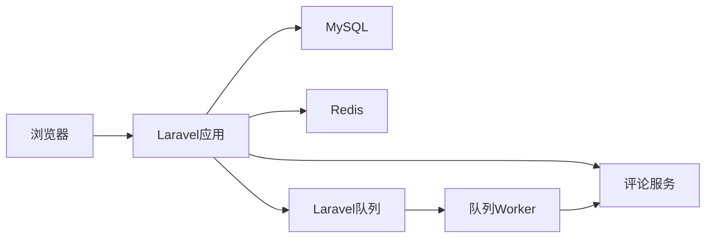
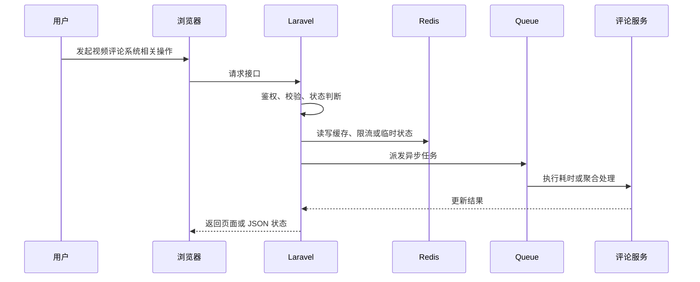

# 【视频评论系统】技术方案设计

> 来源：根据 `docs/live-video-chat/10-mainstream-roadmap.md`、`docs/live-video-chat/laravel-live-video-chat-roadmap.md` 和 `docs/live-video-chat/prompt.md` 整理。

## 1. 模块定位

视频评论系统属于 **业务 + 技术混合模块**。

评论不是简单文本表，它需要分页、回复、删除、审核、敏感词、通知和反刷。

它涉及的核心组件是：video_comments、comment_likes、Policy、RateLimiter、敏感词服务、Notification、Queue。

## 2. 解决的问题

- 用户层面：用户可以对视频发表评论、回复、点赞评论，并能删除自己的评论。
- 系统层面：评论需要持久化、可分页、可审核，并和直播聊天这种实时高频消息区分。
- 不做的问题：评论无审核和限流会带来垃圾内容、XSS、刷屏和后台管理缺失。
- 所在位置：它是视频社区互动的核心模块，并连接通知和审核系统。

## 3. 常见方案对比

| 方案 | 核心思路 | 需要组件 | 优点 | 缺点 | 适合阶段 | 是否推荐 |
| --- | --- | --- | --- | --- | --- | --- |
| 平铺评论 | 所有评论只有 video_id，无回复 | MySQL | 简单 | 缺少楼中楼 | 学习版第一步 | 可用 |
| parent_id 楼中楼 | 一级评论 + 回复评论 | MySQL 索引 | 主流体验 | 查询和权限更复杂 | 学习项目 | 推荐 |
| 评论审核流 | 敏感词命中进入待审或隐藏 | 审核表、后台 | 安全可控 | 需要审核运营 | 项目展示版 | 推荐升级 |
| 独立评论服务 | 评论数据单独存储和扩展 | 独立服务/NoSQL | 适合超大规模 | 当前过度 | 大型平台 | 不推荐当前 |

## 4. 推荐学习方案

当前学习项目推荐方案：

```text
方案名称：MySQL 分页评论 + parent_id 回复 + 敏感词 + 通知
核心组件：video_comments、comment_likes、Redis RateLimiter、Laravel Notification
Laravel 职责：评论 CRUD、权限、敏感词、分页、通知触发
中间件职责：Redis 限流，队列发送通知和审核任务
数据流：用户提交 -> 校验限流和敏感词 -> 写评论 -> 通知作者 -> 页面分页展示
适合原因：能区分评论和直播聊天两类模型
不足：评论排序和大规模楼中楼需要进一步优化
后续升级：审核后台、热评排序、反垃圾策略
```

## 5. 生产环境方案、容量和架构设计

### 5.1 生产环境常见方案

| 方案 | 典型架构 | 适合规模 | 优点 | 缺点 | 成本 | 维护难度 | 是否推荐 |
| --- | --- | --- | --- | --- | --- | --- | --- |
| 小型业务方案 | Laravel + MySQL + Redis，评论服务 单机运行 | 学习项目到小型站点 | 实现成本低，便于排查 | 容量和高可用有限 | 低 | 低 | 学习期推荐 |
| 中型业务方案 | video_comments、comment_likes、Policy、RateLimiter、敏感词服务、Notification、Queue，队列和缓存拆分，关键任务异步 | 有稳定用户和内容增长 | 吞吐更好，边界清晰 | 需要监控和运维 | 中 | 中 | 推荐演进 |
| 大型业务方案 | 评论服务 服务化，Redis Cluster，多 worker，多节点 WebSocket/媒体/存储 | 高并发平台 | 可横向扩展 | 架构复杂 | 高 | 高 | 只做设计理解 |
| 云服务方案 | 云对象存储、云 CDN、云直播、云监控或云 IM 等托管能力 | 快速上线或团队较小 | 稳定省运维 | 费用和厂商绑定 | 中到高 | 低到中 | 生产可选 |
| 自建方案 | 自建媒体服务器、对象存储、监控、队列和边缘节点 | 有基础设施团队 | 可控性强 | 建设和维护成本高 | 高 | 高 | 当前不建议实现 |

### 5.2 生产环境容量估算

需要提前估算：

- 单视频评论数、回复深度、分页大小、日新增评论、评论明细保留周期

估算方式：

```text
先估算峰值用户行为，再换算为数据库写入、Redis key、队列任务、文件容量或广播扇出。
例如一个高峰动作每秒 1000 次，如果每次都同步写 MySQL 热点行，很快会遇到锁竞争；
学习版可以直接写库，项目展示版应增加 Redis 计数、队列聚合或缓存快照。
```

### 5.3 关键设计问题

- Laravel 负责业务控制、权限、状态和元数据，不直接承担大流量或长耗时处理。
- 中间件负责它擅长的事情：Redis 做状态和削峰，Queue 做异步任务，媒体服务器做直播流，对象存储/CDN 做文件分发。
- 所有状态变化要可追踪，失败要能重试或补偿。
- 对用户可见的数据允许最终一致时，要明确同步周期和兜底校准方式。

### 5.4 典型容量瓶颈和解决方式

| 瓶颈 | 表现 | 原因 | 解决方式 |
| --- | --- | --- | --- |
| 热门视频评论分页慢 | 请求变慢、数据不准或任务积压 | 设计不当或容量增长过快 | 拆分异步任务、增加缓存/索引、扩展 worker 或改用专门中间件 |
| 楼中楼深度过深 | 请求变慢、数据不准或任务积压 | 设计不当或容量增长过快 | 拆分异步任务、增加缓存/索引、扩展 worker 或改用专门中间件 |
| 评论计数频繁更新 video_metrics | 请求变慢、数据不准或任务积压 | 设计不当或容量增长过快 | 拆分异步任务、增加缓存/索引、扩展 worker 或改用专门中间件 |
| 通知队列积压 | 请求变慢、数据不准或任务积压 | 设计不当或容量增长过快 | 拆分异步任务、增加缓存/索引、扩展 worker 或改用专门中间件 |

### 5.5 学习版到生产版的演进路线

- 本地学习版：Laravel + MySQL + Redis + 本地 storage，先跑通闭环。
- 项目展示版：引入 Redis queue、状态日志、后台管理、基础监控。
- 小型生产版：Nginx、Supervisor、对象存储、CDN、HTTPS、告警。
- 中大型生产版：多节点、独立 worker、Redis Cluster、读写分离、专门媒体/搜索/监控组件。
- 云服务方案：优先使用云点播、云直播、云 CDN、云对象存储降低运维复杂度。

### 5.6 生产环境面试讲解

如果这个模块从 Demo 变成生产系统，我会先拆清 Laravel 和中间件边界；同步请求只做必要校验和状态写入，耗时任务交给队列，高频状态交给 Redis，大文件和媒体流交给对象存储、CDN 或媒体服务器。容量估算重点看 单视频评论数、回复深度、分页大小、日新增评论、评论明细保留周期。流量上来后，优先处理 热门视频评论分页慢、楼中楼深度过深。

## 6. 系统架构图





## 7. 核心流程

### 正常流程

1. 用户在页面发起操作。
2. 浏览器请求 Laravel 接口，并携带登录态或必要参数。
3. Laravel 通过 Policy / FormRequest / Service 校验权限和输入。
4. MySQL 写入业务记录、状态或审计日志。
5. Redis 处理限流、缓存、计数、锁或在线状态。
6. Queue 处理耗时任务、通知、聚合、清理或重试。
7. 相关中间件完成媒体、存储、实时通信或监控职责。
8. 页面展示最新状态，必要时通过轮询或 WebSocket 接收结果。

### 异常流程

- 权限不足：返回 403，并记录必要审计。
- Redis 不可用：降级到数据库快照或直接提示稍后重试。
- 队列未启动：业务状态停留在 pending/processing，后台健康检查报警。
- 并发请求：使用唯一索引、Redis lock 或状态机防重复执行。
- 中间件异常：记录错误摘要，避免把底层异常直接暴露给用户。

## 8. Laravel 实现拆分

### 8.1 数据库表

- video_comments：id、video_id、user_id、parent_id、body、status、deleted_at
- comment_likes：comment_id、user_id，唯一约束
- comment_reports：comment_id、reporter_id、reason
- blocked_words：word、action

### 8.2 Model

- Video hasMany Comment
- Comment belongsTo User / Video / parent
- Comment hasMany replies
- Comment belongsToMany likedUsers

### 8.3 Controller

- VideoCommentController：index、store、destroy
- CommentReplyController：store
- CommentLikeController：toggle
- CommentReportController：store

Controller 只负责接收请求、调用授权、组织响应；复杂状态、文件、队列和中间件调用应放到 Service 或 Job。

### 8.4 Service / Support / Action

- CommentService：发布、删除、回复
- SensitiveWordService：过滤或命中待审
- CommentNotificationService：通知作者和被回复者

### 8.5 Job

- SendCommentNotificationJob
- ModerateCommentJob
- RecalculateCommentCountJob

Job 需要设置合理的 `tries`、`timeout`、`backoff`，失败后更新业务状态并写入可排查的错误摘要。

### 8.6 Event / Listener

- CommentCreated、CommentDeleted、CommentReported、CommentLiked

### 8.7 WebSocket / Broadcasting

- 评论通常不实时广播；通知可走 private-user.{id}

### 8.8 Policy / Middleware

- 作者可删自己的评论；视频作者和管理员可删除视频下评论；被封禁用户不可评论

## 9. Docker 组件选择

| 组件 | 镜像示例 | 用途 | 本地学习是否需要 |
| --- | --- | --- | --- |
| MySQL | mysql:8.0 | 业务数据、状态、审计日志 | 需要 |
| Redis | redis:7-alpine | 缓存、限流、队列、在线状态 | 多数模块需要 |
| Redis | redis:7-alpine | 限流和评论计数缓存 | 需要 |
| Mailpit | mailpit/mailpit | 本地通知邮件验证 | 可选 |

## 10. 数据和状态设计

核心状态：

- comment.status：normal -> hidden / deleted / pending_review / rejected

状态设计原则：

- 状态迁移必须有明确触发者：用户、管理员、队列任务、媒体服务器回调或定时任务。
- 状态变化失败时要保留错误原因，并允许重试或人工处理。
- 页面展示使用业务状态，不直接暴露内部异常栈。

## 11. Redis / Queue / WebSocket 使用方式

### 11.1 Redis

- RateLimiter 限制用户评论频率
- 热门视频评论第一页短缓存
- 评论点赞计数可 Redis 增量后落库

### 11.2 Queue

- 通知、审核、计数重算异步
- 评论主体写入同步完成以便立即展示

### 11.3 WebSocket / Reverb

- 只在通知中心推送新评论通知，不把评论当聊天室实时广播

## 12. 安全风险

- XSS：输出转义并禁止危险 HTML
- 刷屏：用户和 IP 限流
- 越权删除：Policy 控制
- 敏感内容：命中词进入待审或替换

## 13. 性能和扩展

- 学习版：单机 Laravel + MySQL + Redis 可以支撑低并发演示和手动验收。
- 第一类瓶颈：热门视频评论分页慢。
- 第二类瓶颈：楼中楼深度过深。
- 扩展方式：先拆异步任务和缓存，再拆专门中间件，最后考虑多节点和云服务。
- 存储扩展：本地 storage -> MinIO/S3 -> CDN。
- 队列扩展：database queue -> Redis queue -> Horizon -> 多 worker / 多机器。
- 实时扩展：单 Reverb -> 多节点 Reverb + Redis pub/sub 或专门网关。

## 14. 监控和排查

重点指标：

- 评论发布 QPS
- 评论删除率
- 敏感词命中率
- 举报量
- 通知发送失败数

本地排查方式：

- `storage/logs/laravel.log`
- `php artisan queue:failed`
- `docker compose logs`
- 浏览器 Network / Console
- Redis CLI 查看关键 key
- MySQL 查询状态表和日志表

## 15. 分阶段实施路线

- Phase 1：平铺评论、分页、删除和 Policy
- Phase 2：回复、点赞、举报、敏感词
- Phase 3：审核后台、热评排序、反垃圾和通知聚合

验收标准：

- Phase 1：本地能跑通主流程，有最小权限校验和失败提示。
- Phase 2：状态、队列、Redis、日志和后台入口完整，能作为简历项目讲解。
- Phase 3：能说明生产环境如何扩容、如何监控、如何控制成本和风险。

## 16. 面试讲解角度

### 16.1 这个功能为什么要这样设计？

因为 评论无审核和限流会带来垃圾内容、XSS、刷屏和后台管理缺失。，所以需要把业务状态、技术组件和异常处理拆清楚。

### 16.2 Laravel 在里面负责什么？

Laravel 负责认证授权、业务状态、数据库元数据、队列派发、事件通知和后台管理。

### 16.3 中间件负责什么？

中间件负责缓存、限流、异步执行、媒体处理、实时通信、文件分发或监控采集，避免 Laravel 承担不适合的工作。

### 16.4 为什么不能全部用 Laravel 直接做？

Laravel 适合业务控制，不适合长时间转码、大文件分发、高频实时连接或大规模计数。全部塞进 Laravel 会导致请求超时、内存压力、连接数瓶颈和维护困难。

### 16.5 如果数据量 / 流量变大，怎么扩展？

先做 Redis 缓存和计数削峰，再把耗时逻辑放进队列；文件和媒体流迁移到对象存储、CDN 或媒体服务器；最后按业务压力拆分 worker、WebSocket、搜索或监控组件。

### 16.6 失败场景怎么处理？

失败要记录状态、错误摘要和可重试入口。队列任务失败进入 failed_jobs，用户看到可理解的状态，管理员能在后台查看和处理。

### 16.7 安全风险怎么处理？

围绕越权、刷接口、路径安全、敏感信息泄露和管理员误操作做防护，关键动作都要走 Policy、RateLimiter、审计日志和输入校验。

### 16.8 这个方案还有哪些不足？

学习版强调可理解和可验收，不覆盖复杂推荐、版权识别、支付结算、跨地域高可用和大型风控系统。生产环境需要按业务规模逐步引入专门服务。

## 17. 总结

评论系统要按持久化社区内容设计，重点是分页、权限、审核和通知，而不是复用直播聊天那套实时滚动模型。

## 一句话总结

视频评论系统的核心设计是：Laravel 管业务和状态，中间件管性能和基础设施，所有高频、耗时、可失败的部分都要异步化、可观测、可重试。
