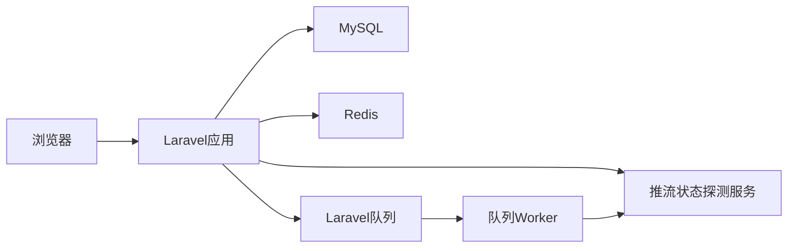
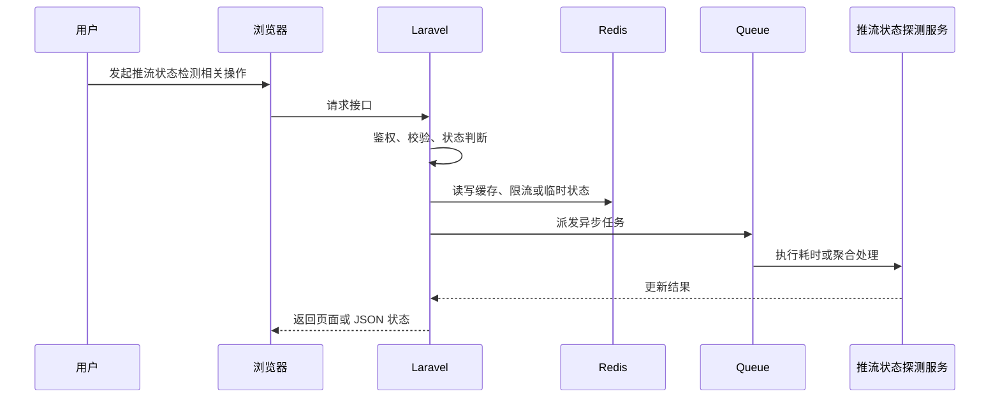

# 【推流状态检测】技术方案设计

> 来源：根据 `docs/live-video-chat/10-mainstream-roadmap.md`、`docs/live-video-chat/laravel-live-video-chat-roadmap.md` 和 `docs/live-video-chat/prompt.md` 整理。

## 1. 模块定位

推流状态检测属于 **技术功能模块**。

推流状态需要从媒体服务器或 HLS 可用性推断，并用防抖避免短暂 404 或网络抖动导致误判。

它涉及的核心组件是：Scheduler、HTTP 探测、MediaMTX API/Hook、live_stream_events、防抖计数、Queue。

## 2. 解决的问题

- 用户层面：主播和观众能看到直播是否正在推流、断流或已结束。
- 系统层面：房间业务状态要跟真实媒体流状态保持最终一致。
- 不做的问题：OBS 停止后房间仍显示直播中，或刚开播 HLS 还没生成就被误判失败。
- 所在位置：它连接 MediaMTX/SRS 和 Laravel 房间状态。

## 3. 常见方案对比

| 方案 | 核心思路 | 需要组件 | 优点 | 缺点 | 适合阶段 | 是否推荐 |
| --- | --- | --- | --- | --- | --- | --- |
| 手动开始结束 | 主播点击按钮切换 live/ended | Laravel | 简单 | 和真实推流不一致 | Demo | 不推荐长期 |
| HLS m3u8 探测 | 定时请求 playback_url 判断是否可播放 | Scheduler、HTTP Client | 无需改媒体服务器 | 有延迟和误判 | 学习项目 | 推荐起步 |
| MediaMTX/SRS Hook | 媒体服务器在 publish/read 事件回调 Laravel | HTTP callback | 更准确 | 需要配置和签名校验 | 项目展示版 | 推荐升级 |
| 媒体平台监控 API | 云直播状态回调和监控指标 | 云直播 API | 生产稳定 | 厂商绑定 | 生产环境 | 可选 |

## 4. 推荐学习方案

当前学习项目推荐方案：

```text
方案名称：Scheduler HLS 探测 + 连续成功/失败防抖
核心组件：Laravel Scheduler、HTTP Client、live_stream_events、Redis
Laravel 职责：定时检测、状态迁移、防抖、记录事件和通知房主
中间件职责：Media server 输出 HLS，后续通过 hook 主动回调
数据流：定时扫描 scheduled/live 房间 -> 探测 m3u8 -> 更新 success/fail count -> 达阈值改状态
适合原因：无需深入媒体服务器配置即可本地验收
不足：HLS 延迟导致状态天然滞后
后续升级：MediaMTX hook publish/unpublish 作为主信号，HLS 探测作为兜底
```

## 5. 生产环境方案、容量和架构设计

### 5.1 生产环境常见方案

| 方案 | 典型架构 | 适合规模 | 优点 | 缺点 | 成本 | 维护难度 | 是否推荐 |
| --- | --- | --- | --- | --- | --- | --- | --- |
| 小型业务方案 | Laravel + MySQL + Redis，推流状态探测服务 单机运行 | 学习项目到小型站点 | 实现成本低，便于排查 | 容量和高可用有限 | 低 | 低 | 学习期推荐 |
| 中型业务方案 | Scheduler、HTTP 探测、MediaMTX API/Hook、live_stream_events、防抖计数、Queue，队列和缓存拆分，关键任务异步 | 有稳定用户和内容增长 | 吞吐更好，边界清晰 | 需要监控和运维 | 中 | 中 | 推荐演进 |
| 大型业务方案 | 推流状态探测服务 服务化，Redis Cluster，多 worker，多节点 WebSocket/媒体/存储 | 高并发平台 | 可横向扩展 | 架构复杂 | 高 | 高 | 只做设计理解 |
| 云服务方案 | 云对象存储、云 CDN、云直播、云监控或云 IM 等托管能力 | 快速上线或团队较小 | 稳定省运维 | 费用和厂商绑定 | 中到高 | 低到中 | 生产可选 |
| 自建方案 | 自建媒体服务器、对象存储、监控、队列和边缘节点 | 有基础设施团队 | 可控性强 | 建设和维护成本高 | 高 | 高 | 当前不建议实现 |

### 5.2 生产环境容量估算

需要提前估算：

- 同时开播房间数、探测间隔、单次探测 timeout、HTTP 并发数、事件日志保留周期

估算方式：

```text
先估算峰值用户行为，再换算为数据库写入、Redis key、队列任务、文件容量或广播扇出。
例如一个高峰动作每秒 1000 次，如果每次都同步写 MySQL 热点行，很快会遇到锁竞争；
学习版可以直接写库，项目展示版应增加 Redis 计数、队列聚合或缓存快照。
```

### 5.3 关键设计问题

- Laravel 负责业务控制、权限、状态和元数据，不直接承担大流量或长耗时处理。
- 中间件负责它擅长的事情：Redis 做状态和削峰，Queue 做异步任务，媒体服务器做直播流，对象存储/CDN 做文件分发。
- 所有状态变化要可追踪，失败要能重试或补偿。
- 对用户可见的数据允许最终一致时，要明确同步周期和兜底校准方式。

### 5.4 典型容量瓶颈和解决方式

| 瓶颈 | 表现 | 原因 | 解决方式 |
| --- | --- | --- | --- |
| 大量房间定时探测导致 HTTP 并发高 | 请求变慢、数据不准或任务积压 | 设计不当或容量增长过快 | 拆分异步任务、增加缓存/索引、扩展 worker 或改用专门中间件 |
| HLS 延迟使状态滞后 | 请求变慢、数据不准或任务积压 | 设计不当或容量增长过快 | 拆分异步任务、增加缓存/索引、扩展 worker 或改用专门中间件 |
| 媒体服务器 API 不稳定 | 请求变慢、数据不准或任务积压 | 设计不当或容量增长过快 | 拆分异步任务、增加缓存/索引、扩展 worker 或改用专门中间件 |

### 5.5 学习版到生产版的演进路线

- 本地学习版：Laravel + MySQL + Redis + 本地 storage，先跑通闭环。
- 项目展示版：引入 Redis queue、状态日志、后台管理、基础监控。
- 小型生产版：Nginx、Supervisor、对象存储、CDN、HTTPS、告警。
- 中大型生产版：多节点、独立 worker、Redis Cluster、读写分离、专门媒体/搜索/监控组件。
- 云服务方案：优先使用云点播、云直播、云 CDN、云对象存储降低运维复杂度。

### 5.6 生产环境面试讲解

如果这个模块从 Demo 变成生产系统，我会先拆清 Laravel 和中间件边界；同步请求只做必要校验和状态写入，耗时任务交给队列，高频状态交给 Redis，大文件和媒体流交给对象存储、CDN 或媒体服务器。容量估算重点看 同时开播房间数、探测间隔、单次探测 timeout、HTTP 并发数、事件日志保留周期。流量上来后，优先处理 大量房间定时探测导致 HTTP 并发高、HLS 延迟使状态滞后。

## 6. 系统架构图





## 7. 核心流程

### 正常流程

1. 用户在页面发起操作。
2. 浏览器请求 Laravel 接口，并携带登录态或必要参数。
3. Laravel 通过 Policy / FormRequest / Service 校验权限和输入。
4. MySQL 写入业务记录、状态或审计日志。
5. Redis 处理限流、缓存、计数、锁或在线状态。
6. Queue 处理耗时任务、通知、聚合、清理或重试。
7. 相关中间件完成媒体、存储、实时通信或监控职责。
8. 页面展示最新状态，必要时通过轮询或 WebSocket 接收结果。

### 异常流程

- 权限不足：返回 403，并记录必要审计。
- Redis 不可用：降级到数据库快照或直接提示稍后重试。
- 队列未启动：业务状态停留在 pending/processing，后台健康检查报警。
- 并发请求：使用唯一索引、Redis lock 或状态机防重复执行。
- 中间件异常：记录错误摘要，避免把底层异常直接暴露给用户。

## 8. Laravel 实现拆分

### 8.1 数据库表

- live_rooms：status、last_stream_seen_at、stream_fail_count、started_at、ended_at
- live_stream_events：room_id、event_type、source、payload、created_at
- live_stream_checks：room_id、status_code、latency_ms、success、checked_at

### 8.2 Model

- LiveRoom hasMany StreamEvent / StreamCheck

### 8.3 Controller

- LiveStreamStatusController：房主查看状态
- MediaServerCallbackController：后续接收 hook

Controller 只负责接收请求、调用授权、组织响应；复杂状态、文件、队列和中间件调用应放到 Service 或 Job。

### 8.4 Service / Support / Action

- LiveStreamProbeService：探测 m3u8
- LiveStatusDebounceService：连续成功/失败阈值
- LiveRoomStatusService：合法状态迁移

### 8.5 Job

- CheckLiveStreamStatusJob
- NotifyOwnerStreamInterruptedJob
- AggregateStreamHealthJob

Job 需要设置合理的 `tries`、`timeout`、`backoff`，失败后更新业务状态并写入可排查的错误摘要。

### 8.6 Event / Listener

- StreamDetected、StreamInterrupted、StreamRecovered、LiveEndedAutomatically

### 8.7 WebSocket / Broadcasting

- private-live-room-owner.{roomId} 推送推流状态
- presence-live-room.{roomId} 推送直播中断提示

### 8.8 Policy / Middleware

- 只有房主和管理员可查看详细推流诊断

## 9. Docker 组件选择

| 组件 | 镜像示例 | 用途 | 本地学习是否需要 |
| --- | --- | --- | --- |
| MySQL | mysql:8.0 | 业务数据、状态、审计日志 | 需要 |
| Redis | redis:7-alpine | 缓存、限流、队列、在线状态 | 多数模块需要 |
| MediaMTX | bluenviron/mediamtx | HLS 输出和后续 hook | 需要 |
| Redis | redis:7-alpine | 防抖计数和锁 | 需要 |

## 10. 数据和状态设计

核心状态：

- scheduled -> live -> interrupted -> live / ended
- probe：unknown -> healthy -> unhealthy

状态设计原则：

- 状态迁移必须有明确触发者：用户、管理员、队列任务、媒体服务器回调或定时任务。
- 状态变化失败时要保留错误原因，并允许重试或人工处理。
- 页面展示使用业务状态，不直接暴露内部异常栈。

## 11. Redis / Queue / WebSocket 使用方式

### 11.1 Redis

- room:{id}:stream_probe_fail_count
- 短期锁避免并发重复检测
- 房间状态快照缓存给列表页

### 11.2 Queue

- 房间多时每个检测拆 Job
- 通知和指标聚合异步
- 探测 Job 设置较短 timeout

### 11.3 WebSocket / Reverb

- 房主后台实时显示推流中断和恢复
- 观众端只显示必要播放提示

## 12. 安全风险

- 误判下播：连续多次失败才切状态
- 探测风暴：限制扫描频率和并发
- 回调伪造：hook 增加签名
- HLS 冷启动：开播后宽限 30-60 秒

## 13. 性能和扩展

- 学习版：单机 Laravel + MySQL + Redis 可以支撑低并发演示和手动验收。
- 第一类瓶颈：大量房间定时探测导致 HTTP 并发高。
- 第二类瓶颈：HLS 延迟使状态滞后。
- 扩展方式：先拆异步任务和缓存，再拆专门中间件，最后考虑多节点和云服务。
- 存储扩展：本地 storage -> MinIO/S3 -> CDN。
- 队列扩展：database queue -> Redis queue -> Horizon -> 多 worker / 多机器。
- 实时扩展：单 Reverb -> 多节点 Reverb + Redis pub/sub 或专门网关。

## 14. 监控和排查

重点指标：

- 探测成功率
- 探测延迟
- 中断次数
- 误判恢复次数
- m3u8 404 数量

本地排查方式：

- `storage/logs/laravel.log`
- `php artisan queue:failed`
- `docker compose logs`
- 浏览器 Network / Console
- Redis CLI 查看关键 key
- MySQL 查询状态表和日志表

## 15. 分阶段实施路线

- Phase 1：Scheduler 探测 m3u8，更新 live/ended
- Phase 2：防抖、事件表、房主实时提示
- Phase 3：MediaMTX/SRS hook、云直播回调、多区域状态聚合

验收标准：

- Phase 1：本地能跑通主流程，有最小权限校验和失败提示。
- Phase 2：状态、队列、Redis、日志和后台入口完整，能作为简历项目讲解。
- Phase 3：能说明生产环境如何扩容、如何监控、如何控制成本和风险。

## 16. 面试讲解角度

### 16.1 这个功能为什么要这样设计？

因为 OBS 停止后房间仍显示直播中，或刚开播 HLS 还没生成就被误判失败。，所以需要把业务状态、技术组件和异常处理拆清楚。

### 16.2 Laravel 在里面负责什么？

Laravel 负责认证授权、业务状态、数据库元数据、队列派发、事件通知和后台管理。

### 16.3 中间件负责什么？

中间件负责缓存、限流、异步执行、媒体处理、实时通信、文件分发或监控采集，避免 Laravel 承担不适合的工作。

### 16.4 为什么不能全部用 Laravel 直接做？

Laravel 适合业务控制，不适合长时间转码、大文件分发、高频实时连接或大规模计数。全部塞进 Laravel 会导致请求超时、内存压力、连接数瓶颈和维护困难。

### 16.5 如果数据量 / 流量变大，怎么扩展？

先做 Redis 缓存和计数削峰，再把耗时逻辑放进队列；文件和媒体流迁移到对象存储、CDN 或媒体服务器；最后按业务压力拆分 worker、WebSocket、搜索或监控组件。

### 16.6 失败场景怎么处理？

失败要记录状态、错误摘要和可重试入口。队列任务失败进入 failed_jobs，用户看到可理解的状态，管理员能在后台查看和处理。

### 16.7 安全风险怎么处理？

围绕越权、刷接口、路径安全、敏感信息泄露和管理员误操作做防护，关键动作都要走 Policy、RateLimiter、审计日志和输入校验。

### 16.8 这个方案还有哪些不足？

学习版强调可理解和可验收，不覆盖复杂推荐、版权识别、支付结算、跨地域高可用和大型风控系统。生产环境需要按业务规模逐步引入专门服务。

## 17. 总结

推流状态检测的关键是不要把一次成功或失败当真，要结合媒体服务器信号、HLS 探测和防抖状态机得到最终一致的房间状态。

## 一句话总结

推流状态检测的核心设计是：Laravel 管业务和状态，中间件管性能和基础设施，所有高频、耗时、可失败的部分都要异步化、可观测、可重试。
