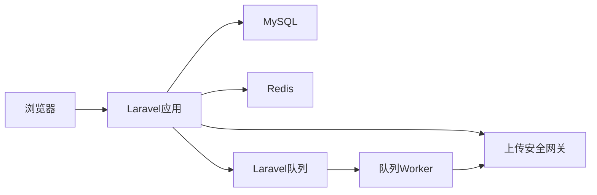
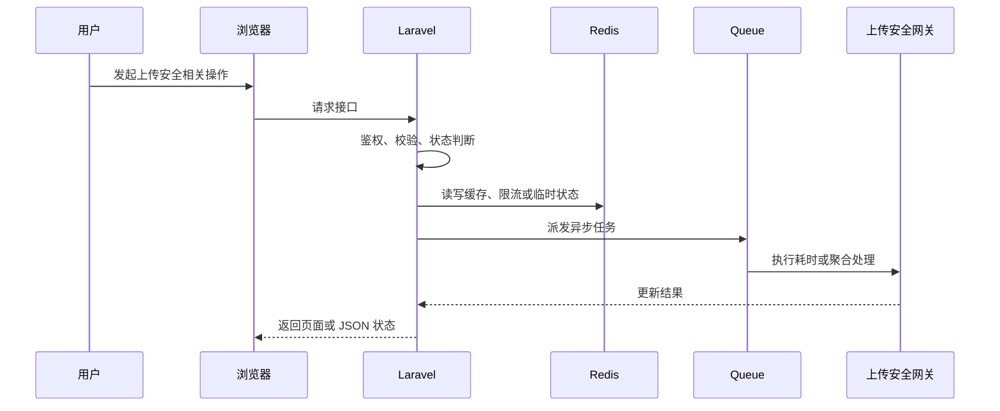

# 【上传安全】技术方案设计

> 来源：根据 `docs/live-video-chat/10-mainstream-roadmap.md`、`docs/live-video-chat/laravel-live-video-chat-roadmap.md` 和 `docs/live-video-chat/prompt.md` 整理。

## 1. 模块定位

上传安全属于 **技术功能模块**。

视频上传会接收大文件和用户输入，需要大小、MIME、路径、频率、FFmpeg 参数和失败文件清理保护。

它涉及的核心组件是：FormRequest、MIME 检测、ffprobe、Storage 路径、RateLimiter、Queue 清理、php.ini/nginx 配置。

## 2. 解决的问题

- 用户层面：用户能明确知道上传失败原因，并避免恶意文件影响其他用户。
- 系统层面：保护服务器磁盘、队列、FFmpeg 和存储目录不被滥用。
- 不做的问题：超大文件打满磁盘，伪造扩展名进入处理链路，路径穿越或命令注入造成安全事故。
- 所在位置：它是所有上传、转码和存储模块的安全底座。

## 3. 常见方案对比

| 方案 | 核心思路 | 需要组件 | 优点 | 缺点 | 适合阶段 | 是否推荐 |
| --- | --- | --- | --- | --- | --- | --- |
| 只校验扩展名 | 限制 mp4/mov/webm 后缀 | FormRequest | 简单 | 容易伪造 | 不推荐 | 否 |
| MIME + 大小校验 | 后端校验大小、MIME 和 PHP 限制 | FormRequest、PHP config | 学习版够用 | 仍需 ffprobe 验证 | 学习项目 | 推荐起步 |
| 上传后 ffprobe 安全检测 | 转码前读取真实媒体信息 | FFmpeg/ffprobe、Queue | 更可靠 | 异步反馈 | 项目展示版 | 推荐 |
| 对象存储直传 + 内容审核 | 直传隔离并机审 | S3/OSS、审核服务 | 生产安全 | 复杂和成本高 | 生产环境 | 后续 |

## 4. 推荐学习方案

当前学习项目推荐方案：

```text
方案名称：FormRequest 基础校验 + MIME/ffprobe 二次验证 + RateLimiter + 清理 Job
核心组件：Laravel validation、Storage、ffprobe、Redis、Queue
Laravel 职责：限制大小格式、生成安全路径、派发检测和清理任务
中间件职责：Nginx/PHP 控制请求体上限，Redis 做限流
数据流：上传请求 -> 基础校验 -> 存临时目录 -> ffprobe 检测 -> 通过进入转码，不通过清理并标记失败
适合原因：符合学习项目组件，能覆盖最常见风险
不足：不能替代专业恶意文件扫描和内容审核
后续升级：对象存储隔离桶、病毒扫描、机审服务
```

## 5. 生产环境方案、容量和架构设计

### 5.1 生产环境常见方案

| 方案 | 典型架构 | 适合规模 | 优点 | 缺点 | 成本 | 维护难度 | 是否推荐 |
| --- | --- | --- | --- | --- | --- | --- | --- |
| 小型业务方案 | Laravel + MySQL + Redis，上传安全网关 单机运行 | 学习项目到小型站点 | 实现成本低，便于排查 | 容量和高可用有限 | 低 | 低 | 学习期推荐 |
| 中型业务方案 | FormRequest、MIME 检测、ffprobe、Storage 路径、RateLimiter、Queue 清理、php.ini/nginx 配置，队列和缓存拆分，关键任务异步 | 有稳定用户和内容增长 | 吞吐更好，边界清晰 | 需要监控和运维 | 中 | 中 | 推荐演进 |
| 大型业务方案 | 上传安全网关 服务化，Redis Cluster，多 worker，多节点 WebSocket/媒体/存储 | 高并发平台 | 可横向扩展 | 架构复杂 | 高 | 高 | 只做设计理解 |
| 云服务方案 | 云对象存储、云 CDN、云直播、云监控或云 IM 等托管能力 | 快速上线或团队较小 | 稳定省运维 | 费用和厂商绑定 | 中到高 | 低到中 | 生产可选 |
| 自建方案 | 自建媒体服务器、对象存储、监控、队列和边缘节点 | 有基础设施团队 | 可控性强 | 建设和维护成本高 | 高 | 高 | 当前不建议实现 |

### 5.2 生产环境容量估算

需要提前估算：

- 单文件最大大小、每日上传量、临时目录保留时间、用户上传配额、ffprobe worker 数

估算方式：

```text
先估算峰值用户行为，再换算为数据库写入、Redis key、队列任务、文件容量或广播扇出。
例如一个高峰动作每秒 1000 次，如果每次都同步写 MySQL 热点行，很快会遇到锁竞争；
学习版可以直接写库，项目展示版应增加 Redis 计数、队列聚合或缓存快照。
```

### 5.3 关键设计问题

- Laravel 负责业务控制、权限、状态和元数据，不直接承担大流量或长耗时处理。
- 中间件负责它擅长的事情：Redis 做状态和削峰，Queue 做异步任务，媒体服务器做直播流，对象存储/CDN 做文件分发。
- 所有状态变化要可追踪，失败要能重试或补偿。
- 对用户可见的数据允许最终一致时，要明确同步周期和兜底校准方式。

### 5.4 典型容量瓶颈和解决方式

| 瓶颈 | 表现 | 原因 | 解决方式 |
| --- | --- | --- | --- |
| 大文件占用 PHP 临时目录 | 请求变慢、数据不准或任务积压 | 设计不当或容量增长过快 | 拆分异步任务、增加缓存/索引、扩展 worker 或改用专门中间件 |
| ffprobe 队列积压 | 请求变慢、数据不准或任务积压 | 设计不当或容量增长过快 | 拆分异步任务、增加缓存/索引、扩展 worker 或改用专门中间件 |
| 失败文件未清理 | 请求变慢、数据不准或任务积压 | 设计不当或容量增长过快 | 拆分异步任务、增加缓存/索引、扩展 worker 或改用专门中间件 |
| Nginx/PHP 上传限制不一致 | 请求变慢、数据不准或任务积压 | 设计不当或容量增长过快 | 拆分异步任务、增加缓存/索引、扩展 worker 或改用专门中间件 |

### 5.5 学习版到生产版的演进路线

- 本地学习版：Laravel + MySQL + Redis + 本地 storage，先跑通闭环。
- 项目展示版：引入 Redis queue、状态日志、后台管理、基础监控。
- 小型生产版：Nginx、Supervisor、对象存储、CDN、HTTPS、告警。
- 中大型生产版：多节点、独立 worker、Redis Cluster、读写分离、专门媒体/搜索/监控组件。
- 云服务方案：优先使用云点播、云直播、云 CDN、云对象存储降低运维复杂度。

### 5.6 生产环境面试讲解

如果这个模块从 Demo 变成生产系统，我会先拆清 Laravel 和中间件边界；同步请求只做必要校验和状态写入，耗时任务交给队列，高频状态交给 Redis，大文件和媒体流交给对象存储、CDN 或媒体服务器。容量估算重点看 单文件最大大小、每日上传量、临时目录保留时间、用户上传配额、ffprobe worker 数。流量上来后，优先处理 大文件占用 PHP 临时目录、ffprobe 队列积压。

## 6. 系统架构图





## 7. 核心流程

### 正常流程

1. 用户在页面发起操作。
2. 浏览器请求 Laravel 接口，并携带登录态或必要参数。
3. Laravel 通过 Policy / FormRequest / Service 校验权限和输入。
4. MySQL 写入业务记录、状态或审计日志。
5. Redis 处理限流、缓存、计数、锁或在线状态。
6. Queue 处理耗时任务、通知、聚合、清理或重试。
7. 相关中间件完成媒体、存储、实时通信或监控职责。
8. 页面展示最新状态，必要时通过轮询或 WebSocket 接收结果。

### 异常流程

- 权限不足：返回 403，并记录必要审计。
- Redis 不可用：降级到数据库快照或直接提示稍后重试。
- 队列未启动：业务状态停留在 pending/processing，后台健康检查报警。
- 并发请求：使用唯一索引、Redis lock 或状态机防重复执行。
- 中间件异常：记录错误摘要，避免把底层异常直接暴露给用户。

## 8. Laravel 实现拆分

### 8.1 数据库表

- upload_security_logs：user_id、filename、size、mime、result、reason
- videos：original_mime、original_size、security_status
- video_upload_sessions：status、failure_reason

### 8.2 Model

- Video has security_status
- UploadSecurityLog belongsTo User

### 8.3 Controller

- VideoUploadController：只做基础校验和存储
- UploadSessionController：分片上传同样调用安全规则

Controller 只负责接收请求、调用授权、组织响应；复杂状态、文件、队列和中间件调用应放到 Service 或 Job。

### 8.4 Service / Support / Action

- UploadValidationService：统一大小/MIME/扩展名规则
- SafePathService：生成不可猜路径
- MediaProbeSecurityService：ffprobe 检测真实媒体
- UploadQuotaService：用户上传限额

### 8.5 Job

- ProbeUploadedMediaJob
- CleanupRejectedUploadJob
- ResetDailyUploadQuotaJob

Job 需要设置合理的 `tries`、`timeout`、`backoff`，失败后更新业务状态并写入可排查的错误摘要。

### 8.6 Event / Listener

- UploadRejected、UploadSecurityPassed、UploadSecurityFailed

### 8.7 WebSocket / Broadcasting

- private-user.{id} 推送异步检测失败原因

### 8.8 Policy / Middleware

- 登录用户才能上传；封禁用户不能上传；管理员可查看安全日志

## 9. Docker 组件选择

| 组件 | 镜像示例 | 用途 | 本地学习是否需要 |
| --- | --- | --- | --- |
| MySQL | mysql:8.0 | 业务数据、状态、审计日志 | 需要 |
| Redis | redis:7-alpine | 缓存、限流、队列、在线状态 | 多数模块需要 |
| Nginx | nginx | 请求体大小和超时控制 | 后续扩展 |
| FFmpeg | jrottenberg/ffmpeg | ffprobe 媒体检测 | 可用宿主或镜像 |

## 10. 数据和状态设计

核心状态：

- security_status：pending -> scanning -> passed / rejected
- upload_status：uploaded -> probing -> accepted / failed

状态设计原则：

- 状态迁移必须有明确触发者：用户、管理员、队列任务、媒体服务器回调或定时任务。
- 状态变化失败时要保留错误原因，并允许重试或人工处理。
- 页面展示使用业务状态，不直接暴露内部异常栈。

## 11. Redis / Queue / WebSocket 使用方式

### 11.1 Redis

- 上传频率限流
- 用户每日上传容量计数
- 重复文件 hash 短期去重

### 11.2 Queue

- ffprobe 检测、失败清理、限额重置异步
- 安全失败必须阻止后续转码

### 11.3 WebSocket / Reverb

- 可通知用户上传被拒原因，不需要公开广播

## 12. 安全风险

- 扩展名伪造：MIME 和 ffprobe 二次验证
- 路径穿越：系统生成路径，不使用用户文件名作为路径
- FFmpeg 命令注入：参数数组方式调用，不拼接 shell
- 磁盘打满：大小限制、配额、临时文件清理

## 13. 性能和扩展

- 学习版：单机 Laravel + MySQL + Redis 可以支撑低并发演示和手动验收。
- 第一类瓶颈：大文件占用 PHP 临时目录。
- 第二类瓶颈：ffprobe 队列积压。
- 扩展方式：先拆异步任务和缓存，再拆专门中间件，最后考虑多节点和云服务。
- 存储扩展：本地 storage -> MinIO/S3 -> CDN。
- 队列扩展：database queue -> Redis queue -> Horizon -> 多 worker / 多机器。
- 实时扩展：单 Reverb -> 多节点 Reverb + Redis pub/sub 或专门网关。

## 14. 监控和排查

重点指标：

- 上传拒绝率
- MIME 不匹配次数
- ffprobe 失败数
- 临时文件大小
- 用户限额命中数

本地排查方式：

- `storage/logs/laravel.log`
- `php artisan queue:failed`
- `docker compose logs`
- 浏览器 Network / Console
- Redis CLI 查看关键 key
- MySQL 查询状态表和日志表

## 15. 分阶段实施路线

- Phase 1：FormRequest、大小、MIME、路径安全
- Phase 2：ffprobe 检测、上传限额、失败文件清理
- Phase 3：对象存储隔离、病毒扫描、内容审核服务

验收标准：

- Phase 1：本地能跑通主流程，有最小权限校验和失败提示。
- Phase 2：状态、队列、Redis、日志和后台入口完整，能作为简历项目讲解。
- Phase 3：能说明生产环境如何扩容、如何监控、如何控制成本和风险。

## 16. 面试讲解角度

### 16.1 这个功能为什么要这样设计？

因为 超大文件打满磁盘，伪造扩展名进入处理链路，路径穿越或命令注入造成安全事故。，所以需要把业务状态、技术组件和异常处理拆清楚。

### 16.2 Laravel 在里面负责什么？

Laravel 负责认证授权、业务状态、数据库元数据、队列派发、事件通知和后台管理。

### 16.3 中间件负责什么？

中间件负责缓存、限流、异步执行、媒体处理、实时通信、文件分发或监控采集，避免 Laravel 承担不适合的工作。

### 16.4 为什么不能全部用 Laravel 直接做？

Laravel 适合业务控制，不适合长时间转码、大文件分发、高频实时连接或大规模计数。全部塞进 Laravel 会导致请求超时、内存压力、连接数瓶颈和维护困难。

### 16.5 如果数据量 / 流量变大，怎么扩展？

先做 Redis 缓存和计数削峰，再把耗时逻辑放进队列；文件和媒体流迁移到对象存储、CDN 或媒体服务器；最后按业务压力拆分 worker、WebSocket、搜索或监控组件。

### 16.6 失败场景怎么处理？

失败要记录状态、错误摘要和可重试入口。队列任务失败进入 failed_jobs，用户看到可理解的状态，管理员能在后台查看和处理。

### 16.7 安全风险怎么处理？

围绕越权、刷接口、路径安全、敏感信息泄露和管理员误操作做防护，关键动作都要走 Policy、RateLimiter、审计日志和输入校验。

### 16.8 这个方案还有哪些不足？

学习版强调可理解和可验收，不覆盖复杂推荐、版权识别、支付结算、跨地域高可用和大型风控系统。生产环境需要按业务规模逐步引入专门服务。

## 17. 总结

上传安全的重点是分层拦截：入口限制大小和类型，存储使用安全路径，转码前用 ffprobe 验证，失败文件必须可追踪清理。

## 一句话总结

上传安全的核心设计是：Laravel 管业务和状态，中间件管性能和基础设施，所有高频、耗时、可失败的部分都要异步化、可观测、可重试。
