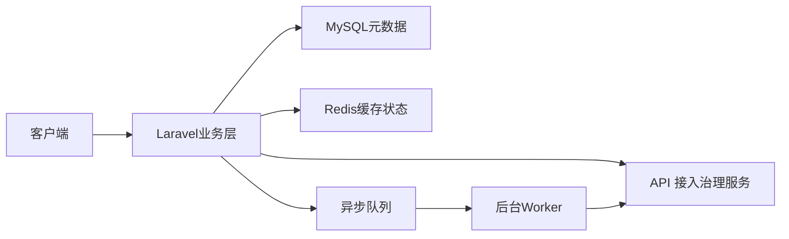
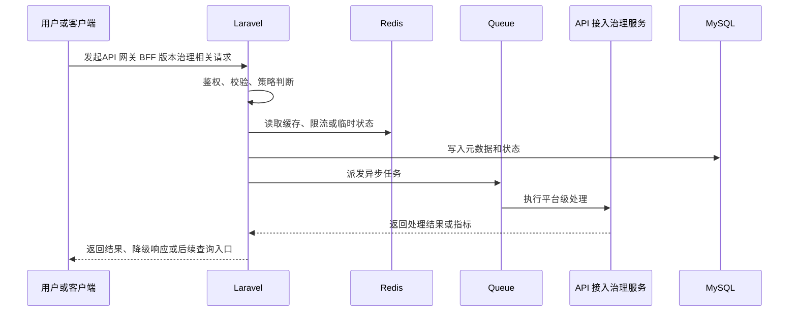

# 【API 网关 BFF 版本治理】技术方案设计

> 来源：根据 `docs/live-video-chat/11-senior-backend-interview-system-design.md` 的 `0.3 资深后端面试视角下仍需补充的方向`，并参考 `docs/live-video-chat/prompt.md` 的输出规范整理。

## 1. 模块定位

API 网关 BFF 版本治理属于 **技术功能模块**。

视频平台通常同时支持 Web、App、小程序、管理后台和第三方接口，需要网关、BFF、版本兼容和统一限流鉴权。

它涉及的核心组件是：Nginx/API Gateway、Laravel API routes、BFF Controller、Sanctum/JWT、版本号、RateLimiter。

## 2. 解决的问题

- 用户层面：不同终端都能获得合适的数据结构和稳定 API，不会因为后端改动导致旧客户端崩溃。
- 系统层面：把认证、限流、版本、聚合、灰度和兼容策略从业务 Controller 中抽象出来。
- 如果不做：接口散乱、版本不可控、移动端升级困难、限流鉴权重复实现。
- 在视频 / 直播 / 聊天平台中的位置：位于客户端和 Laravel 业务服务之间，是多端接入和生产治理入口。

## 3. 常见方案对比

| 方案 | 核心思路 | 需要组件 | 优点 | 缺点 | 适合阶段 | 是否推荐 |
| --- | --- | --- | --- | --- | --- | --- |
| 单套 Web API | 所有端共用 Laravel Controller | Laravel routes | 简单 | 多端差异难处理 | 学习版 | 可起步 |
| 版本化 API | 按 /api/v1 /api/v2 管理兼容 | Route group、Resource | 清晰可控 | 维护多版本成本 | 项目展示版 | 推荐 |
| BFF 层 | Web/App/Admin 各自聚合适合的数据 | BFF Controller/Service | 端体验更好 | 代码量增加 | 中型业务 | 推荐演进 |
| 独立 API 网关 | 统一鉴权、限流、路由、灰度、审计 | Kong/Apisix/Nginx | 治理能力强 | 部署复杂 | 生产环境 | 设计理解 |

## 4. 推荐学习方案

当前学习项目推荐方案：

```text
方案名称：Laravel 版本化 API + 简单 BFF Service + Nginx 网关预留
核心组件：api.php route groups、Sanctum、RateLimiter、ApiResponse、BffService
Laravel 职责：认证授权、版本路由、端侧聚合、兼容字段、错误码规范
中间件职责：Nginx 或网关处理 TLS、限流、请求体限制和路由转发
数据流：客户端请求 /api/v1/feed -> auth/version/throttle -> BFF 聚合视频、用户、互动状态 -> 返回统一响应
适合原因：不引入独立网关也能讲清多端 API 治理
不足：真正的大规模网关能力需要专业组件
后续升级：Kong/APISIX、OpenAPI、灰度路由、客户端版本策略
```

## 5. 生产环境方案、容量和架构设计

### 5.1 生产环境常见方案

| 方案 | 典型架构 | 适合规模 | 优点 | 缺点 | 成本 | 维护难度 | 是否推荐 |
| --- | --- | --- | --- | --- | --- | --- | --- |
| 小型业务方案 | Laravel + MySQL + Redis，API 接入治理服务 以规则和配置为主 | 学习项目到小型产品 | 实现成本低，易排查 | 能力边界有限 | 低 | 低 | 推荐学习 |
| 中型业务方案 | Nginx/API Gateway、Laravel API routes、BFF Controller、Sanctum/JWT、版本号、RateLimiter，增加异步任务、缓存、后台和指标 | 稳定增长业务 | 可扩展，可运营 | 需要监控和运维 | 中 | 中 | 推荐演进 |
| 大型业务方案 | API 接入治理服务 平台化，接入事件流、OLAP、调度、自动化治理 | 高并发平台 | 能力完整，抗风险强 | 复杂度和成本高 | 高 | 高 | 只做设计理解 |
| 云服务方案 | 使用云厂商托管能力或第三方 SaaS | 快速上线或团队较小 | 省运维，稳定 | 厂商绑定和费用不可忽视 | 中到高 | 低到中 | 生产可选 |
| 自建方案 | 自建数据、调度、风控、媒体或分析平台 | 有基础设施团队 | 可控性强 | 建设周期长 | 高 | 高 | 大型团队再考虑 |

### 5.2 生产环境容量估算

需要提前估算：

- 客户端数量、API QPS、版本数量、单接口聚合查询数、请求日志保留周期

估算方式：

```text
先从业务峰值倒推技术容量：用户量、请求量、事件量、文件量、带宽、队列任务和缓存规模。
再按高峰系数、保留周期、失败重试比例和降级策略估算真实资源。
如果容量估算无法解释成本和瓶颈，这个设计就还停留在 Demo 层面。
```

### 5.3 关键设计问题

- Laravel 负责业务控制、权限、元数据、状态流转和后台管理。
- 高频、耗时、可失败的动作要进入 Redis、Queue、媒体服务、数据平台或 CDN。
- 生产设计必须说明一致性边界：哪些强一致，哪些最终一致，哪些允许降级。
- 资深后端面试中要主动说明容量、成本、稳定性、安全和演进路线。

### 5.4 典型容量瓶颈和解决方式

| 瓶颈 | 表现 | 原因 | 解决方式 |
| --- | --- | --- | --- |
| BFF 聚合导致 N+1 查询 | 延迟升高、错误增加、成本上升或数据不准 | 访问量、数据量或组件能力超过当前设计 | 加缓存、异步化、分层拆分、容量规划、监控告警和降级策略 |
| 旧版本维护过久 | 延迟升高、错误增加、成本上升或数据不准 | 访问量、数据量或组件能力超过当前设计 | 加缓存、异步化、分层拆分、容量规划、监控告警和降级策略 |
| 网关限流配置不一致 | 延迟升高、错误增加、成本上升或数据不准 | 访问量、数据量或组件能力超过当前设计 | 加缓存、异步化、分层拆分、容量规划、监控告警和降级策略 |
| 响应字段过大 | 延迟升高、错误增加、成本上升或数据不准 | 访问量、数据量或组件能力超过当前设计 | 加缓存、异步化、分层拆分、容量规划、监控告警和降级策略 |

### 5.5 学习版到生产版的演进路线

- 本地学习版：用 Laravel、MySQL、Redis 和少量配置跑通核心流程。
- 项目展示版：增加状态表、后台入口、Redis 缓存/队列、指标和失败重试。
- 小型生产版：接入对象存储、CDN、Nginx、Supervisor、告警和备份。
- 中大型生产版：按能力拆分专门服务，接入 Kafka、OLAP、调度、风控、HA 和成本治理。
- 云服务方案：优先使用云托管能力降低运维难度，再保留业务抽象避免强绑定。

### 5.6 生产环境面试讲解

如果从 Demo 升级到生产，我会先定义容量指标和故障边界，再把同步链路压到最短；Laravel 只做业务判断和元数据更新，吞吐型任务交给中间件或专门服务。这个模块最容易被追问的是：BFF 聚合导致 N+1 查询、旧版本维护过久、网关限流配置不一致，所以需要提前准备降级、监控和成本口径。

## 6. 系统架构图





## 7. 核心流程

### 正常流程

1. 用户或客户端发起请求。
2. Laravel 完成认证、授权、参数校验和业务策略判断。
3. Redis 处理缓存、限流、锁、短期状态或热点数据。
4. MySQL 记录核心业务状态、配置、审计和聚合结果。
5. Queue 处理异步计算、同步、聚合、导出或通知。
6. API 接入治理服务 执行该模块的核心平台能力。
7. 前端或后台读取结果，并通过日志、指标或通知观察处理状态。

### 异常流程

- 中间件不可用：走降级策略，使用缓存快照或返回可理解的错误。
- 队列积压：限制入口流量，降低非核心任务优先级，扩容 worker。
- 数据不一致：通过幂等键、状态机、补偿 Job 和定时校准修复。
- 权限不足：返回 403，关键动作写审计日志。
- 外部服务失败：设置 timeout、重试、熔断和人工处理入口。

## 8. Laravel 实现拆分

### 8.1 数据库表

- api_clients：name、platform、version、status
- api_request_logs：client_id、path、status_code、latency_ms
- api_deprecation_notices：version、deadline、message

### 8.2 Model

- ApiClient hasMany RequestLogs
- ApiDeprecationNotice 记录版本下线计划

### 8.3 Controller

- Api\V1\FeedController
- Api\V1\VideoController
- Api\V1\LiveRoomController
- AdminApiVersionController

Controller 只负责接收请求、调用授权、组织响应；核心策略放在 Service，耗时逻辑放在 Job。

### 8.4 Service / Support / Action

- ApiResponseFactory：统一响应结构
- ClientVersionService：判断版本兼容
- BffAggregationService：按端聚合数据
- ApiRateLimitService：按客户端限流

### 8.5 Job

- AggregateApiRequestMetricsJob
- NotifyDeprecatedClientJob

Job 要设置 `tries`、`timeout`、`backoff`，失败时写入状态和错误摘要，便于后台重试或人工处理。

### 8.6 Event / Listener

- ApiDeprecatedVersionCalled、ApiRateLimitExceeded、ClientVersionBlocked

### 8.7 WebSocket / Broadcasting

- 不需要业务 WebSocket；后台可推送 API 异常

### 8.8 Policy / Middleware

- 用户 token、客户端 token、管理员 token 分开校验；旧版本只读或限制功能

## 9. Docker 组件选择

| 组件 | 镜像示例 | 用途 | 本地学习是否需要 |
| --- | --- | --- | --- |
| MySQL | mysql:8.0 | 业务元数据、状态、审计日志 | 需要 |
| Redis | redis:7-alpine | 缓存、限流、队列、计数、锁 | 多数模块需要 |
| Nginx | nginx | 本地网关/反代 | 推荐 |
| APISIX | apache/apisix | 生产网关演练 | 后续扩展 |

## 10. 数据和状态设计

核心状态：

- api_version：active -> deprecated -> sunset
- client.status：active -> limited -> blocked

状态设计说明：

- 状态迁移必须有明确触发者：用户、管理员、队列任务、定时任务或外部回调。
- 状态失败必须保留原因，并提供重试、跳过、回滚或人工处理方式。
- 前台页面展示业务状态，后台保留技术状态和错误详情。

## 11. Redis / Queue / WebSocket 使用方式

### 11.1 Redis

- api rate limit key
- 客户端版本配置缓存
- 热点 API 响应短缓存

### 11.2 Queue

- 请求日志聚合异步
- 版本下线通知异步
- 核心 API 请求不等待日志写入

### 11.3 WebSocket / Reverb

- API 网关不依赖 WebSocket；但 WebSocket 连接也要有版本和鉴权策略

## 12. 安全风险

- 旧客户端崩溃：字段兼容和版本下线周期
- 接口滥用：客户端维度限流
- 敏感字段泄露：Resource/DTO 控制输出
- 错误码混乱：统一错误结构

## 13. 性能和扩展

- 学习版可以先用单机 Laravel + MySQL + Redis 验证流程。
- 当读多写少时，优先做缓存和 CDN。
- 当写入和事件量增加时，优先拆队列、批量写入和数据管道。
- 当单点不可接受时，增加健康检查、主从、多节点和降级开关。
- 当成本开始明显增长时，把 API 接入治理服务 的核心指标纳入成本报表。

## 14. 监控和排查

重点指标：

- API QPS
- P95 延迟
- 各版本调用量
- 错误率
- 限流次数
- 旧版本占比

本地排查方式：

- `storage/logs/laravel.log`
- `php artisan queue:failed`
- `docker compose logs`
- Redis CLI 查看关键 key
- MySQL 查询状态表、日志表和慢查询
- 浏览器 Network / Console
- 后台管理页查看任务状态和指标快照

## 15. 分阶段实施路线

- Phase 1：/api/v1 路由、统一响应、Sanctum 认证
- Phase 2：BFF 聚合、版本兼容、请求指标和限流
- Phase 3：独立 API 网关、OpenAPI、灰度路由和版本下线治理

验收标准：

- Phase 1：本地能手动跑通主流程，并能说清楚核心原理。
- Phase 2：有状态表、后台入口、异步任务、指标和异常处理。
- Phase 3：能说明生产环境扩展、降级、监控、成本和风险控制。

## 16. 面试讲解角度

### 16.1 这个功能为什么要这样设计？

因为 接口散乱、版本不可控、移动端升级困难、限流鉴权重复实现。，所以需要平台级设计，而不是只在 Controller 中补几行逻辑。

### 16.2 Laravel 在里面负责什么？

Laravel 负责业务策略、权限、状态、元数据、后台管理、任务派发和结果查询。

### 16.3 中间件负责什么？

中间件负责高吞吐、低延迟、异步化、数据分析、媒体处理、缓存分发或基础设施能力。

### 16.4 为什么不能全部用 Laravel 直接做？

Laravel 不适合承载媒体流、大规模事件、高频实时计算、复杂调度和海量分析。它应该作为业务控制层，而不是所有基础设施的替代品。

### 16.5 如果数据量 / 流量变大，怎么扩展？

先缓存和异步化，再拆专门服务；先做单机可观察，再做多节点和容灾；先用规则可解释方案，再引入复杂平台能力。

### 16.6 失败场景怎么处理？

通过状态机、幂等键、重试、死信、补偿任务、降级开关和后台人工处理入口处理失败。

### 16.7 安全风险怎么处理？

围绕权限、输入校验、限流、签名、审计、隐私和误操作防护设计安全边界。

### 16.8 这个方案还有哪些不足？

学习版主要用于理解和面试讲解，不等价于真实大厂平台。真正生产还需要组织流程、SLA、成本预算、专门团队和长期数据积累。

## 17. 总结

API 治理的核心是让多端接入有稳定边界：版本、鉴权、限流、响应结构和兼容策略都要可控。

## 一句话总结

API 网关 BFF 版本治理的核心是：让 Laravel 站在业务控制层，平台组件承担高吞吐和基础设施能力，并用容量、成本、稳定性和安全边界证明设计可以从 Demo 演进到生产。
