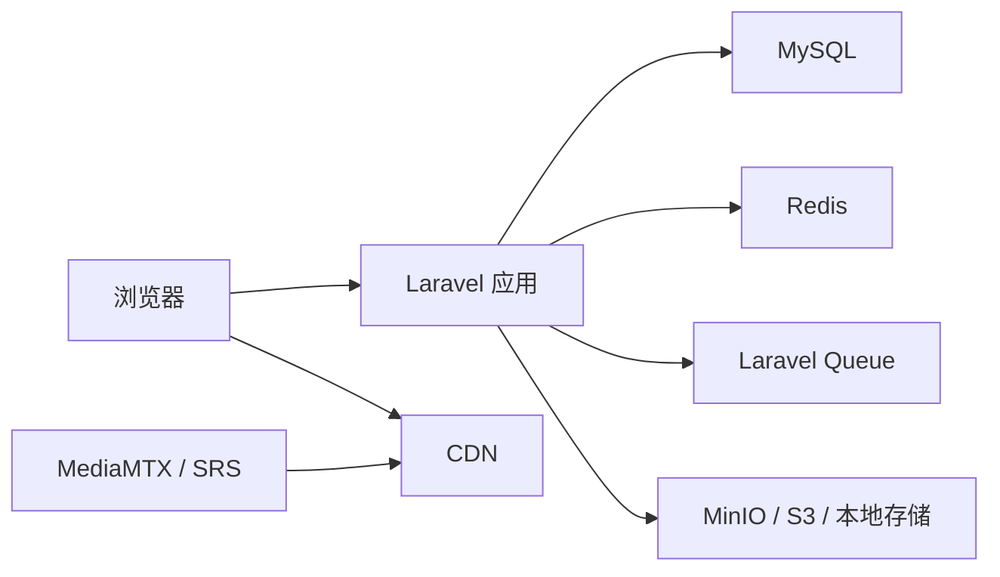

你是一名资深后端架构师和 Laravel 技术导师。

我正在用 Laravel 框架学习和设计一套“视频分享 + 直播 + 在线聊天”系统。

项目基础假设：

- 后端框架：Laravel
- 数据库：MySQL
- 缓存 / 队列：Redis
- 实时通信：Laravel Reverb / WebSocket
- 视频处理：FFmpeg
- 直播媒体服务：MediaMTX / SRS / Nginx-RTMP / 云直播服务等
- 文件存储：本地 storage / MinIO / S3 / 对象存储
- CDN：可使用云 CDN 或自建 Nginx / 边缘节点方案
- 部署和中间件：优先使用 Docker / Docker Compose
- 前端可以先用 Blade + JS，不强制引入 Vue / React
- 目标不是立刻做生产级系统，而是学习如何设计、搭建、扩展，并能在面试中讲清楚方案

本次我要设计的功能 / 技术模块是：

【在这里填写模块名称】

例如：

- 直播间实时在线人数设计
- 视频上传、转码和队列处理设计
- CDN 接入设计
- MinIO / S3 对象存储接入设计
- MediaMTX / SRS 直播推流方案设计
- 视频播放权限和防盗链设计
- 直播聊天和弹幕设计
- 私信和未读数设计
- 视频评论系统设计
- 视频点赞、收藏、播放量统计设计
- 直播回放设计
- 视频审核和举报设计
- Redis 队列和 Horizon 设计
- 日志、监控和 Prometheus 指标设计

请围绕这个模块，输出一份“技术方案设计文档”。

注意：

- 不需要检查当前项目代码。
- 不需要直接写代码。
- 不需要给出过度复杂的企业级方案。
- 需要提供主流或常见解决方案供选择。
- 需要说明不同方案适合什么业务规模和公司阶段。
- 需要告诉我如果用 Laravel 应该怎么实现。
- 需要告诉我 Docker 可以安装哪些相关组件。
- 需要说明学习版、进阶版、生产版分别怎么做。
- 需要重点说明生产环境方案、容量估算、瓶颈和演进路线。
- 需要让我即使没做过视频网站开发，也能理解这个模块如何实现。
- 需要整理成适合面试复盘和项目讲解的内容。

# ==================== 一、模块定位

请先说明这个模块属于哪一类：

1. 纯功能模块

例如：

- 用户头像
- 用户昵称
- 用户简介
- 视频标题
- 视频分类
- 视频标签
- 个人主页

这类功能主要涉及：

- 数据库字段
- 表单
- 页面展示
- 基础权限
- 简单 CRUD

1. 技术功能模块

例如：

- 直播间实时在线人数
- 视频上传和转码
- HLS 播放
- CDN 接入
- 防盗链
- WebSocket 聊天
- 队列处理
- 对象存储
- 直播推流
- 日志监控

这类功能通常涉及：

- Redis
- Queue
- WebSocket
- FFmpeg
- 媒体服务器
- 对象存储
- CDN
- 异步任务
- 状态流转
- 容量和性能设计

1. 业务 + 技术混合模块

例如：

- 直播回放
- 视频审核
- 播放量统计
- 直播间状态检测
- 私信未读数
- 举报处理
- 关注主播开播通知

这类功能既有业务流程，也有技术实现细节。

请说明本模块为什么属于这个分类。

# ==================== 二、这个功能解决什么问题

请用通俗语言说明：

- 用户层面解决什么问题
- 系统层面解决什么问题
- 如果不做这个模块，会有什么问题
- 在视频分享 / 直播 / 聊天网站中，它处于什么位置

例如：

直播间实时在线人数不是简单显示一个数字，它涉及用户进入、离开、异常断开、多端登录、刷新页面、WebSocket 连接、Redis 统计、最终一致性等问题。

再例如：

视频转码不是简单上传文件后直接播放，它涉及大文件上传、异步处理、FFmpeg、HLS、多码率、失败重试、队列积压、存储容量和播放体验。

# ==================== 三、常见实现方案

请列出主流或常见实现方案。

至少给出 2 到 4 种方案。

每种方案说明：

- 基本思路
- 需要哪些组件
- Laravel 负责什么
- 中间件负责什么
- 优点
- 缺点
- 适合什么阶段
- 是否推荐当前学习项目使用

用表格对比：

| 方案 | 核心思路 | 需要组件 | 优点 | 缺点 | 适合阶段 | 是否推荐 |
| ---- | -------- | -------- | ---- | ---- | -------- | -------- |
|      |          |          |      |      |          |          |

示例：

如果是在线人数，可以比较：

- 只用 MySQL 统计
- Laravel Reverb presence channel 统计
- Redis Set / Hash 统计
- WebSocket + Redis + 定时心跳
- WebSocket 集群 + Redis / Kafka 方案

如果是 CDN，可以比较：

- Laravel public storage
- Nginx 静态资源
- MinIO / S3 对象存储
- 对象存储 + CDN
- 签名 URL + CDN 防盗链

如果是直播推流，可以比较：

- Nginx-RTMP
- MediaMTX
- SRS
- 云直播服务
- WebRTC SFU 方案

# ==================== 四、推荐学习方案

请给出一个最适合当前学习项目的方案。

要求：

- 不要太复杂
- 能本地 Docker 搭建
- 能用 Laravel 串起来
- 能手动验收
- 能解释核心原理
- 后续可以平滑升级

请说明：

- 为什么推荐这个方案
- 它相比其他方案简单在哪里
- 它有哪些不足
- 后续怎么升级到更完整方案

格式：

当前学习项目推荐方案：

```text
方案名称：
核心组件：
Laravel 职责：
中间件职责：
数据流：
适合原因：
不足：
后续升级：
```

# ==================== 五、生产环境方案、容量和架构设计

请重点说明如果这个模块用于真实生产环境，通常有哪些方案，以及设计时需要考虑哪些容量、流量、稳定性和成本问题。

注意：

- 不要只简单写“小型 / 中型 / 大型怎么做”。
- 需要告诉我真实公司里常见的技术选型有哪些。
- 需要说明不同方案适合什么业务规模。
- 需要说明容量估算要关注哪些指标。
- 需要说明哪些地方会成为瓶颈。
- 需要说明如何从学习版演进到生产版。
- 不要求给出精确压测数据，但要给出合理的估算维度和设计思路。

## 5.1 生产环境常见方案

请列出这个模块在生产环境中的常见实现方式。

至少包含：

1. 小型业务方案
2. 中型业务方案
3. 大型业务方案
4. 云服务方案
5. 自建方案

格式：

| 方案 | 典型架构 | 适合规模 | 优点 | 缺点 | 成本 | 维护难度 | 是否推荐 |
| ---- | -------- | -------- | ---- | ---- | ---- | -------- | -------- |
|      |          |          |      |      |      |          |          |

例如：

如果是视频播放 / CDN：

- 小型：Laravel + 本地 storage / Nginx 静态文件
- 中型：MinIO / S3 + HLS + Nginx
- 大型：对象存储 + CDN + 多码率 HLS + 播放鉴权
- 云服务：云点播 / 云转码 / 云 CDN
- 自建：对象存储集群 + 转码集群 + CDN 或边缘节点

如果是直播推流：

- 小型：MediaMTX / Nginx-RTMP 单机
- 中型：SRS + HLS / HTTP-FLV + Nginx
- 大型：SRS 集群 / 云直播 / 边缘分发 / 多地域节点
- 云服务：腾讯云直播、阿里云直播、七牛云、声网等
- 自建：媒体服务器集群 + 录制转码集群 + CDN

如果是在线人数：

- 小型：Reverb presence channel
- 中型：Redis Set / Hash + 心跳 TTL
- 大型：WebSocket 集群 + Redis / Kafka + 定时校准
- 云服务：云消息推送 / IM 服务
- 自建：WebSocket 网关集群 + 状态服务 + Redis Cluster

## 5.2 生产环境容量估算

请说明设计这个模块时，需要提前估算哪些容量指标。

根据模块选择相关指标。

### 用户和访问量

- 日活用户 DAU
- 月活用户 MAU
- 同时在线人数
- 峰值同时在线人数
- 单房间峰值在线人数
- 页面 QPS
- API QPS
- WebSocket 连接数
- 消息发送 QPS
- 评论 / 点赞 / 收藏 QPS

### 视频相关容量

- 每日上传视频数量
- 单个视频平均大小
- 单个视频最大大小
- 每日新增原始视频存储量
- 转码后膨胀比例
- HLS 分片数量
- 多码率版本数量，例如 360p / 720p / 1080p
- 每日转码任务数量
- 单个转码任务平均耗时
- 转码队列峰值积压
- 存储保留周期
- 回放保留周期

### 直播相关容量

- 同时开播房间数
- 单房间观众数
- 总并发观看人数
- 推流码率
- 播放码率
- 直播带宽峰值
- 直播录制文件大小
- 直播回放生成任务数量
- HLS 延迟要求
- 是否需要低延迟直播
- 是否需要多码率直播

### 聊天和实时通信容量

- WebSocket 连接数
- 单房间消息 QPS
- 全站消息 QPS
- 消息广播扇出量
- 历史消息存储量
- 未读消息数量
- 在线状态刷新频率
- 心跳间隔
- Redis key 数量
- Redis 内存占用

### 存储和带宽容量

- 原视频存储
- 转码后视频存储
- HLS 分片存储
- 封面图存储
- 用户头像 / 图片存储
- 每日播放流量
- CDN 带宽峰值
- 回源流量
- 热点视频比例
- 冷数据归档策略

请用示例说明容量估算方式。

例如：

```text
如果每天上传 1000 个视频，平均每个原视频 200MB，
原始视频每天新增约 200GB。
如果生成 360p、720p、1080p 三个版本，转码后总体可能增加 1 到 2 倍存储，
则每天视频存储增长可能达到 400GB 到 600GB。
```

再例如：

```text
如果一个直播间有 1 万观众，平均播放码率 2Mbps，
则单房间下行带宽约为 20Gbps。
这种流量不能由 Laravel 或单台媒体服务器直接承担，
必须使用 CDN 或边缘分发。
```

## 5.3 关键设计问题

请说明生产环境中必须考虑哪些关键设计问题。

根据模块选择相关内容。

### 架构边界

- Laravel 负责业务控制，不直接承载大流量视频流。
- 视频文件分发应由对象存储 / Nginx / CDN 承担。
- 直播推流和转封装应由媒体服务器承担。
- 转码应由队列和转码 worker 承担。
- 实时聊天应由 WebSocket 服务和 Redis 等状态组件承担。
- 大规模日志和指标应进入专门的监控系统。

### 存储设计

- 本地 storage 是否足够
- 什么时候接 MinIO
- 什么时候接 S3 / OSS / COS
- 原视频是否保留
- 转码文件是否保留
- HLS 分片如何清理
- 回放保留多久
- 冷热数据如何区分
- 存储权限如何控制

### 带宽和 CDN

- 什么内容需要走 CDN
- HLS m3u8 是否走 CDN
- ts / m4s 分片是否走 CDN
- 封面图是否走 CDN
- CDN 回源如何配置
- 如何处理热点视频
- 如何做防盗链
- 如何做签名 URL
- CDN 缓存时间如何设置

### 队列和异步任务

- 哪些任务必须异步
- 是否需要 Redis queue
- 是否需要 Laravel Horizon
- 是否需要单独转码队列
- 是否需要高低优先级队列
- 转码失败如何重试
- 失败任务如何告警
- 队列积压如何扩容
- worker 数量如何估算

### 数据库设计

- 哪些字段需要索引
- 哪些统计不能实时写 MySQL
- 播放量、点赞数、在线人数是否要先写 Redis
- 是否需要定时落库
- 是否需要分表
- 是否需要读写分离
- 是否需要归档历史数据

### Redis 设计

- Redis 用于缓存还是状态
- 是否用 Set 记录在线用户
- 是否用 Hash 记录房间计数
- 是否用 Sorted Set 做排行榜
- 是否用 Redis 做限流
- 是否用 Redis 做队列
- key 如何命名
- TTL 如何设置
- Redis 内存如何估算
- Redis 挂了怎么降级

### 实时通信设计

- WebSocket 是否单节点
- 多节点如何广播
- presence channel 是否够用
- 在线人数是否允许最终一致
- 断线重连如何处理
- 心跳间隔如何设置
- 消息是否持久化
- 聊天刷屏如何限制
- 敏感词如何处理

### 媒体服务设计

- 是否用 MediaMTX
- 是否用 SRS
- 是否用云直播
- 是否需要低延迟
- 是否需要 WebRTC
- 是否需要 HLS / HTTP-FLV
- 是否需要录制
- 是否需要回放
- 是否需要多码率直播
- 推流鉴权怎么做
- 推流中断如何检测

### 安全设计

- 上传文件安全
- FFmpeg 命令注入
- 文件路径穿越
- HLS 防盗链
- CDN URL 签名
- 私有视频鉴权
- stream_key 保护
- 聊天 XSS
- 接口限流
- 用户越权
- 管理员误操作

### 可观测性设计

- 上传成功率
- 转码成功率
- 转码耗时
- 转码队列积压
- 播放失败率
- CDN 404
- 回源失败率
- 直播推流状态
- 直播中断次数
- WebSocket 连接数
- 消息 QPS
- Redis 内存
- MySQL 慢查询
- worker 进程状态

## 5.4 典型容量瓶颈和解决方式

请列出这个模块常见瓶颈。

格式：

| 瓶颈 | 表现 | 原因 | 解决方式 |
| ---- | ---- | ---- | -------- |
|      |      |      |          |

例如：

- 上传大文件导致 PHP 请求超时
- 转码任务积压
- 单机 storage 磁盘不足
- HLS 分片太多导致 inode 压力
- 视频播放带宽过高
- CDN 回源压力大
- WebSocket 连接数过多
- 聊天消息广播风暴
- Redis 内存过高
- MySQL 热点行频繁更新
- 直播流中断后状态不准确

## 5.5 学习版到生产版的演进路线

请说明这个模块从学习项目到生产环境，可以如何逐步演进。

### 阶段 1：本地学习版

- Laravel
- Docker MySQL
- Docker Redis
- 本地 storage
- FFmpeg 本机执行
- MediaMTX / Reverb 单机
- 适合理解流程

### 阶段 2：项目展示版

- Redis queue
- MinIO
- 多码率 HLS
- 简单鉴权
- 简单监控
- 基础后台管理
- 适合简历项目和面试讲解

### 阶段 3：小型生产版

- 对象存储
- CDN
- Redis queue + Horizon
- Supervisor 管理 worker
- Nginx
- HTTPS
- 日志和告警
- 基础限流和权限

### 阶段 4：中大型生产版

- 独立转码服务
- 多 worker / 多机器转码
- 媒体服务器集群
- CDN 多地域分发
- Redis Cluster
- MySQL 读写分离 / 分库分表视情况
- WebSocket 集群
- Prometheus + Grafana + Loki
- 完整审核和风控

### 阶段 5：云服务 / 平台化方案

- 云点播
- 云直播
- 云转码
- 云 CDN
- 云对象存储
- 云监控
- 更低运维成本
- 更高服务成本
- 适合业务快速上线

## 5.6 生产环境面试讲解

请整理这个模块在生产环境中的面试讲解。

至少回答：

### 问题 1：如果这个功能从 Demo 变成生产系统，你会怎么改？

### 问题 2：容量估算你会看哪些指标？

### 问题 3：哪些地方不能直接由 Laravel 承担？

### 问题 4：流量上来以后，最先会遇到什么瓶颈？

### 问题 5：你会如何做异步化和削峰？

### 问题 6：你会如何设计存储和 CDN？

### 问题 7：你会如何做失败重试和告警？

### 问题 8：你会如何在成本和复杂度之间做取舍？

回答要接近真实后端项目经验，不要只写概念。

# ==================== 六、系统架构图

请使用 Mermaid 画架构图。

至少包含：

- 用户浏览器
- Laravel
- MySQL
- Redis
- 队列
- 相关中间件
- 对象存储 / CDN / 媒体服务器，如果涉及

示例：



如果这个模块有明显流程，也请补充 sequenceDiagram。

# ==================== 七、核心流程

请按步骤说明完整流程。

### 正常流程

1. 用户做什么
2. 浏览器请求什么
3. Laravel 做什么
4. 数据库写什么
5. Redis 写什么
6. 队列做什么
7. 中间件做什么
8. 页面如何展示结果

### 异常流程

根据具体模块选择相关异常说明：

- 中间件不可用
- 队列未启动
- Redis 断开
- 文件不存在
- 视频转码失败
- WebSocket 断开
- 推流中断
- CDN 404
- 用户重复刷新
- 并发请求
- 权限不足

# ==================== 八、Laravel 实现拆分

请说明在 Laravel 中一般会拆成哪些部分。

## 8.1 数据库表

需要哪些表？

例如：

- users
- videos
- video_renditions
- live_rooms
- live_room_messages
- live_room_viewers
- video_views
- video_likes
- video_favorites
- video_comments
- notifications

请说明核心字段，不需要写完整 migration 代码。

## 8.2 Model

需要哪些 Model？
它们之间有什么关系？

## 8.3 Controller

Controller 负责什么？
哪些逻辑不应该放 Controller？

## 8.4 Service / Support / Action

复杂逻辑是否要拆 Service？

例如：

- VideoTranscodeService
- LiveStreamService
- OnlineUserService
- CdnUrlService
- StorageService
- PlaybackUrlService

## 8.5 Job

如果涉及异步任务，请说明：

- Job 名称
- 何时派发
- 做什么
- 如何失败重试
- 状态如何更新

## 8.6 Event / Listener

如果涉及事件，请说明：

- 事件名称
- 触发时机
- 监听后做什么

## 8.7 WebSocket / Broadcasting

如果涉及实时功能，请说明：

- channel 怎么设计
- private channel 还是 presence channel
- broadcastWith 返回什么
- 如何避免暴露敏感信息

## 8.8 Policy / Middleware

如果涉及权限，请说明：

- 谁可以访问
- 谁可以修改
- 谁可以管理
- 是否需要管理员权限
- 是否需要主播权限

# ==================== 九、Docker 可以使用哪些组件

请列出这个模块可能用到的 Docker 服务。

格式：

| 组件 | 镜像示例 | 用途 | 本地学习是否需要 |
| ---- | -------- | ---- | ---------------- |
|      |          |      |                  |

例如：

- mysql:8.0
- redis:7-alpine
- minio/minio
- bluenviron/mediamtx
- ossrs/srs
- nginx
- prom/prometheus
- grafana/grafana
- grafana/loki
- mailpit/mailpit

如果某组件不是当前阶段必须，也请说明是“后续扩展”。

# ==================== 十、数据设计和状态设计

如果这个模块涉及数据库，请说明：

- 需要哪些核心表
- 每张表存什么
- 关键字段
- 关键索引
- 是否需要唯一约束
- 是否需要软删除
- 是否需要状态字段

如果涉及状态流转，请画出状态。

例如：

```text
pending -> processing -> ready
pending -> processing -> failed
failed -> retrying -> ready
```

或者：

```text
scheduled -> live -> interrupted -> ended
```

请说明：

- 每个状态什么意思
- 谁触发状态变化
- 状态变化失败怎么办
- 用户页面看到什么

# ==================== 十一、缓存、队列、实时通信怎么用

请根据模块判断是否需要这些能力。

## 11.1 Redis

如果需要 Redis，请说明用法：

- 缓存
- 计数器
- Set
- Hash
- Sorted Set 排行榜
- 分布式锁
- 限流
- 在线状态
- 队列 backend

## 11.2 Queue

如果需要队列，请说明：

- 为什么不能同步处理
- 队列处理什么
- 是否需要重试
- 是否需要失败表
- 是否需要独立队列
- 是否需要 Laravel Horizon

## 11.3 WebSocket / Reverb

如果需要实时通信，请说明：

- 为什么 HTTP 轮询不够
- 使用 private channel 还是 presence channel
- 如何处理断线
- 如何处理多端登录
- 如何处理在线人数

# ==================== 十二、安全和风险

请说明这个模块的安全风险。

根据模块选择相关项：

- 上传文件校验
- 文件路径穿越
- FFmpeg 命令注入
- HLS m3u8 / ts 防盗链
- CDN URL 签名
- stream_key 泄露
- WebSocket 敏感信息广播
- 聊天刷屏
- XSS
- CSRF
- SQL 注入
- 接口限流
- Redis key 滥用
- 用户越权
- 管理员误操作

每个风险给一个简单处理方案。

# ==================== 十三、性能和扩展

请说明：

- 当前学习版能支持什么规模
- 哪些地方会成为瓶颈
- 流量变大后怎么扩展
- 单机版如何升级到多节点
- 本地 storage 如何升级到对象存储
- 对象存储如何接 CDN
- database queue 如何升级到 Redis queue
- 单 WebSocket 节点如何扩展
- 单媒体服务器如何扩展

不要写空话，要结合当前模块。

# ==================== 十四、监控和排查

请说明这个模块应该关注哪些日志和指标。

例如：

- 上传成功 / 失败
- 转码成功 / 失败
- 队列积压
- 任务耗时
- 在线人数
- 峰值在线人数
- WebSocket 连接数
- 推流状态
- 播放失败次数
- CDN 404
- Redis 连接异常
- MySQL 慢查询

并说明本地学习阶段可以怎么排查：

- Laravel log
- docker compose logs
- php artisan queue:failed
- 浏览器 Network
- Redis CLI
- MySQL 查询
- FFmpeg 命令行手动测试

# ==================== 十五、分阶段实施路线

请把方案拆成 3 个阶段：

## Phase 1：学习版 / 最小可用

目标：

- 本地能跑
- 用 Docker 启动必要中间件
- Laravel 能串起完整流程
- 能手动验收

说明：

- 做哪些功能
- 不做哪些功能
- 验收标准

## Phase 2：进阶版 / 项目可展示

目标：

- 功能更完整
- 状态更清楚
- 异常处理更好
- 能作为简历项目讲

说明：

- 增强哪些能力
- 涉及哪些技术点
- 验收标准

## Phase 3：生产化方向

目标：

- 接近真实公司方案
- 说明如何扩展
- 不一定现在实现

说明：

- 需要哪些组件
- 架构如何变化
- 主要风险是什么

# ==================== 十六、面试讲解角度

请整理成面试可以复述的内容。

包括：

## 16.1 这个功能为什么要这样设计？

## 16.2 Laravel 在里面负责什么？

## 16.3 中间件负责什么？

## 16.4 为什么不能全部用 Laravel 直接做？

## 16.5 如果数据量 / 流量变大，怎么扩展？

## 16.6 失败场景怎么处理？

## 16.7 安全风险怎么处理？

## 16.8 这个方案还有哪些不足？

回答要像后端开发面试中的项目讲解，不要太空泛。

# ==================== 十七、最终输出格式

请按 Markdown 输出。

标题：

# 【模块名称】技术方案设计

目录结构：

1. 模块定位
2. 解决的问题
3. 常见方案对比
4. 推荐学习方案
5. 生产环境方案、容量和架构设计
6. 系统架构图
7. 核心流程
8. Laravel 实现拆分
9. Docker 组件选择
10. 数据和状态设计
11. Redis / Queue / WebSocket 使用方式
12. 安全风险
13. 性能和扩展
14. 监控和排查
15. 分阶段实施路线
16. 面试讲解角度
17. 总结

最后再单独输出：

## 一句话总结

用一两句话概括这个模块的核心设计。